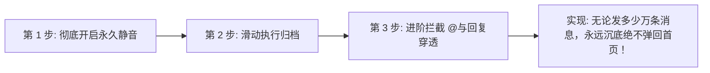

# Telegram 归档 (Archive) 功能完全指南：永久静默归档、隐藏归档箱与会话降噪实战

随着加入的 Telegram 频道、技术交流群以及币圈项目群越来越多，许多用户的消息首页常常被成百上千条未读红点彻底淹没，陷入严重的“信息过载焦虑”。

Telegram 官方提供的 **「归档 (Archive)」** 是打造 **收件箱清零 (Inbox Zero)** 的核心利器。然而，许多用户在使用时经常遇到一个令人崩溃的问题：**“为什么我明明归档了某个大群，只要里面有人发一条新消息，它立刻又自己弹回了首页？！”**

本文将为你深度拆解 Telegram 归档的底层流转逻辑，传授**永久静默归档三部曲**、桌面端彻底隐藏归档入口、**归档内突破限制“无限置顶”的极客秘技**，以及配合 Premium 彻底拦截陌生人广告的实战方案。

---

## 一、归档消息的核心运作模型：为什么会自动弹出来？

理解归档，首先必须掌握 Telegram 底层的 **「会话状态转移模型」**：

```mermaid
stateDiagram-v2
    [*] --> 活跃会话: 正常接收消息
    活跃会话 --> 归档状态: 用户手动右滑/右键归档
    
    state 归档状态 {
        [*] --> 开启通知
        [*] --> 永久静音
        
        开启通知 --> 活跃会话: ⚠️ 出现任意新消息 (自动取消归档并弹回首页)
        开启通知 --> 活跃会话: ⚠️ 有人 @你 或回复你的消息 (强制弹回首页)
        
        永久静音 --> 归档状态: ✅ 有新消息到达 (继续静默沉底，绝不弹回)
        永久静音 --> 活跃会话: ⚠️ 有人 @你 或回复 (若未关闭 Mentions 提醒则弹回)
    }
```

### 核心真相：
- **开启通知的对话**：归档只是一次性的临时隐藏。只要群内出现**任意一条新消息**，系统判定其具备即时优先级，**会自动解除归档并强制置顶回首页**！
- **永久静音的对话**：只有当一个对话**处于「静音 (Muted)」状态**时，新消息到达才会在归档箱内静默增加计数，**永远不会弹回主聊天界面**。

---

## 二、实战第一招：彻底实现「永久静默归档」三步法

要让低频大群、纯资源频道或偶尔查阅的社群老老实实呆在归档里，必须严格执行以下三步：



### 具体操作步骤：
1. **第一步：永久静音目标对话**
   - 进入该群组或频道 -> 点击顶部标题栏进入资料页。
   - 点击 **「通知 (Mute)」** -> 选择 **「永久静音 (Disable Sound / Mute Forever)」**。
2. **第二步：执行归档**
   - **iOS 端**：在聊天列表中向左滑动该对话 -> 点击 **「归档 (Archive)」**。
   - **Android 端**：在聊天列表中长按该对话 -> 点击右上角「归档」图标（或菜单中的归档）。
   - **桌面端 (Desktop)**：鼠标右键点击该对话 -> 选择 **「归档 (Archive)」**。
3. **第三步：进阶防止 `@你` 或回复穿透弹回**
   - 如果某个群经常有人无脑 `@everyone` 导致群组依然跳出来：
   - 进入 `设置` -> `通知与声音 (Notifications and Sounds)`。
   - 检查群组通知中的「例外名单」，确保该群处于完全静默状态。

---

## 三、实战第二招：隐藏「已归档对话」卡片，让首页极致纯净

归档后，聊天列表顶部通常会出现一个灰色的 **「已归档对话 (Archived Chats)」** 卡片。如果你希望主屏连这根横条都看不见，可以将其彻底隐藏：

### 3.1 移动端（iOS / Android）隐藏与呼出
- **隐藏操作**：在消息列表顶部的「已归档对话」卡片上，**向左滑动**（iOS）或长按选择隐藏（Android），该卡片会瞬间折叠隐形。
- **重新呼出**：在聊天列表最顶部，**用手指向下拉动屏幕（Pull Down）**，已归档对话栏便会像抽屉一样滑出；松手后自动吸顶，再次左滑可重新隐藏。

### 3.2 桌面端（Windows / Mac）：移入左侧主菜单
这是资深桌面端办公党最推荐的整洁方案：
1. 鼠标右键点击顶部的「已归档对话」条目。
2. 选择 **「移动至主菜单 (Move to main menu)」**。
3. **效果**：聊天列表顶部的归档栏将彻底消失！主会话界面只剩下你当前正在聊天的核心窗口。
4. **如何查看**：点击左上角的“三短线”汉堡主菜单，即可在侧边栏中看到独立的「已归档对话」入口。

---

## 四、极客秘技：利用归档突破限制实现「无限置顶」

在 Telegram 官方规则中，主界面的置顶会话（Pin）有着严格的人数上限：
- **普通免费用户**：主界面最多置顶 **5 个** 对话；
- **Premium 会员**：主界面最多置顶 **10 个** 对话。

::: tip 💡 归档文件夹的专属特权：无限置顶 (Infinite Pins)
Telegram 官方在「已归档对话」文件夹内部**完全取消了置顶数量限制**！
你可以将 20 个、50 个甚至上百个查资料专用的频道、机器人、备忘录群组**全部置顶**在归档文件夹内，并自由拖拽调整前后顺序。
- **最佳用法**：将归档文件夹当成个人的**「知识库/工具箱」**，平时隐藏在后台，需要检索工具或阅读技术周刊时下拉点开，所有核心资源整整齐齐置顶排列！
:::

---

## 五、降噪神器：Telegram Premium 自动归档陌生人私聊

对于开通了 [Telegram Premium 会员](./premium.html) 的用户，Telegram 提供了目前整个即时通讯行业最强大的**防骚扰安全锁**：

```mermaid
graph TD
    Incoming[陌生人 / 非联系人发来私聊] --> Check{是否开启了「自动归档与静音」?}
    Check -- 未开启 (默认) --> Ring[主屏红点弹窗 + 震动提醒 (极易被骗子骚扰)]
    Check -- 开启 (推荐) --> Auto[自动直接送入「已归档文件夹」+ 自动静音]
    Auto --> Clean[主界面 0 干扰，闲暇时统一在归档箱批量清理]
```

### 开启路径：
1. 进入 `设置 (Settings)` -> `隐私与安全 (Privacy and Security)`。
2. 找到并点击 **「新聊天的归档与静音 (Archive and Mute)」**。
3. 勾选 **「将非联系人的新对话归档并静音 (Automatically archive and mute new chats from non-contacts)」**。
4. **效果**：任何不在你手机通讯录里的陌生人、黑产垃圾号向你发私聊，你的手机**绝不响铃、绝不震动、主界面绝不出现红点**，全被自动打入归档冷宫，彻底清净！

---

## 六、四大整理工具选型决策树：我到底该用哪个？

面对杂乱的群聊，许多新手常常混淆「退群、静音、分组、归档」的使用时机：

```mermaid
graph TD
    Chat[面对一个群组/频道] --> Q1{以后还想看里面的内容吗?}
    Q1 -- 不想看了，彻底无用 --> Action1[直接退群 / 离开频道 (Leave)]
    Q1 -- 以后还要查资料/偶尔浏览 --> Q2{每天必须高频查看吗?}
    
    Q2 -- 是核心日常 (工作/好友/关键群) --> Action2[建立「分组文件夹 (Folders)」分类置顶]
    Q2 -- 仅仅是低频备用 (资源/素材/不活跃群) --> Q3{希望主界面保持清爽吗?}
    
    Q3 -- 是 --> Action3[【静音 + 归档】(Archive)]
    Q3 -- 否，留在首页无所谓 --> Action4[仅开启免打扰静音 (Mute)]
```

---

## 七、常见问题 (FAQ)

### Q1: 归档会占用更多手机内存或导致记录丢失吗？
**完全不会。** 归档只是一个纯粹的界面显示状态（视图标记），不涉及任何文件的移动或重复下载，聊天记录依然永久保存在 Telegram 云端，永不丢失。

### Q2: 我把某个群归档了，对方群主或其他成员知道吗？
**不知道。** 归档操作 100% 仅在本地生效，属于个人客户端的私密操作，对群内其他任何人完全透明无感。

---

**相关阅读：**

- [聊天分组与文件夹完全指南](./folder.md) — 配合归档打造模块化高效工作流
- [高级隐私与反追踪实战](./topics/privacy-advanced.md) — 匿名号码与防骚扰全攻略
- [Telegram Premium 会员特权盘点](./premium.md) — 解锁陌生人自动归档等高阶安全配置
- [群组慢速模式完全指南](./slowmode.md) — 限制群员发言频率，从源头降低群内消息洪峰
