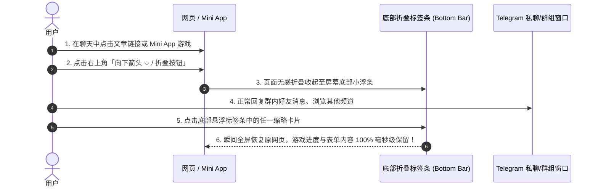
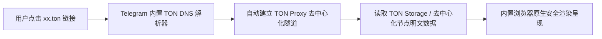

# Telegram 内置多标签浏览器与 Web3 浏览完全指南：多任务折叠、TON Sites 解析与隐私沙盒

随着 Telegram 从单纯的即时通讯工具演进为集成了 Mini App、去中心化 Web3 商业生态的“超级应用平台”，Telegram 官方对**应用内内置浏览器（In-App Browser）**进行了颠覆性的架构重构。

现代 Telegram 内置浏览器不再只是一个简单的内嵌网页查看器，而是支持**多标签页并行切换（Multi-Tab）、小程序与聊天界面的无感折叠收起、原生支持 Web3 去中心化域名（`.ton`）解析，以及具备独立沙盒隔离的隐私防护引擎**。

本文将为你全面拆解内置浏览器的核心特性、多任务并行的操作技巧、Web3 去中心化网站访问机制，以及如何平衡“便捷浏览”与“外部密码管理器自动填充”的配置策略。

---

## 一、现代 Telegram 内置浏览器核心进化全景

```mermaid
graph TD
    A[现代 Telegram 内置浏览器] --> B[多标签页与小程序折叠 (Multi-Tab)]
    A --> C[去中心化 Web3 站点解析 (TON Sites)]
    A --> D[即时预览极速排版 (Instant View)]
    A --> E[安全沙盒与钓鱼拦截 (Security Sandbox)]

    B --> B1[网页与游戏折叠至底部条，聊天/刷推文两不误]
    C --> C1[原生直连 .ton 域名，无需第三方代理插件]
    D --> D1[零广告秒级渲染新闻长文]
    E --> E1[拦截恶意 Intent 劫持，Cookie 独立隔离]
```

### 内置浏览器 vs 外部浏览器（Safari / Chrome）深度对比：

| 评估维度 | Telegram 内置浏览器 | 外部默认浏览器 (Safari / Chrome) |
|:---|:---|:---|
| **多任务切换** | 🟢 **支持随时折叠至底部条**，边聊天边看网页，不丢进度 | 需频繁切换 App，切回后网页经常被系统杀后台重载 |
| **小程序 (Mini App) 联动** | 🟢 **原生融合**，游戏与 Web 页面共享多标签栏 | ❌ 外部浏览器无法直接唤起 Telegram 内部游戏数据 |
| **Web3 / `.ton` 域名解析** | 🟢 **原生开箱即用**，自动走 TON Proxy 通道 | 需在电脑/手机额外配置复杂的 Web3 网关插件 |
| **密码管理器支持** | 🟡 依靠系统底层，部分第三方密码插件无法自动识别弹窗 | 🟢 完美支持 1Password / Bitwarden / iCloud 钥匙串自动填充 |
| **数据与账号隔离** | 🟢 运行在应用专属沙盒内，外部网站无法读取宿主数据 | 共享全局 Cookie 与历史记录 |

---

## 二、多标签页与多任务折叠实操 (Multi-Tab)

以往在群内点击链接或玩 Telegram 小游戏时，如果要回复朋友私聊，必须先关闭网页，下次再进又得重新加载。现在的多任务系统彻底解决了这一痛点：



### 核心实操技巧：
- **一键折叠**：浏览任意网页或小程序时，点击右上角下拉箭头或手势向下滑动，页面会自动缩放并驻留在屏幕底部的灰色标签栏中。
- **多标签管理**：点击底部标签栏，可以查看当前后台打开的所有网页卡片，左右滑动切换，或点击卡片右上角的「×」关闭特定页面。
- **添加书签收藏**：点击右上角菜单按钮 -> 选择 **「添加到书签 (Add to Bookmarks)」**，可在日后随时从个人主页的书签夹中一键唤起常用站点。

---

## 三、原生支持 Web3：如何访问去中心化 TON Sites？

Telegram 是全球首个深度集成 TON 区块链生态的超级平台。其内置浏览器底层原生打通了 **TON DNS 与 TON Proxy** 网络协议：



### 访问 TON 站点步骤：
1. 任何人在群内发送形如 `http://foundation.ton` 或 `http://username.ton` 的链接。
2. 直接轻触链接，Telegram 内置浏览器会**自动识别 `.ton` 域名后缀**，并调用内置的去中心化中继代理完成 DNS 解析与数据抓取。
3. 用户**无需安装任何浏览器扩展或第三方区块链节点客户端**，即可像浏览常规 Web 页面一样浏览去中心化博客、DApp 展示页与加密工具。

---

## 四、即时预览 (Instant View)：极速免广告排版

对于支持 Telegram 即时预览规范的内容平台（如 Medium、Telegraph、主流科技媒体）：
- 链接右侧会附带一个 **「⚡️ 即时预览 (Instant View)」** 按钮。
- 点击后，Telegram 会直接展示由云端预先抓取并格式化完毕的轻量级页面：**去除所有弹窗广告、追踪脚本与冗余排版，秒开纯净文字与高清图集**，并在弱网环境下节省高达 90% 的流量消耗。

---

## 五、浏览器设置与隐私安全管理指南

如果部分用户更习惯使用系统级 Chrome / Safari，或者需要清理浏览数据：

### 5.1 修改默认打开方式
1. 打开 Telegram，进入 `设置 (Settings)`。
2. 进入 `外观 (Appearance)` 或 `数据与存储 (Data and Storage)`。
3. 滑动找到 **「应用内浏览器 (In-App Browser)」**：
   - **开启（推荐）**：点击链接优先在 Telegram 内部多标签打开，保持流畅多任务体验。
   - **关闭**：点击外部链接将直接唤起系统默认浏览器（如 iOS Safari 或 Android Chrome）。

### 5.2 隐私数据与缓存清理
在公用设备或长期使用后，建议定期释放浏览器缓存：
- 在内置浏览器界面点击右上角「设置」图标，或进入 Telegram 存储管理：
  - **清除 Cookies (Clear Cookies)**：退出所有已登录的 Web 网页会话。
  - **清除网页缓存 (Clear Cache)**：释放加载网页图片与视频产生的本地存储空间。
  - **清除历史记录 (Clear History)**：彻底抹除所有访问过的网址痕迹。

::: danger 🚨 钓鱼网页防范警示
许多伪造的虚假空投网站、假冒登录页面会伪装成 Telegram 官方风格。**当内置浏览器顶部出现红色或黄色风险警告横幅时，切勿输入任何手机号、短信验证码或钱包助记词！**
:::

---

## 六、总结

Telegram 内置浏览器将传统的网页浏览提升到了“多任务协同、Web3 去中心化直达”的新高度：
- 日常阅读与娱乐：利用**多标签折叠**享受聊天与摸鱼无缝切换；
- Web3 与跨境业务：利用**原生 `.ton` 域名解析**免插件直连去中心化世界；
- 重度账号登录：必要时通过右上角「在外部浏览器打开」调用系统密码管理器完成安全认证。

---

**相关阅读：**

- [Telegraph 长文排版完全指南](./telegraph.md) — 打造支持即时预览的图文专栏
- [TON 生态与钱包完全指南](./topics/ton/wallet.md) — 畅玩 TON 域名与 Web3 数字资产
- [Telegram Mini App 爆款开发全景](./topics/game/miniapp-dev.md) — 探索小程序与浏览器的原生融合
- [高级隐私保护与反追踪实战](./topics/privacy-advanced.md) — 打造零泄露的安全环境