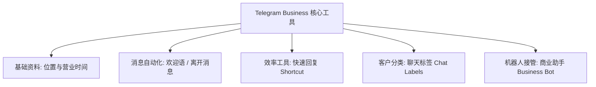
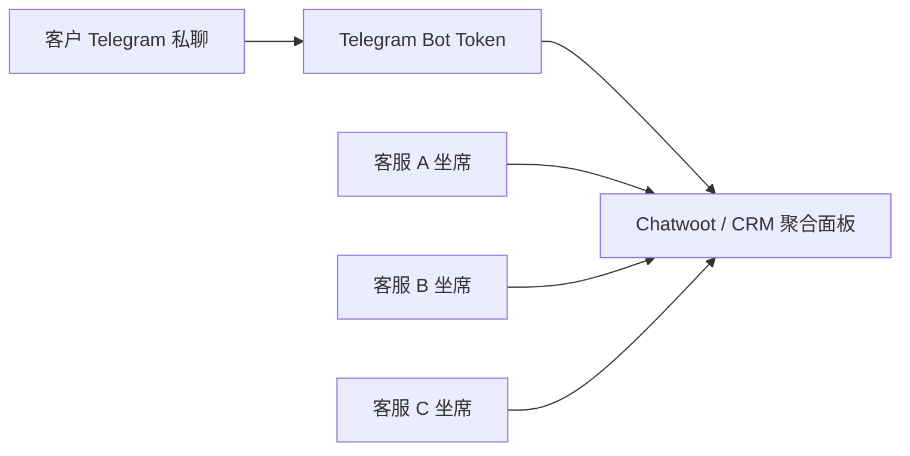

# Telegram 商业版 CRM 客服与团队多坐席聚合系统搭建指南

随着 Telegram 商业生态的爆发，越来越多的商家、独立创作者、出海企业与服务团队将 Telegram 作为核心客户沟通与售后支持阵地。

然而，仅靠单个人的手机或电脑操作，往往面临**消息回复不及时、多客服无法协同、客户缺乏分类标签、账号风险导致客户丢失**等难题。

本文将为你详解 Telegram 官方 [商业版 (Telegram Business)](./business.html) 的内置 CRM 功能、小团队到大企业的客服演进路径、开源聚合客服系统 (Chatwoot) 自建实战以及客户数据管理防封指南。

---

## 一、Telegram Business 官方内置 CRM 功能解析

Telegram 官方推出的商业版功能（Premium 用户免费解锁）为个人与小团队提供了免代码的轻量级 CRM 工具：



### 1. 聊天标签 (Chat Labels)
支持为每个对话添加自定义颜色的彩色标签（例如：🔴 `待付款` / 🟡 `咨询中` / 🟢 `已交割` / 🔵 `售后中`）。
- **使用技巧**：通过标签快速筛选特定客户群体，大幅提升日常跟进效率。

### 2. 快速回复 (Quick Replies)
预设常用的回复模板，并分配快捷斜杠指令（例如 `/price` 自动替换为完整的服务报价单；`/pay` 替换为收款账号与说明）。

### 3. 打招呼与离开消息 (Greeting & Away Messages)
- **打招呼消息**：在客户首次发起私聊或超过 14 天未沟通后，自动触发欢迎词。
- **离开消息**：在非营业时间（自动匹配你设置的工作时间表）或休假期间，自动回复离开说明。

---

## 二、客服系统的三个演进阶段

| 发展阶段 | 适用团队规模 | 核心方案与架构 | 优缺点分析 |
|:---|:---|:---|:---|
| **第一阶段：个人单号商业版** | 1 人个体户 / 独立创作者 | 直接使用个人 Telegram 账号开启 Telegram Business | 成本为 0，简单易用；但无法实现团队多人协同。 |
| **第二阶段：Bot 转发模式** | 2 ~ 3 人小团队 | 基于 Livegram 等 [私聊机器人](./livegram.html) | 将客户私聊转接至 Telegram 管理员群组；操作简陋，缺乏工单系统。 |
| **第三阶段：多坐席 CRM 系统** | 3 人以上专业团队 / 企业 | 对接 Chatwoot / SaleSmartly 等聚合客服系统 | **专业级工单与多客服分发**、知识库自动回复、客户数据集中留存。 |



---

## 三、开源聚合客服系统接入实战：Chatwoot

[Chatwoot](https://www.chatwoot.com/) 是全球最受欢迎的开源免费全渠道客服系统，支持 Docker 自建部署，能够无缝接管 Telegram Bot。

### 3.1 Chatwoot 的核心优势
- **多客服平行响应**：多个客服人员登录同一个 Web 后台，系统自动分配新咨询工单给空闲客服。
- **客户轨迹记录**：记录客户历史对话、邮箱、电话、来源标签与客服内部备注（Private Note）。
- **消息毫秒级透传**：客服在网页端打字回复，系统瞬间以 Telegram 机器人身份发给用户。

### 3.2 极简 Docker Compose 部署配置

在 VPS 服务器上新建 `docker-compose.yml`：

```yaml
version: '3'

services:
  base: &base
    image: chatwoot/chatwoot:latest
    env_file: .env
    volumes:
      - storage:/app/storage

  web:
    <<: *base
    command: bundle exec rails s -p 3000 -b 0.0.0.0
    ports:
      - "3000:3000"

  worker:
    <<: *base
    command: bundle exec sidekiq -C config/sidekiq.yml

volumes:
  storage:
```

### 3.3 对接 Telegram 渠道步骤
1. 打开 Chatwoot 管理员后台 -> 点击 **`Inboxes (收件箱)`** -> **`Add Inbox (添加收件箱)`**。
2. 选择渠道类型为 **`Telegram`**。
3. 输入通过 [@BotFather](https://t.me/BotFather) 申请获得的 **Bot Token**。
4. 系统将自动生成 Webhook 链接并绑定成功！此后所有发送给该机器人的私聊均会在 Chatwoot 工作台中生成工单。

---

## 四、客户数据安全与防封控策略

在运营 Telegram 客服体系时，**客户资产保护与风控防范**至关重要：

1. **避免使用个人号批量主动私聊**：个人号主动私聊陌生人极易触发 `SpamBlock` 封号。客服接待应**引导客户主动向 Bot 发起咨询**。
2. **导出与备份客户数据库**：定期在 CRM 系统中导出客户名单及对应的 Telegram `User ID`，防止单点账号故障导致客户失联。
3. **员工离职权限管控**：通过 Chatwoot 等 CRM 系统，员工离职只需停用其 CRM 账号，客户资料与聊天历史依然完好保存在企业后台，切断客户被员工带走的风险。

---

**相关阅读：**

- [Telegram 商业版深度指南](./business.md) — 官方商业版功能配置
- [私聊机器人搭建教程](./livegram.html) — 极简 Telegram 消息转接方案
- [Bot 开发入门](./topics/bot/bot-dev-guide.md) — Telegram Bot API 交互详解
- [账号安全与 2FA 指南](./2fa.md) — 客服账号安全防护
