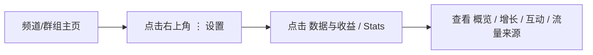
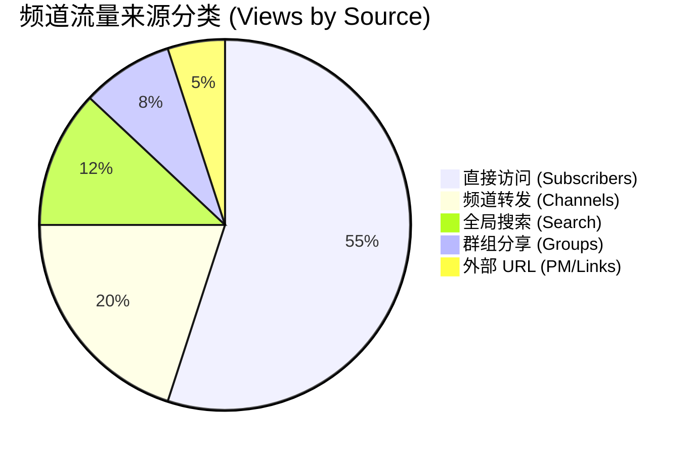

# Telegram 频道与群组数据统计分析、算法推荐与增长指标完全指南

在 Telegram 运营中，许多创作者常常陷入“凭感觉发帖、不知道粉丝从何而来、无法评估广告效果”的困境。Telegram 官方提供了非常强大且直观的**数据统计与分析工具 (Statistics & Boosts)**。

通过精准的数据分析，你可以清晰了解粉丝画像、互动率、内容传播扩散路径、搜索推荐权重，并识别黑产刷量假粉。

本文将为你深度拆解 Telegram 频道与群组的数据统计体系、核心计算公式、算法推荐机制以及第三方专业分析工具。

---

## 一、官方统计功能解锁条件与查看入口

Telegram 官方为了保证图表有效性，对数据统计功能设置了最小阈值：

| 统计类型 | 最低解锁门槛 | 支持的客户端 | 查看入口路径 |
|:---|:---|:---|:---|
| **频道数据统计 (Channel Stats)** | 订阅者人数 **≥ 50 人** | iOS / Android / Desktop / Web | 频道信息页 -> 「⋮」菜单 -> **「数据与收益 (Stats)」** |
| **群组数据统计 (Group Stats)** | 成员人数 **≥ 500 人** | iOS / Android / Desktop / Web | 群组信息页 -> 「⋮」菜单 -> **「统计 (Statistics)」** |



---

## 二、核心数据指标深度拆解与计算公式

### 2.1 概览与增长指标 (Overview & Growth)
- **订阅者趋势 (Followers Graph)**：展示每日新增与流失人数。
- **净增长率 (Net Growth Rate)**：`净增长 = 新增订阅人数 - 退订人数`。如果退订曲线与发布新内容的时间高度重合，说明近期内容质量不符粉丝预期。
- **通知开启率 (Notifications Enabled %)**：**极核心的粉丝粘性指标**。
  - 正常高质量频道开启率通常在 **15% ~ 40%**。
  - 如果开启率低于 **5%**，说明绝大部分粉丝已静音你的频道，转化率极低。

### 2.2 内容传播与互动指标 (Interactions & Posts)
- **单帖平均阅读量 (Mean Views per Post)**：发布后 24 小时内的平均阅读数。
- **互动率 ERR (Engagement Rate by Reach)**：
  $$\text{ERR} = \left( \frac{\text{单帖平均阅读数}}{\text{总订阅者人数}} \right) \times 100\%$$
- **转发数 (Shares)** 与 **表态数 (Reactions)**：评估内容扩散能力的关键。被转发到其他群组或私聊的消息会带来二次裂变流量。

### 2.3 流量来源与语言分布 (Views by Source & Languages)



- **Search (全局搜索)**：粉丝通过 Telegram 顶部搜索框输入关键词搜索进入。
- **Channels / Groups (转发流)**：内容被转发到其他频道/群组带来的引流。
- **URL (外部链接)**：来自网站、社交平台或导航站（如 TGNAV）的点击。

---

## 三、Telegram 搜索与「类似频道」推荐算法

Telegram 官方在频道尾部推出了**「类似频道 (Similar Channels)」**推荐机制，其算法权重主要由以下四大维度决定：

```mermaid
graph TD
    Algorithm[Telegram 推荐算法权重] --> W1[关键词匹配 (Title / Username)]
    Algorithm --> W2[Boost 助推等级 (Boost Level)]
    Algorithm --> W3[粉丝重合度 (Subscriber Overlap)]
    Algorithm --> W4[活跃互动率 ERR & 语言分布]

    W2 --> Out1[Boost 等级越高，同搜索词排名靠前]
    W3 --> Out2[与同类大频道粉丝重合度高，优先获得类似频道推荐]
```

1. **关键词与名称匹配**：频道标题及 `@Username` 含有用户搜索的关键词。
2. **Boost 助推等级**：[Boost 等级](./boost.html) 越高的频道，在全局搜索及类似频道推荐中的排序权重显著提升。
3. **粉丝重合度**：当用户关注了 A 频道，系统会分析同时关注了 A 的其他用户还关注了哪些频道，并将其推荐在底部。
4. **语言与地域归属**：系统根据粉丝客户端的语言设置自动归类频道语言分类。

---

## 四、第三方专业数据分析工具

除了官方内置的 Statistics，在进行广告投放、行业竞品分析或刷量识别时，推荐使用以下权威第三方平台：

### 4.1 Telemetrio (telemetr.io)
- **全球最大索引库**：收录了数百万 Telegram 频道。
- **刷量识别**：自动对异常增长（如 1 小时内暴涨数万印地语/俄语僵尸粉）的频道标记红字警告。
- **历史数据曲线**：查看频道过去几年的粉丝增长与帖子阅读历史。

### 4.2 TGStat (tgstat.com)
- **资深分析平台**：支持全网关键词热度监控、频道排名榜单。
- **广告投后评估**：精确跟踪某条带跟踪参数的消息在各群组转发后的实际转化效果。

---

## 五、数据驱动运营与刷量识别实战策略

### 5.1 如何识别黑产刷量假粉频道？
在寻找 Telegram 频道进行广告合作时，可以通过以下数据特征识别刷量防骗：

| 数据特征 | 真实优质频道 | 刷量假粉频道 |
|:---|:---|:---|
| **阅读量增长曲线** | 随时间平滑增长，发帖后 1-2 小时达到峰值 | 瞬间暴涨数千 Views，随后几小时几乎零增长 |
| **通知开启率** | 15% ~ 40% | 极低（往往 < 1%） |
| **互动/转发比例** | 拥有正常的 Reactions 点赞与转发 | 阅读量极高，但 **零转发、零表态点赞** |
| **粉丝语言与地域** | 与频道定位匹配（如中文频道粉丝语言为 zh-hans）| 混杂大量无头像异国字符账号 |

### 5.2 数据调优运营策略
1. **定位最佳发帖时段**：根据「阅读时间分布图」，在粉丝活跃度最高的时段（如中午 12:00 或晚上 21:00）发布重磅内容。
2. **复盘爆款内容**：每月导出阅读量与转发量 TOP 5 的文章，分析标题吸睛点与题材偏好，形成模版化输出。

---

**相关阅读：**

- [频道运营全攻略](./createchannel.md) — 频道涨粉、引流与管理
- [引流与推广实战指南](./promotion.md) — 搜索 SEO、共享文件夹与导航站收录
- [频道助推 Boost 指南](./boost.md) — 提升 Boost 等级解锁推荐位与自定义外观
- [Stars 星币与变现指南](./stars.md) — 付费内容与频道收益提现
