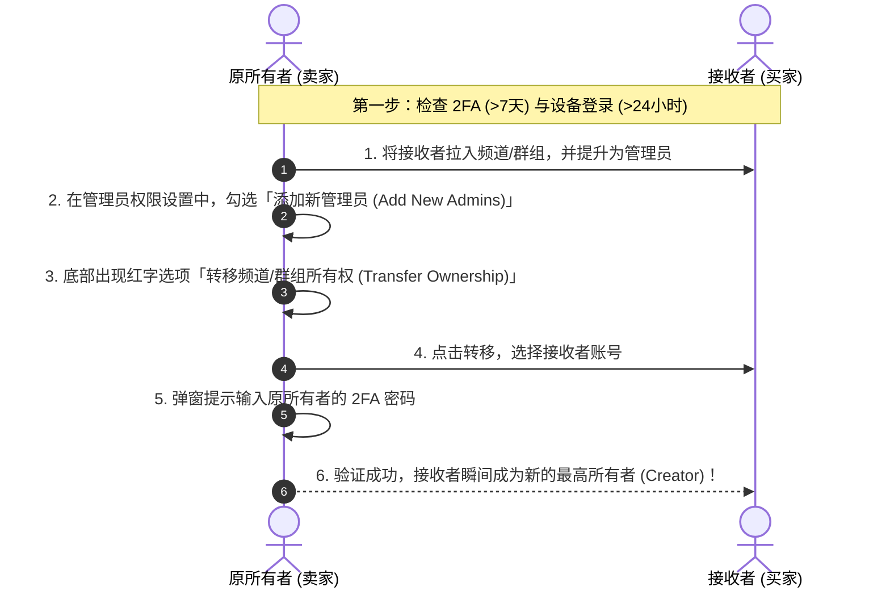

# Telegram 频道与群组所有权转移完全指南：过户规则、2FA限制、安全担保与防骗避坑

在 Telegram 运营中，由于团队人员变更、商业并购、频道交易或账号迁移，经常需要将**频道（Channel）或群组（Group/Supergroup）的最高所有权（Creator / Owner）转移给另一个账号**。

Telegram 官方提供了原生的「所有权转移（Transfer Ownership）」功能，但出于账户安全考虑，设定了非常严格的前置风控门槛。

本文将为你详述频道/群组所有权转移的**硬性条件、图解步骤、关联资产清理清单**以及**交易过户防骗避坑规则**。

---

## 一、什么是所有权转移？与添加管理员有何区别？

```mermaid
graph TD
    subgraph 传统管理员 (Admin)
        A1[发布/删除消息]
        A2[管理成员/禁言]
        A3[修改群组/频道资料]
        A4[⚠️ 随时可被所有者 (Creator) 一键撤销权限]
    end

    subgraph 最高所有者 (Creator / Owner)
        B1[拥有最高不可撤销权限]
        B2[可解散频道/删除群组]
        B3[可添加/撤销所有管理员]
        B4[可将最高所有权永久转让给他人]
    end
```

在 Telegram 中，普通的「管理员权限」无论勾选多少项目，本质上都受制于创建者（Creator）。只有完成**所有权转移**，接收方才会成为新的最高 Creator，原创建者降级为普通管理员或普通成员。

---

## 二、所有权转移的前置硬性条件 (Hard Prerequisites)

为防止盗号者或黑客在窃取账号后瞬间划走高价值的频道/群组资产，Telegram 官方设定了**两个无法绕过的硬性安全门槛**：

| 条件类型 | 官方硬性要求 | 校验失败提示 |
|:---|:---|:---|
| **两步验证 (2FA)** | 你的账号必须开启两步验证密码 **超过 7 天 (168 小时)** | *Two-Step Verification Enabled Less Than 7 Days Ago* |
| **设备会话 (Session)** | 当前发起过户的设备/客户端必须已登录持续 **超过 24 小时** | *Session Used For Less Than 24 Hours* |

::: danger 🚨 必读提示
只要上述任意一个条件未满足，点击过户时系统必定报错并阻止操作。没有例外，也没有任何客服可以人工豁免！
- 如果你刚开启 2FA，请严格等待 **7 天 (168 小时)** 倒计时结束。
- 如果你刚换了新手机或新电脑登录 Telegram，请在**该设备上保持在线 24 小时**后再试。
:::

---

## 三、图解频道与群组过户实操步骤



### 详细操作步骤（以移动端/桌面端为例）：

1. **提升接收者为管理员**：打开频道/群组信息页 -> `管理 (Edit)` -> `管理员 (Administrators)` -> `添加管理员` -> 选择接收者账号。
2. **授予最高权限**：开启所有管理权限，尤其是必须勾选 **「添加新管理员 (Add New Admins)」** 选项。
3. **触发转移入口**：勾选完所有权限后，界面最下方会显示红色的 **「转移频道所有权 (Transfer Ownership)」** 或 **「转移群组所有权 (Transfer Group Ownership)」** 按钮。
4. **确认与密码验证**：点击按钮，系统会弹出二次确认窗口。输入你当前账号的 **两步验证 (2FA) 密码**。
5. **过户完成**：验证通过后，转移瞬间生效！接收者的图标旁将出现代表最高创建者的星号或 Creator 标识。

---

## 四、过户前的全套资产清理检查清单

在完成所有权转移之前，建议双方对关联资产进行全方位清理检查：

- [ ] **关联讨论组 (Discussion Group)**：确认频道绑定的解说群/讨论组是否也需要一并过户。如果频道与群组是绑定的，需分别进行两次过户操作！
- [ ] **机器人管理员 (Bot Admins)**：清理频道/群组内所有现存的机器人管理员，防止旧 Bot 含有自动删除消息或恶意踢人的后端逻辑。
- [ ] ** Fragment 用户名/靓号 (Username NFT)**：如果频道绑定的 `@Username` 是在 [Fragment 平台](./fragment.html) 竞拍的 NFT 靓号，需确认该 Username 是否随频道一并转让。如果是，还需在 Fragment 上完成 NFT 的 Web3 钱包转移。
- [ ] **Telegram Stars 与广告收益 (Monetization)**：检查频道内的 [Telegram Stars 星币收益](./stars.html) 余额及广告分成，确认未提取的收益归属。

---

## 五、交易过户防骗与安全规则 (Anti-Scam Guide)

在 Telegram 频道/群组交易中，私下交易存在极高的被诈骗风险。

```mermaid
graph TD
    A[频道/群组交易风险点] --> B[假中介 / 假担保群]
    A --> C[伪造转账截图]
    A --> D[过户后恶心举报申诉]
    
    B --> B1[校验担保人的真实 @Username 与 User ID，切勿相信搜索出来的假冒账号]
    C --> C1[加密货币 (USDT/TON) 需以链上 TXID 实际到账为准]
    D --> D1[建议通过官方 Fragment 或权威中介平台交易]
```

### 5 大防骗黄金法则：

1. **警惕假中介/假担保骗局**：骗子常伪造名人的 Telegram 账号（使用高度相似的字符，如用字母 `l` 替换数字 `1`），建立虚假的担保群。**务必通过 User ID 校验中介真实身份**。
2. **必须以实际链上到账为准**：任何形式的转账截图、短信通知均可伪造。必须在区块链浏览器上查到 USDT / TON 交易哈希 (TXID) 并确认 6 个区块确认后，再点击确认转移所有权。
3. **过户后立即删除旧管理员**：新的 Creator 在拿到所有权后，应立即进入管理员列表，清理所有旧的管理员和不必要的 Bot，重新配置安全权限。
4. **不要借出账号登录验证码**：任何索要短信验证码、二维码扫码或要求在未知网页输入的行为均为盗号钓鱼行为。
5. **推荐官方 Fragment Username 交易**：对于高价值的频道用户名，推荐直接在 [Fragment.com](./fragment.html) 进行官方 NFT 竞拍挂牌交易，安全性最高。

---

## 六、常见问题排查 (FAQ)

### Q1: 转移按钮是灰色的，或者提示 `Session used for less than 24 hours`？
你的 Telegram 账号在当前手机/电脑上登录的时间未满 24 小时。请保持该设备持续登录，等到满 24 小时后再进行过户操作。

### Q2: 提示 `Two-step verification enabled less than 7 days ago`？
你的两步验证 (2FA) 密码开启时间未满 7 天（或最近修改过 2FA 密码）。系统出于安全保护要求等待满 168 小时，倒计时结束后即可正常过户。

### Q3: 转移所有权后，原群主会被自动踢出群组吗？
不会。转移所有权后，原群主会自动降级为普通的「管理员」或「成员」。新群主可以自由选择保留或将其移除。

---

**相关阅读：**

- [频道运营全攻略](./createchannel.md) — 频道建群、数据分析与管理
- [创建群组教程](./creategroup.md) — 群组权限管理与群规配置
- [Fragment 交易平台完全指南](./fragment.md) — 靓号与 +888 匿名号 NFT 交易
- [账号安全与 2FA 完全指南](./2fa.md) — 两步验证开启与安全设置
- [账号被盗与钓鱼自救](./hacked.md) — 设备强退与安全抢救
