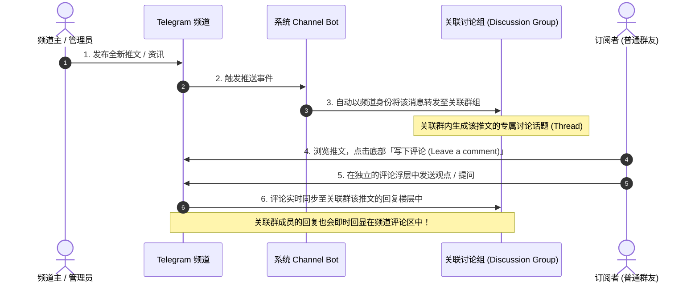
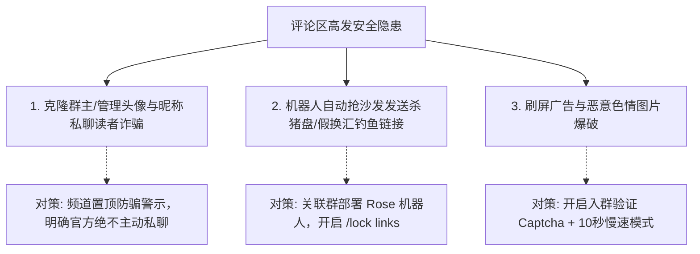

# Telegram 频道开启评论功能完全指南：关联讨论组、双向同步、评论区防骗与高粘性社群打造

在 Telegram 生态中，频道（Channel）是高效的“一对多”广播喇叭，具备极高的信息信噪比；然而，单向广播往往缺乏与读者的即时双向互动。为了解决这一痛点，Telegram 推出了 **频道评论区功能（Channel Comments）**。

通过将一个公开或私密群组绑定为频道的 **「关联讨论组 (Discussion Group)」**，频道发布的每一条新消息下方都会自动出现 **「写下评论 (Leave a comment)」** 按钮。粉丝不仅能针对特定内容展开高密度的精准讨论，更能将公域流量沉淀为高粘性私域社群。

本文将手把手详解频道关联讨论组的完整实操流程、底层双向同步机制、评论区假冒客服与钓鱼链接攻防，以及高净值频道的评论区运营心法。

---

## 一、频道评论区的运作架构与双向同步原理

Telegram 的评论系统并非独立的论坛插件，而是由 **「频道广播」+「关联群组」** 深度协同构建的消息流转系统：



### 核心运作机制：
1. **自动转发锚点**：频道每发布一条新推文，Telegram 系统机器人会自动将该消息复制转发一份到绑定的关联群组中，作为该条推文的“话题锚点 (Thread Root)”。
2. **轻量级浮层阅读**：订阅者在频道内点击「评论」时，并不会强制跳转离开频道，而是在当前界面拉起一个纯净的**子评论楼层（Thread）**，阅读体验丝滑流畅。
3. **双向实时互通**：在关联群中直接回复该条转发推文，回复内容会实时穿透回显至频道该消息的评论列表中；反之亦然。

---

## 二、手把手实操：如何为频道开启评论功能？

### 2.1 绑定关联讨论组的前置条件
- 你必须是频道的 **创建者 (Owner)** 或拥有更改频道信息的 **管理员**。
- 准备一个由你创建的群组（公开群或私密群均可），或者在绑定流程中**直接现场新建一个群组**。

```mermaid
graph TD
    A[打开频道资料页] --> B[点击右上角「编辑 (Edit / ✏️)」]
    B --> C[选择「讨论组 (Discussion)」]
    C --> D{选择现有群组 或 新建群组?}
    D -- 绑定已有群 --> E[选择名下群组并确认授权]
    D -- 新建专属群 --> F[输入群名称，系统自动完成关联]
    E & F --> G[绑定成功！推文下方立即出现「评论」按钮]
```

### 2.2 详细设置步骤（全平台通用）：
1. 打开你的目标频道，点击顶部频道名称进入频道主页。
2. 点击右上角 **「编辑 (Edit / ✏️)」** 按钮。
3. 找到并点击 **「讨论组 (Discussion)」** 设置项。
4. **选择绑定方式**：
   - **关联已有群组**：从列表中选择一个你拥有管理权的群组，点击确认。系统会提示将该群组设为关联讨论区。
   - **创建新群组 (Create New Group)**：如果你希望保持纯净讨论，直接点击「新建群组」，输入群名（例如：`xx频道专属讨论区`），点击保存即可秒级完成创建与绑定。
5. 保存退出。此后频道发布的所有新消息，底部都会自动生成评论区入口。

::: tip 💡 解绑或更换讨论组的影响
如果后续需要更换讨论组：在「讨论组」设置中点击「解绑 (Unlink)」。解绑后，以往推文下的旧评论不会被删除，但会被永久固化在旧群组内；新推文将绑定至新群组重新开始累积讨论。
:::

---

## 三、评论区安全隐患与反诈风控防御 (重中之重)

评论区开启后，频道将从单向净室变为公开互动广场。**高度活跃的评论区是黑产电诈团伙最热衷的捕鱼池**，必须筑牢安全防线：



### 3.1 假冒官方客服/管理员钓鱼
- **套路**：粉丝在评论区留言咨询问题或寻求帮助，骗子立即使用与频道主**一模一样的头像、昵称甚至仿冒的 Bio 简介**，主动发起私聊，诱导受害者交纳“手续费”或授权恶意空投钱包。
- **防御方案**：
  1. 在频道和关联群置顶醒目防诈公告：*“官方管理人员绝不会在任何情况下主动发起私聊！”*。
  2. 启用 [以频道身份在群组发言](./speakaschannel.md)，日常在评论区互动时统一使用带官方认证标识的频道身份回复，形成权威识别标志。

### 3.2 部署自动化群管机器人（防广告与杀垃圾）
因为评论内容实际上是发送在关联群组中的，所以**所有针对群组的防护机器人对评论区同样 100% 生效**：
1. **添加群管机器人**：将 [@MissRose_bot](https://t.me/MissRose_bot) 邀请进关联讨论组并授予管理员权限。
2. **封锁链接与违禁词**：
   - 发送 `/lock links`：禁止普通群友在评论区发送外链，直接扼杀 99% 的黑灰产引流链接。
   - 发送 `/lock url`、`/lock spam`：过滤推广广告。
3. **开启入群验证码 (Captcha)**：
   - 参考 [群组验证机器人教程](./topics/bot/verify.md)，开启进群点按钮验证，阻断自动化机器人账号批量进群灌水。
4. **配合慢速模式 (Slow Mode)**：
   - 依据 [群组慢速模式完全指南](./slowmode.md)，在讨论组中开启 10 秒或 30 秒发言冷却，防止恶意程序瞬时刷屏数百条。

---

## 四、自媒体高粘性增长：评论区运营实战三法则

优秀的自媒体与内容创作者，善于将评论区转化为忠实铁粉的裂变加速器：

1. **正文末尾抛出开放性议题 (Call to Action)**：
   - 避免发布冷冰冰的单向通报。在文章结尾留一个思考题或话题讨论：“你更看好 A 还是 B？欢迎在评论区留下你的看法”，调动粉丝留言积极性。
2. **作者亲自下场点赞与深度互动**：
   - 频道主在推文发出后的前 15 分钟，积极回复前排优质留言。作者的回复不仅能激励粉丝继续生产优质内容，更会让读者感受到强烈的尊重与认同感。
3. **精选评论反哺频道正文**：
   - 定期挑选评论区中的高赞观点、深度行业见解或搞笑神评，截图整理成第二天的频道推文，形成“读者共创”的内容良性闭环。

---

## 五、常见问题 (FAQ)

### Q1: 能否只对某一篇文章关闭评论区？
**原生暂不支持单篇精准关闭。** 只要频道绑定了讨论组，所有推文都会默认显示评论按钮。如果你发布了一条重要的赞助商广告或敏感声明，不想被评论：
- 可以在发布后，**前往关联讨论组中，将自动转发过来的那条对应消息直接删除**。删掉讨论组内的锚点消息后，频道推文底部的评论按钮将失效或无法展开新楼层。

### Q2: 频道内有 10 万订阅者，关联讨论组的人数上限是多少？
Telegram 超级群组的人数上限为 **20 万人**。由于很多读者只在频道内点开评论浮层发言，并不会主动加入关联讨论组，因此即使频道数十万粉丝，关联讨论组的容量也完全充裕。

---

**相关阅读：**

- [创建频道从零到一全攻略](./createchannel.md) — 频道搭建、定位与公网靓号抢注
- [以频道身份在群组发言完全指南](./speakaschannel.md) — 匿名马甲与官方身份回复
- [群组慢速模式完全指南](./slowmode.md) — 限制发言频率，守护评论区秩序
- [Telegram 常见骗术与防诈自救](./scam.md) — 识别克隆账号与仿冒客服套路
