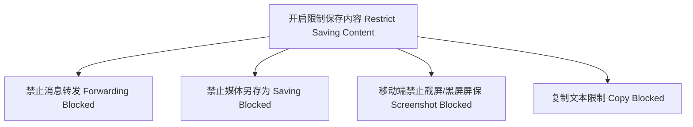

# Telegram 频道与群组防搬运与数字版权保护 (DRM) 实战指南

在 Telegram 上运营知识付费群组、原创自媒体、数字艺术或独家资源频道时，很多创作者都会遇到最头疼的问题——**内容被无成本搬运与偷盗**。黑产团伙常利用自动监听机器人（Userbot）或爬虫，将付费频道的内容实时同步复制到盗版群组中二次牟利。

由于 Telegram 采用去中心化架构且无自动版权比对系统，保护数字资产的责任完全落在了运营者肩上。本文将从**官方限制**、**隐蔽追溯水印**、**反爬虫对抗**以及**DMCA 法律下架投诉**四个维度，为你构建一套完整的 Telegram 数字版权保护（DRM）防御体系。

---

## 一、官方原生防防护设置 (Native Protection)

 Telegram 官方提供了一套基础但有效的“禁止保存内容”功能。



### 1.1 开启「限制保存内容 (Restrict Saving Content)」
- **配置路径**：
  - **频道**：进入频道 -> 点击顶部名称 -> 编辑 -> **「频道类型 (Channel Type)」** -> 开启 **「限制保存内容 (Restrict saving content)」**。
  - **群组**：进入群组 -> 编辑 -> **「群组类型 (Group Type)」** -> 开启 **「限制保存内容 (Restrict saving content)」**。
- **生效防护**：
  1. **禁止转发**：订阅者无法将你的消息、图片、视频转发给其他任何人或群组。
  2. **禁止媒体另存为**：鼠标右键或长按媒体时，不显示“保存到相册”或“另存为”按钮。
  3. **手机端禁截屏**：在 Android 手机上截屏会弹框提示“由于系统安全政策，无法截屏”；在 iOS 上截屏导出的图片将呈一片黑屏。

::: tip 💡 原生防护的局限性
开启限制保存能阻断 90% 的普通小白用户搬运。但正如我们在 [受限资源提取指南](./topics/resource/download-tools.html) 中分析过的，技术人员仍可通过网页端缓存解析或 API 抓取。因此必须结合下文的隐蔽水印与追溯手段。
:::

### 1.2 专属动态邀请链接 (One-Time Invite Links)
为了防止内鬼把私密群组的加入链接直接公开传播：
- 在「邀请链接」管理中，开启 **「需要管理员审核 (Request Admin Approval)」**。
- 为每一个付费会员生成**专属且有使用次数限制（Limit=1）**的独立邀请链接。
- 当发现某条链接进来的账号有异常搬运行为时，可以精确回溯是哪一位会员泄露了链接并予以封禁。

---

## 二、进阶追溯：明暗水印与隐形标记技术

哪怕搬运者通过摄像机偷拍屏幕或使用底层抓包工具下载了文件，只要我们在内容中嵌入了**个人独占水印**，就能精准定位泄露源头并彻底关停其权限。

### 2.1 文本零宽字符水印 (Zero-Width Unicode Watermark)
这是目前防护付费文案、电子书、独家研报最强的技术之一。

- **原理**：Unicode 字符集中包含一些肉眼完全不可见的控制字符（如 `\u200B` 零宽空格、`\u200C` 零宽不连字）。
- **应用场景**：在向不同会员发送文案时，将该会员的 Telegram `User ID` 编码为二进制，并以零宽字符的形式隐蔽嵌入在段落文字的空格或句号之间。
- **追溯效果**：即便搬运者直接复制纯文本粘贴到他自己的频道里，你只需将盗版文本复制出来放入解析脚本中，就能**瞬间解码出该文案是由哪个 Telegram 用户 ID 泄露出去的**。

```python
# Python 示例：将 User ID 隐藏注入文本中
def embed_watermark(text, user_id):
    binary_id = bin(int(user_id))[2:]
    # 0 映射为零宽空格 \u200b，1 映射为零宽不连字 \u200c
    zero_width = ''.join(['\u200b' if bit == '0' else '\u200c' for bit in binary_id])
    # 插入在文本第一个句号后面
    return text.replace('。', '。' + zero_width, 1)

def extract_watermark(watermarked_text):
    import re
    # 提取隐藏的零宽字符
    zero_width = ''.join(re.findall(r'[\u200b\u200c]', watermarked_text))
    binary_id = ''.join(['0' if char == '\u200b' else '1' for char in zero_width])
    return int(binary_id, 2) if binary_id else None
```

### 2.2 视频/图片频域暗水印 (Invisible Frequency-Domain Watermark)
对于独家视频课程或图片：
- **明水印**：在视频中央或四角加上带个人 ID 的动态漂移文字（如 `仅供 用户:12345 观摩`），增加盗版者人工剪辑抹除的成本。
- **暗水印（盲水印）**：使用傅里叶变换 (DFT) 或离散余弦变换 (DCT)，将版权标识隐藏在图像的高频色彩频域中。
  - **特点**：图像看起来没有任何异常，即使搬运者对图片进行了截取、缩放、压缩甚至加滤镜，使用解密算法依然能重新还原出隐藏在像素底层的版权证明。

---

## 三、反爬虫与自动化抓取对抗

偷盗内容者通常使用基于 Telethon/Pyrogram 框架的机器人脚本在线监听你的频道。针对这类 Userbot，可以使用以下反制手段：

### 3.1 蜜罐陷阱消息 (Honeypot Defense)
- **机制**：爬虫脚本的逻辑通常是“一旦监听到 `NewMessage` 事件，就自动转发或调用 `download_media`”。
- **操作**：
  1. 在频道中定期静默发送一条带有**特殊追踪标记或诱饵 Payload** 的测试消息。
  2. 如果某个账号在消息发布的 100 毫秒内瞬间读取并触发了转发或解析行为，系统机器人（Bot）即可将其判定为自动化爬虫 Userbot。
  3. 自动调取 API 将该账号从频道中移除并拉黑。

### 3.2 分块切割与延迟发布 (Segmented Release)
- 将核心技术文件压缩打包，并使用密码加密（密码不要直接发在频道里，可以通过 Bot 一对一向验证过的真实用户发放）。
- 视频课程分块发布，避免单大文件一次性被脚本全部拖走。

---

## 四、法律与官方维权下架 (DMCA & Take-Down)

如果你的原创内容已经被盗发到了别人的公开频道或 Telegram 盗版群中，可以通过官方合规渠道强制要求 Telegram 删除对方的侵权违规内容。

### 4.1 官方 DMCA 版权投诉流程
Telegram 严格遵守国际《数字千年版权法案》(DMCA)。

- **官方投诉邮箱**：`dmca@telegram.org`
- **处理范围**：公开频道 (Public Channels)、公开群组 (Public Groups) 中的侵权资源。

### 4.2 英文 DMCA 投诉邮件标准模板

```text
To: dmca@telegram.org
Subject: DMCA Copyright Infringement Notice - [Your Brand/Channel Name]

Dear Telegram Copyright Team,

I am writing to issue a formal Notice of Copyright Infringement under the Digital Millennium Copyright Act (DMCA).

1. Identification of the Copyrighted Work:
I am the copyright owner of the original content/course entitled "[作品名称/课程名称]".
Original Source/Proof of Ownership: [填入你的官方网站、Telegram 频道链接或版权登记凭证]

2. Infringing Material to be Removed:
The following unauthorized Telegram channel/messages are distributing my copyrighted work without permission:
- Infringing Channel URL: https://t.me/pirate_channel_name
- Infringing Message Links: 
  https://t.me/pirate_channel_name/123
  https://t.me/pirate_channel_name/124

3. Contact Information:
- Full Name: [你的真实姓名或公司名称]
- Email: [你的联系邮箱]
- Address: [你的联系地址/公司地址]

4. Good Faith Statement:
I have a good faith belief that the use of the material in the manner complained of is not authorized by the copyright owner, its agent, or the law.

5. Accuracy & Signature Statement:
The information in this notification is accurate, and under penalty of perjury, I am authorized to act on behalf of the copyright owner.

Sincerely,
[你的电子签名/拼音全名]
```

### 4.3 客户端商店投诉通道（封杀盗版频道端游入口）
除了直接邮件联系 Telegram 官方外，如果盗版频道非常猖獗，你还可以向 **Apple App Store** 或 **Google Play Store** 的版权团队举报：
- **Apple 投诉**：通过 Apple Unlawful Content Page 举报 Telegram 频道违规。
- **效果**：一旦苹果核实，Telegram 官方会被迫在 iOS 客户端中直接屏蔽该盗版频道，所有使用 iPhone 的用户打开该频道都会提示：*“This channel cannot be displayed on Telegram apps downloaded from the App Store...”*，从而彻底阻断盗版者的变现转化。

---

## 五、总结与版权防护最佳实践

1. **防范先行**：在创建频道的第一天，就开启 **「限制保存内容」** 并在进群链接上设置管理员审核与一客一码。
2. **文本加水印**：对核心文章、研报使用 **零宽字符编码** 标记，随时保持追溯能力。
3. **维权留凭据**：保存好你的原始创作工程文件（如 PSD、剪辑工程、创作时间戳），以便在发送 DMCA 邮件时能秒级提交官方认可的法律证据。
