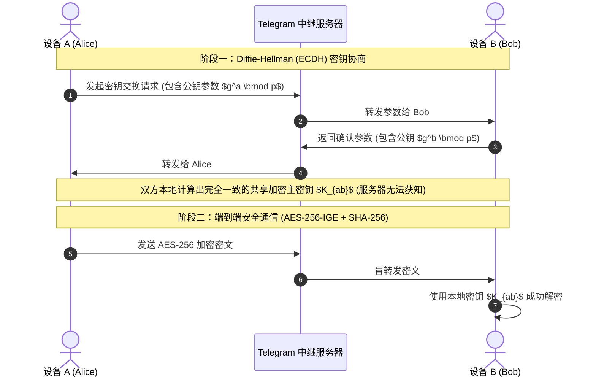
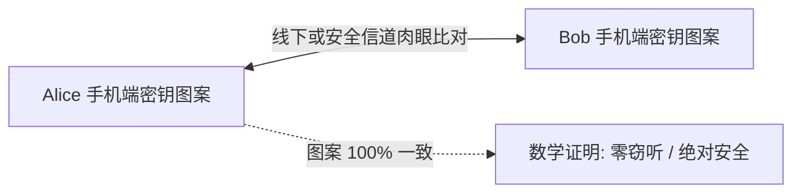

# Telegram 加密对话 (Secret Chat) 与端到端加密完全指南：MTProto 2.0 密码学、阅后即焚与隐私防线

在即时通讯领域，隐私与安全始终是核心焦点。Telegram 采用了独特的**双层加密架构**：绝大多数日常聊天属于**云端加密聊天（Cloud Chat）**，而在需要最高等级隐私防护的敏感场景下，Telegram 提供了基于**端到端加密（End-to-End Encryption, E2EE）的私密对话（Secret Chat）**。

本文将从密码学底层机制（MTProto 2.0、Diffie-Hellman 密钥交换、PFS 完美前向保密）、多平台实操入口、阅后即焚与防截屏技巧，到客观的安全局限性分析，为你提供专业、权威的端到端加密完全指南。

---

## 一、云端聊天 vs 端到端加密对话：架构全景对比

理解 Telegram 的安全体系，首先需要厘清普通「云端聊天」与「端到端加密对话」的本质区别：

```mermaid
graph TD
    subgraph 默认云端聊天 (Cloud Chat)
        A1[设备 A (发送方)] -->|Client-to-Server TLS/MTProto| Server[Telegram 云端分布式数据中心]
        Server -->|Server-to-Client TLS/MTProto| B1[设备 B (接收方)]
        Server -.->|密文分散存储在多个司法管辖区| Storage[(分布式云存储)]
    end

    subgraph 端到端私密对话 (Secret Chat)
        A2[设备 A (发送方)] ===|端到端高强度密钥直接加密 (E2EE)| B2[设备 B (接收方)]
        Server2[Telegram 路由服务器] -.->|仅中继加密数据包，无法解密| Relay[中继节点 (零知识)]
    end
```

### 深度维度对比表：

| 评估维度 | 默认云端聊天 (Cloud Chat) | 加密对话 (Secret Chat) |
|:---|:---|:---|
| **加密方式** | 客户端-服务器加密（Client-Server） | **端到端加密（Client-Client E2EE）** |
| **密钥存放位置** | 密钥分片分散存储在不同国家的数据中心 | **仅保存在发起方与接收方的两台物理设备中** |
| **服务器可见性** | 服务器负责同步与索引（用于多端同步） | **服务器充当盲中继，完全无法解密明文** |
| **多设备跨端同步** | ✅ 完美支持（手机/电脑/平板实时漫游） | ❌ **不支持**（仅限发起对话的两台原始设备）|
| **消息转发 (Forward)** | ✅ 支持 | ❌ **严格禁止** |
| **消息自毁 (TTL)** | 需手动设置全局定时删除 | ✅ **原生支持精准到秒的「阅后即焚」** |
| **支持平台** | 全平台（iOS / Android / Desktop / Web） | **iOS / Android / macOS 原生端**（Windows/Linux 暂不支持）|

---

## 二、MTProto 2.0 底层密码学原理拆解

Telegram 的加密对话并非采用业界通用的 Signal 协议，而是由数学家 Nikolai Durov 博士专门自主设计的 **MTProto 2.0 协议**。



### 1. 256 位对称加密与 AES-IGE 模式
- **算法核心**：使用 **AES-256** 加密算法，搭配特殊的 **IGE (Infinite Garble Extension)** 分组密码模式。
- **完整性校验**：结合 **SHA-256** 哈希校验（Message Authentication Code），确保数据包在传输过程中哪怕 1 比特被篡改都会被接收端直接丢弃。

### 2. 完美前向保密 (Perfect Forward Secrecy, PFS)
为了防止未来某一时刻设备被物理攻陷而导致历史聊天记录全部被破解，Telegram Secret Chat 引入了 **PFS 密钥自动轮换机制**：
- 聊天双方的会话密钥会在**每传输 100 条消息**或**使用时间满 7 天**时自动销毁并重新协商生成新密钥。
- 即使攻击者获取了当前时刻的密钥，也绝对无法解密过去的旧消息或未来的新消息。

---

## 三、加密对话开启与安全验证实操

### 3.1 开启加密对话步骤
1. 打开 Telegram 移动端（iOS / Android）或 macOS 原生端。
2. 进入目标联系人的个人资料页面。
3. 点击 **「更多 (More / ⋮ / …)」** 按钮。
4. 选择 **「开始加密对话 (Start Secret Chat)」**。
5. 等待对方设备上线建立密钥握手，聊天标题变绿并附带一把小锁图标即表示建立成功。

### 3.2 验证加密密钥图像（防范中间人攻击 MITM）
为了 100% 确认通信链路没有被恶意第三方或恶意中继节点监听，你可以验证可视化密钥：

1. 点击加密对话顶部的对方头像，进入聊天设置页。
2. 点击 **「加密密钥 (Encryption Key)」**。
3. 界面会呈现一张由数十个独特图案组成的**可视化色块图**以及对应的文本指纹。
4. **线下当面比对**或通过其他可信渠道（如电话）比对两台手机上的图案：**如果双方图案完全一致，则从数学上绝对保证该对话未受任何中间人窃听！**



---

## 四、高级隐私功能：阅后即焚与截屏防范

### 4.1 阅后即焚自毁计时器 (Self-Destruct Timer)
- **触发逻辑**：在输入框时钟图标处设置时间（支持 1 秒至 1 周）。
- **倒计时起点**：倒计时从**对方在屏幕上亲眼看到该消息（打上两个勾 ✅✅）的瞬间**开始计时。
- **彻底粉碎**：倒计时归零后，消息会从双方手机的内存和磁盘数据库中彻底抹除，不留碎片。

### 4.2 截屏提醒与防截屏机制
- **Android 端**：Telegram 会启用系统级 `FLAG_SECURE` 安全标记，**直接在系统底层拦截截屏行为**（截屏时提示“由于安全策略无法捕获屏幕”）。
- **iOS 端**：由于 Apple 系统的沙盒限制无法直接禁止截屏，但只要对方按下截屏键，Telegram 会立刻在对话框内发送醒目的系统提示：*“XX took a screenshot!”*。

::: danger ⚠️ 现实世界物理防御提示
没有任何软件能阻止对方使用另一台手机、相机拍摄屏幕，或使用视频采集卡翻录。涉及极其敏感的绝密信息，仍需建立在对交流对象的现实信任基础之上。
:::

---

## 五、加密对话的局限性与使用边界 (FAQ)

### Q1: 为什么 Windows / Linux 官方桌面端不支持加密对话？
因为桌面操作系统的本地文件系统通常缺乏移动端（iOS Secure Enclave / Android KeyStore）级别的硬件级安全隔离区，Telegram 官方为了防止密聊记录在桌面端被本地木马直接读取，在大部分桌面客户端中限制了端到端密聊功能（macOS 原生 Swift 客户端除外）。

### Q2: 切换手机或卸载重装后，加密对话还在吗？
**不在。** 端到端加密密钥存储在手机本地硬件安全区内。退出账号、卸载应用或更换新手机都会导致本地密钥销毁，原有的加密对话将永久消失且无法从云端恢复。

---

**相关阅读：**

- [账号安全与 2FA 完全指南](./2fa.md) — 开启两步验证保护账号主权
- [高级隐私保护指南](./topics/privacy-advanced.md) — 匿名号码、反追踪与身份隔离
- [账号被盗紧急自救指南](./hacked.md) — 强退异常设备与会话重置
- [Telegram 隐藏技巧大全](./power-tips.md) — 30+ 效率与隐私实用秘技
