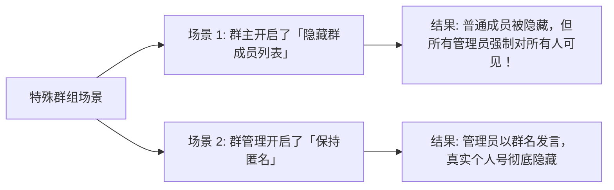
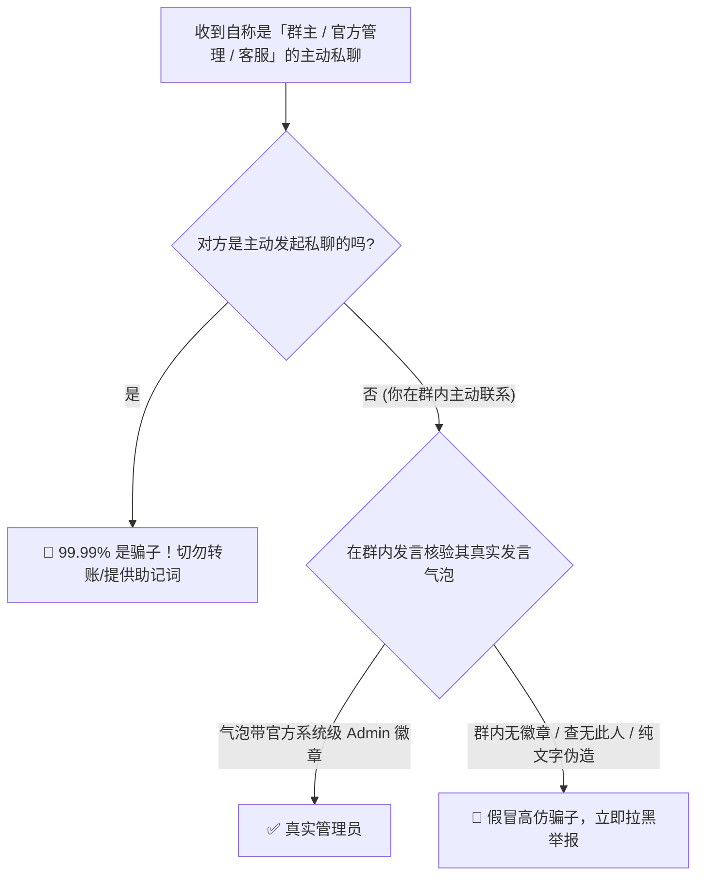

# Telegram 群组管理员与群主查看完全指南：官方标识识别、匿名管理反查与假冒骗局防范

在加入 Telegram 群组后，无论是寻求客服支持、举报群内违规广告、洽谈商务合作，还是遭受误封进行申诉，快速准确地**找到真实的群主（Owner / 创建者）与管理员（Admin）** 是一项必备的基本功。

更重要的是，在区块链、跨境电商及各类技术交流群中，**“李鬼冒充李逵”——高仿管理员头像与昵称私聊实施诈骗** 是发生率最高的黑产套路之一。

本文将手把手为你解析全平台客户端查找群主与管理的有效方法、隐藏群成员与匿名管理机制背后的逻辑，并提供 100% 识破高仿骗子的安全核验铁律。

---

## 一、官方权威标识：如何从视觉上辨别真管理？

在 Telegram 官方客户端中，系统通过底层的权限标记对群主与管理员进行了严格的防伪设计：

```mermaid
graph TD
    User[群内发言成员] --> Check{是否有系统级管理标识?}
    
    Check -- 拥有金星 ★ 或皇冠 👑 --> Owner[群组创建者 / 群主 (Creator)]
    Check -- 拥有银星 ★ 或自定义文本头衔 --> Admin[群管理员 (Administrator)]
    Check -- 头像昵称为当前群组名且带 Group Admin --> Anon[开启了「保持匿名」的群管理]
    Check -- 名字右侧无任何系统标识 (哪怕个人简介写着Admin) --> Normal[普通群员 或 仿冒高仿骗子 🚨]
```

### 1. 官方头衔与徽章特征
- **创建者徽章 (Creator)**：通常在消息昵称右侧带有 **金色星标（★）** 或文字标注 `创建者 / Owner`。
- **管理员徽章 (Admin)**：带有 **星标（★）** 或管理员在后台设置的 **自定义专属头衔（Custom Title）**，例如 `Admin`、`Mod`、`Tech Support`、`社区运营`。
- **不可伪造性**：这个系统头衔是由 Telegram 客户端在消息气泡上方**原生渲染的蓝色/灰色系统标签**，普通群成员在修改自己的昵称或简介时，**绝对无法生成该原生徽章**！

---

## 二、全平台客户端查找管理员的 4 种有效方法

### 方法一：查看群成员列表（官方最推荐）
在绝大多数正常群组中，群主与管理员会优先固定置顶在群成员列表的最上方：

1. **移动端 (iOS / Android)**：
   - 点击群组顶部栏进入「群组信息资料页」。
   - 在下方的成员列表中，排在最前面的几位成员，其名字右侧会明确附带 **`创建者 (Owner)`** 或 **`管理员 (Admin)`** 标识。
   - **iOS 快速筛选技巧**：在群资料页向上轻拉展开成员列表，点击右上角搜索框，列表上方会自动出现 **「管理员」** 分类过滤标签，点击即可只列出全部管理人员。
2. **桌面端 (Windows / macOS / Desktop)**：
   - 点击群组顶部标题打开右侧面板 -> 点击 **「成员 (Members)」**。
   - 成员名字右侧带有 **蓝色/灰色小五角星（★）** 的成员即为管理员，带有特殊皇冠或创建者标签的即为群主。

### 方法二：在群内呼叫管理机器人 (`@admin` / `/report`)
很多中大型群组部署了官方认可的群管机器人（如 [Miss Rose](./topics/bot/rose.html) 或 [Combot](./topics/bot/combot.html)）：
- 在群内直接发送消息：`@admin 违规举报描述` 或 `/report` 回复某条违规消息。
- 机器人会自动在后台静默向**全体在职管理员**推送警报与违规消息链接，无需你逐个私聊寻找。

::: caution ⚠️ 慎用群内 @admin
部分未配置反滥用机器人的小群，随意发送 `@admin` 可能会打扰到所有离线管理的手机推送，容易被警告甚至禁言。建议优先查阅成员列表。
:::

---

## 三、特殊场景：隐藏成员列表与匿名管理怎么找？

随着 Telegram 隐私功能的演进，部分大型群组开启了高级隐私权限，导致常规方法失效：



### 场景 1：群组开启了「隐藏群成员列表 (Hide Members)」
- **规则**：超过 100 人的超级群组可以开启隐藏成员功能。开启后，普通成员看不到互不认识的普通群友。
- **管理员能看到吗？**：**能！** Telegram 官方机制明确规定：**隐藏成员列表时，所有管理员与群主依然公开展示在列表中**。因此，开启该功能的群，你反而能更一眼看清谁是管理！

### 场景 2：群管理开启了「保持匿名 (Remain Anonymous)」
- **规则**：群主或管理员开启匿名后，其在群内发出的所有消息，头像和名字都会**直接显示为当前群组的名称**，且带有 `Group Admin` 标记。
- **应对方案**：此时你无法从客户端表面获取该管理员背后的真实个人账号。如果需要联系官方，请直接在群内回复该匿名消息留言，或查看群简介中是否有预留的「官方客服 Bot / 官方联络号」。

---

## 四、安全铁律：防范假冒管理员私聊钓鱼诈骗 (极度重要)

在 Telegram 各类群组中，**假冒管理员私聊** 是造成财产损失最惨烈的黑产手段。请务必牢记以下防骗铁律：



### 识别假冒骗子的 3 个破绽：
1. **破绽一：绝对不要看简介 (Bio)**：
   - 骗子最喜欢在自己的个人简介里写：`Official Admin of XX Group`、`唯一官方客服`。**简介是任何人都能随意填写的文字，毫无公信力！**
2. **破绽二：用户名形近字障眼法**：
   - 真实群主用户名：`@alex_manager`
   - 骗子高仿用户名：`@aIex_manager`（将小写 `l` 换成大写 `I`）、`@alex_managerr`、`@alex_manager_bot`。
3. **破绽三：主动私聊索要资金或账号权限**：
   - 真正的官方管理员**永远不会**在私聊中向你索要：
     - 钱包助记词 / 私钥
     - 登录短信验证码 / 两步验证 2FA 密码
     - 任何形式的“先验资”、“转账解冻费”或“退款押金”。

::: danger 🚨 黄金核验准则
当你对私聊你的所谓“管理”产生怀疑时，**最安全的核实方法是：在公开群组内发送消息并要求该管理员在群内公开回复你一句**。只要他在群内发言带有原生 Admin 徽章，才是真管理；不敢在公开大群露面的，100% 为电诈骗子！
:::

---

## 五、总结

在 Telegram 中查找群主和管理员，不仅是为了日常沟通，更是保障个人账号与数字资产安全的关键防线。

- **查管理**：认准系统原生蓝灰色徽章与置顶列表，善用 `@admin` 机器人报警。
- **防骗子**：**“官方绝不主动私聊、群内公开回复验明真身”**，时刻对私聊的“假客服”保持零信任警惕。

---

**相关阅读：**

- [Telegram 群组管理完全指南](./managegroup.md) — 权限分配、管理架构与秩序维护
- [以频道身份在群组发言完全指南](./speakaschannel.md) — 匿名马甲与官方身份回复
- [Telegram 常见骗术与防诈自救](./scam.md) — 揭秘克隆账号、假冒客服与钓鱼机器人
- [账号安全与 2FA 完全指南](./2fa.md) — 保护账号免遭黑客窃取