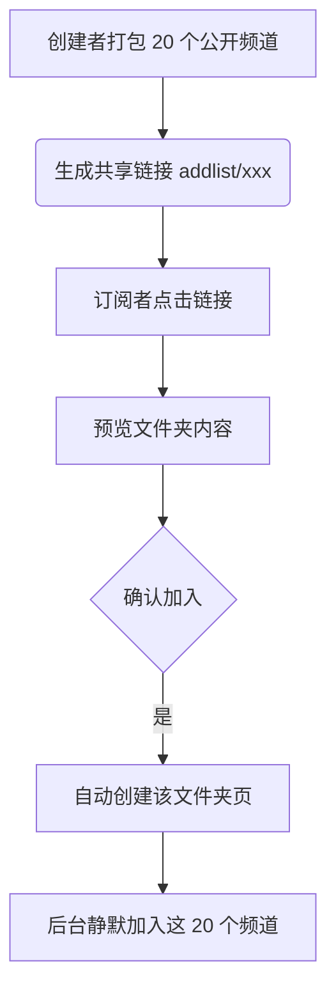

# Telegram 聊天分组与共享文件夹 (Shareable Chat Folders) 深度应用

随着加入的群组和订阅的频道越来越多，Telegram 默认的主聊天列表（All Chats）很容易被海量信息淹没，导致重要消息被漏掉。为了解决信息过载问题，Telegram 推出了 **聊天文件夹 (Chat Folders)** 功能。

除了个人分类整理外，官方还支持 **共享文件夹 (Shareable Chat Folders)**，你可以把一系列群组/频道打包成一个链接一键分享给他人。本文将深度解析聊天分组的配置、共享文件夹的工作机制以及高频实战技巧。

---

## 一、聊天文件夹基础规则与限制对比

聊天文件夹允许你根据“对话类型”（如群组、频道、私聊、机器人）或“指定对话”将聊天列表划分为不同的标签页。

| 维度限制 | 普通版用户 (Free) | Premium 会员用户 |
| :--- | :--- | :--- |
| **可创建文件夹上限** | 10 个 | **30 个** |
| **单个文件夹内对话数**| 100 个 | **200 个** |
| **文件夹内置顶对话数**| 无限制 (全置顶) | **无限制 (全置顶)** |
| **共享文件夹链接数量**| 最多创建 3 个共享链接 | **最多创建 100 个共享链接** |
| **加入他人共享文件夹**| 最多加入 2 个共享文件夹 | **最多加入 25 个共享文件夹** |

::: tip 💡 置顶冷知识
在 Telegram 主对话列表中，普通用户最多只能置顶 5 个对话。但在**聊天文件夹内部，你可以置顶无限个对话**。合理利用文件夹可以绕过主列表的置顶限制！
:::

---

## 二、如何创建与配置聊天文件夹

### 2.1 快捷开启路径
- **移动端**：长按底部「聊天 (Chats)」图标，或进入「设置 (Settings)」->「聊天文件夹 (Chat Folders)」。
- **电脑端**：左上角三短线菜单 ->「设置 (Settings)」->「聊天文件夹 (Chat Folders)」。
- **一键直达链接**：在任意客户端内点击或发送并打开：[tg://settings/folders](tg://settings/folders)

### 2.2 高级过滤器 (Included & Excluded)
创建一个高效文件夹的核心在于合理运用**“包含 (Included Chats)”**与**“排除 (Excluded Chats)”**规则。

```markdown
新建文件夹推荐逻辑：
- 文件夹名称：【工作群组】
  ├─ 包含的聊天 (Included)：选择“群组 (Groups)”类型
  └─ 排除的聊天 (Excluded)：勾选“已读 (Read)”、“静音 (Muted)”、“已归档 (Archived)”
  （效果：该文件夹只会显示有“未读且开启了通知”的工作群组，看完即消失，实现“零件夹”管理法）
```

- **包含类型**：个人私聊、非联系人、群组、频道、机器人。
- **排除状态**：
  - **已静音 (Muted)**：排除所有免打扰的群或频道。
  - **已阅读 (Read)**：只看未读消息。
  - **已归档 (Archived)**：被丢进归档文件夹的对话不在此分组显示。

---

## 三、进阶：共享文件夹 (Shareable Chat Folders)

共享文件夹是 Telegram 团队协作和资源分享的神器。你可以创建一个名为“TON 生态研究”或“必备软件推荐”的文件夹，把几十个相关的公开频道和群组塞进去，生成一个类似 `https://t.me/addlist/xxxx` 的专属邀请链接。



### 3.1 哪些内容可以被分享？
为了保护隐私，共享文件夹内**只能包含**：
- 公开的频道 (Public Channels)
- 公开的群组 (Public Groups)
- 你拥有管理员邀请权限的私有群组/频道

❌ **绝对无法包含**：个人私聊、普通机器人、无管理权限的私密群组。

### 3.2 动态同步更新机制（核心优势）
共享文件夹最强大的一点是支持**动态同步**：
- 当创建者在自己的“共享文件夹”中**新增**了 2 个新频道，或者**删除**了 1 个旧频道时，系统会提示“是否更新共享链接”。
- 确认更新后，所有曾经通过该链接添加过此文件夹的订阅者，都会在客户端收到系统通知，提示他们一键同步新增或移除对应的频道。这非常适合做资源列表的长期维护更新。

---

## 四、多端快捷键与手势操作技巧

### 4.1 移动端手势
- **快速切换**：在聊天列表界面，**左右滑动**可以快速在不同的文件夹标签页之间切换。
- **长按管理**：在标签栏长按某个文件夹的名字，可以快速调出菜单进行“编辑”、“重新排序”或“删除”操作（删除文件夹不会退群或删除聊天记录，只是删除了这个分类框）。

### 4.2 电脑端快捷键
在桌面客户端中，使用快捷键切换文件夹能极大提升效率：

- **Windows / Linux Desktop**：
  - `Ctrl + 1` 到 `Ctrl + 9`：切换到第 1 至第 9 个文件夹。
  - `Ctrl + 0`：切换到“所有聊天 (All Chats)”列表。
- **macOS 原生客户端**：
  - `Command + 1` 到 `Command + 9`：切换对应的文件夹。
  - `Command + 0`：切换回主聊天列表。
  - 右键拖动文件夹标签，可以调整它们的上下/左右排列顺序。