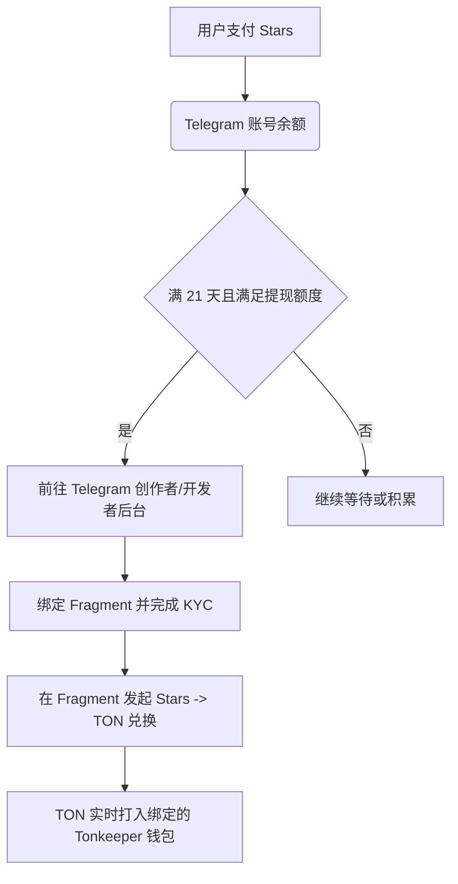

# Fragment 交易平台完全指南：从靓号交易到 Stars 提现

**Fragment** (https://fragment.com) 是 Telegram 官方推出的基于 **TON 智能合约** 的去中心化资产交易平台。在这里，Telegram 的核心资源（如**用户名/靓号**、**+888虚拟匿名手机号**、**广告合作**等）被转化为区块链上的 **NFT（非同质化代币）** 资产进行自由交易。同时，它也是开发者将 **Telegram Stars（星币）** 提现为 TON 代币的唯一官方通道。

本文将为您深度解析 Fragment 的主要功能、KYC 实名认证规范、连接钱包与竞拍实操，以及 Stars 提现步骤。

---

## 一、Fragment 平台五大核心功能

### 1.1 用户名 (Usernames) 拍卖与交易
在 Telegram 中，稀有或简短的用户名（如 4-5 位字母）是非常宝贵的资源。
- **所有权变更为 NFT**：一旦用户名在 Fragment 上被拍卖，它将变成 TON 链上的一枚 NFT。这意味着你对该用户名拥有绝对的所有权，即使你的 Telegram 账号被注销，用户名 NFT 依然保存在你的区块链钱包中。
- **多用户名绑定**：通过 Fragment 获得用户名后，你可以将其绑定到你的个人账号、群组或频道上。一个实体（如一个频道）可以同时绑定并启用多个公开的用户名。
- **发布售卖**：你可以将自己名下闲置的用户名挂在 Fragment 上进行“公开拍卖 (Auction)”或“直接出售 (Buy Now)”。

### 1.2 +888 匿名号码 (Anonymous Numbers)
- **免 SIM 卡登录**：为了彻底摆脱实体 SIM 卡可能面临的隐私泄露及漫游限制，Telegram 联合 TON 推出了以 `+888` 开头的匿名虚拟号码。
- **运作机制**：+888 号码以 NFT 形式存在于你的钱包里。它没有实体卡，无法接收常规的移动电话或普通短信。但在登录 Telegram 时，验证码可以通过绑定的 TON 钱包（如 Tonkeeper）进行 Web3 签名解密，或在已登录的 Telegram 设备上直接接收。
- **资产价值**：早期出厂的 +888 号码最低只需 9 TON，目前在二级市场上，部分靓号（如连号、顺子号）身价已翻了数十倍。

### 1.3 优惠购买与赠送 Premium (Telegram Premium)
在 Fragment 上，你可以直接使用 TON 购买或向他人赠送 Telegram Premium 会员。
- **价格优势**：由于省去了 Apple App Store (iOS) 和 Google Play Store (Android) 的 30% 平台抽税，在 Fragment 上使用 TON 购买 Premium 通常比在手机端直充**便宜 20% - 30%**。
- **赠送机制**：只需输入对方的 Telegram 用户名，选择 3 个月、6 个月或 12 个月的额度，支付 TON 即可瞬间赠送给好友。

### 1.4 广告主自助投放 (Telegram Ads)
- **按 CPM 投放**：广告商可以使用 TON 代币在 Fragment 平台自助创建和投放 Telegram 频道广告。
- **收益分成**：广告展示所产生的收益，其中 **50%** 将通过 TON 直接分配给对应的频道所有者，实现自媒体变现。

### 1.5 开发者 Stars (星币) 提现
如果你是 Telegram Mini App（小程序）开发者、Bot 开发者或频道主，并且赚取了 Telegram Stars（星币），Fragment 是你唯一的合规变现渠道。
- 开发者可以通过将 Stars 转换为 TON，再通过交易所兑换为法定货币。

---

## 二、关键前置：Sumsub KYC 实名认证

根据监管与反洗钱（AML）要求，**目前在使用 Fragment 平台的大部分交易功能前，必须完成身份认证（KYC）**。

- **服务商**：由国际合规服务商 Sumsub 提供。
- **认证级别**：
  1. **基本认证**：通常要求提交身份证、护照或驾驶证照片，并进行人脸活体检测。
  2. **高级认证**：对于大额交易或高频账户，可能需要提供居住地址证明（水断电费账单或银行流水）。
- **受限地区**：受法律限制，部分国家和地区的居民可能无法通过 KYC，或无法使用 Fragment 的交易和提现服务。

::: important ⚠️ 注意
请确保你提交的身份信息真实有效，且用于实名的个人身份与你绑定的 Telegram 账号所绑定的手机号国区尽量保持逻辑一致，以避免触发二次风控。
:::

---

## 三、连接钱包与交易实操指南

### 3.1 准备工具
1. **TON 钱包**：推荐使用官方推荐的 **Tonkeeper**（支持 iOS、Android 和 Chrome 插件）。
2. **TON 代币**：从主流加密货币交易所（如 OKX、Binance 等）购买 TON，并提币到你的 Tonkeeper 钱包地址中作为交易本金与 Gas 费（矿工费）。

### 3.2 绑定账户
1. 访问官方网站 [Fragment](https://fragment.com/)。
2. **连接 Telegram**：点击网页右上角的 **Connect Telegram**，输入你的手机号，在 Telegram 官方服务号中确认授权登录。
3. **连接 TON 钱包**：点击 **Connect TON**，网页会显示二维码。使用手机上的 Tonkeeper 扫码并确认授权。

### 3.3 参与竞拍与购买步骤
1. **浏览商品**：在 Fragment 首页搜索你想购买的用户名（如 `mycoolname`）或前往「Numbers」板块挑选 +888 匿名号。
2. **检查状态**：
   - **On Auction (拍卖中)**：显示当前最高出价（Current Bid）和剩余时间。你可以点击 **Place a bid** 出价。
   - **For Sale (直售)**：标明了固定售价（Buy Now Price），你可以直接一口价买下。
3. **支付交易**：
   - 点击竞拍或购买后，网页会拉起 Tonkeeper 钱包的扫码支付界面。
   - 确认支付金额和 Gas 费，在手机上输入钱包密码确认。
4. **竞拍期退款**：如果你参与了竞拍，但在截止时间前被其他人加价超越（Outbid），你的竞拍本金将**自动原路退回**到你的钱包中。
5. **资产接收**：交易成功后，对应的用户名 NFT 或 +888 号码 NFT 将安全存入你的 Tonkeeper 钱包中。你可以在 Telegram 客户端的设置中看到并启用它们。

---

## 四、核心变现：Telegram Stars (星币) 提现至 TON

若你是开发者或创作者，并且在后台积累了 Stars，可以按照以下步骤提现。

### 4.1 提现规则与周期
- **保留期 (Holding Period)**：用户打赏或支付的 Stars 必须在你的账户中保留 **21 天** 后，才能申请提取。
- **费率与磨损**：提现时，Telegram 会扣除一定的运营维护费和链上 Gas 费，具体磨损率会根据 TON 的网络拥堵和实时币价有所浮动。

### 4.2 提现步骤
1. **进入创作者/开发者后台**：
   - **频道主**：进入「频道设置」->「统计与收益」->「Stars」。
   - **小程序/Bot 开发者**：进入 [@BotFather](https://t.me/BotFather)，选择对应的 Bot，进入「Bot Settings」->「Payments」->「Stars Revenue」。
2. **关联 Fragment**：点击 **Withdraw (提现)** 按钮，系统会指引你跳转至 Fragment 并关联你已通过 KYC 认证的钱包。
3. **发起兑换**：输入你想转换的 Stars 数量，在 Fragment 上点击 **Convert to TON**。
4. **钱包查收**：智能合约会自动将 Stars 销毁，并将等值的 TON 币发送到你的 Tonkeeper 钱包中。

---

## 五、Fragment 安全防范指南

1. **防范钓鱼网站**：认准唯一官方域名 `fragment.com`。许多诈骗分子会制作假冒的 Fragment 界面，诱骗用户扫码并授权，从而盗干钱包中的所有资产。
2. **检查 NFT 归属权**：在第三方二级交易平台购买用户名或匿名号时，请确认 NFT 的发行合约是否确实来自 Fragment 官方合约，避免买到假冒的仿制 NFT。
3. **合理保管助记词**：你的用户名和号码都储存在区块链钱包里，丢失钱包助记词（Private Key）意味着永久失去这些资产，Telegram 官方也无法帮你找回。