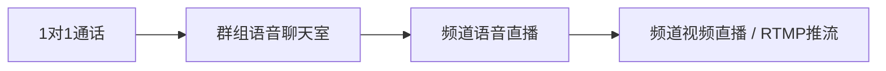

# Telegram 语音聊天室与直播推流完全指南：频道广播、OBS 推流、录制存档与大规模会议

Telegram 的语音聊天室（Voice Chat）与直播推流（Live Stream）功能，让 Telegram 从即时通讯软件跃升为**万人级实时互动平台**。无论是社群周会、线上讲座、AM 广播、播客节目，还是产品发布会，Telegram 都能一站式搞定。

与 [基础视频通话指南](./video-call.md) 不同，本文聚焦于**进阶玩法**：频道级直播、RTMP 专业推流、录音存档、日程预约、举手管理、万人会议等核心功能。

---

## 一、语音聊天室体系总览

Telegram 的实时语音功能分为**四个等级**，覆盖从几人私聊到百万人直播的全场景：

| 类型 | 人数上限 | 适合场景 | 位置 |
|:---|:---:|:---|:---|
| **一对一语音通话** | 2 人 | 好友私聊 | 聊天窗口右上角电话按钮 |
| **群组语音聊天室** | ~30 发言 + 无限旁听 | 社群讨论、家庭群聊 | 群组信息页 → 开始语音聊天 |
| **频道直播（语音）** | 无限听众 | 播客、电台、课程 | 频道信息页 → 开始直播 |
| **频道直播（视频/屏幕）** | 无限观众 | 发布会、直播课、典礼 | 频道信息页 → 开始视频直播 |



::: tip 核心区别
- **群组 Voice Chat**：所有人可自由申请发言（像 Clubhouse）
- **频道 Live Stream**：仅管理员/特邀嘉宾可发言，其余为听众（像传统直播）
:::

---

## 二、群组语音聊天室（Voice Chat）深度指南

### 2.1 发起语音聊天室

**入口：** 打开群组 → 点击群名称/群头像 → 点击「⋮」→ **开始语音聊天（Start Voice Chat）**

**创建时可选：**
- 标题（如「周一工作会议」）
- 是否立即开启（可安排到未来时间）
- 是否启用视频/屏幕共享

### 2.2 发言模式与举手

| 身份 | 加入状态 | 发言方式 |
|:---|:---|:---|
| **创建者** | 默认发言者 | 直接说话 |
| **管理员** | 默认发言者（可配置） | 直接说话 |
| **普通成员** | 默认**旁听者**，麦克风静音 | 点击「举手（Raise Hand）」申请发言 |

**举手流程：**
1. 旁听成员点击底部「✋ 举手」按钮
2. 管理员/创建者界面会弹出举手通知
3. 管理员点击「允许发言」或「拒绝」
4. 成员变为发言者，麦克风自动启用
5. 发言结束后可点击「回到旁听席」

### 2.3 管理员进阶操作

**全员控制：**
- **全员静音（Mute All）**：一键静音所有非管理员发言者
- **允许旁听者自由发言**：关闭举手机制，所有人加入即可说话（适合小群）
- **邀请发言者**：主动邀请群内某成员上麦

**个人管理：**
- 长按/右键某个成员 → **静音**（或移除）
- 设置为**管理员级发言者**（不会被误静音）

### 2.4 屏幕与视频共享

在群组语音聊天室中，可以开启视频或屏幕共享：

| 操作 | 移动端 | 桌面端 |
|:---|:---|:---|
| **开启摄像头** | 点击界面「📹 视频」按钮 | 点击界面「Video」按钮 |
| **共享屏幕** | 点击「🖥️ 共享屏幕」→ 选择屏幕 | 点击「Share Screen」→ 选窗口或全屏 |
| **多人同时视频** | ✅ 最多 30 人同时开视频 | ✅ 最多 30 人同时开视频 |

::: tip 应用场景
- 线上例会：共享 PPT 屏幕 + 语音讲解
- 远程教学：老师摄像头 + 课件窗口共享
- 产品演示：直接共享操作界面给数百位旁听观众
:::

### 2.5 日程预约语音聊天

可以预约**未来的语音聊天**并生成倒计时通知：

1. 发起语音聊天时 → 不选择「立即开始」→ 选「安排到...」
2. 选择日期时间（精确到分钟）
3. 群组会出现一条**倒计时置顶消息**
4. 成员可点击「设置提醒（Set Reminder）」，开始前自动通知
5. 聊天开始前 5 分钟，机器人自动 @全员 提醒

### 2.6 录音与存档

Telegram 支持**将语音聊天录制为视频/音频文件**，自动发布到群组：

**开启方法：**
1. 开始语音聊天后 → 点击「⋮」或「...」
2. 选择 **开始录制（Start Recording）**
3. 选择格式：
   - **视频文件**：含屏幕共享内容，输出为 MP4
   - **音频文件**：仅声音，输出为 OGG
4. 录制状态会在界面左上角显示红点
5. 结束录制 → 文件自动发送到群组聊天

::: warning 录制合规提醒
录制前请确保获得所有参与者同意。部分司法管辖区要求所有参与方知情。
:::

---

## 三、频道直播（Live Stream）—— 万人级广播

当你需要**无上限的听众数量**时，频道直播（Live Stream）是最佳选择。

### 3.1 频道 vs 群组语音的核心差异

| 特性 | 群组语音聊天 | 频道直播 |
|:---|:---|:---|
| **听众上限** | 理论无限（实践 ~1 万） | **完全无上限**（实测百万级） |
| **默认身份** | 成员是旁听者，可举手 | 订阅者是纯观众，完全无发言权限 |
| **发言者来源** | 群成员举手申请 | 管理员指定 + 邀请嘉宾 |
| **录制文件** | 发布到群组 | 发布到频道 |
| **分享链接** | 群内 | 任何外部平台均可 |
| **RTMP 推流** | ❌ 不支持 | ✅ 支持 |

### 3.2 发起频道直播

**入口：** 打开频道 → 点击频道头像 → 点击「⋮」→ **开始直播（Start Live Stream）**

**三种直播模式：**

```
开始直播
    ├── 🎤 语音直播 (Voice) —— 仅音频，类似电台
    ├── 📹 视频直播 (Video) —— 摄像头画面直播
    └── 🖥️ 屏幕共享直播 —— 演示屏幕内容
```

### 3.3 嘉宾管理

频道直播默认只有**管理员**可以发言或开视频，但是你可以**邀请嘉宾**：

1. 直播开始后 → 点击右侧「👥 成员/观众」面板
2. 点击「邀请嘉宾（Invite Speakers）」
3. 可选择三种方式：
   - **从频道成员中邀请**：直接选择某位订阅者
   - **分享嘉宾链接**：生成专属链接，任何人点击即可成为发言者
   - **邀请机器人**：让音乐 Bot、录制 Bot 加入直播

::: tip 嘉宾链接妙用
生成嘉宾链接后发给外部讲师，讲师无需加入频道即可直接作为嘉宾发言——特别适合邀请外部嘉宾做线上分享会。
:::

### 3.4 查看直播数据

直播过程中，管理员可以查看：
- **当前观众数**（实时刷新）
- **峰值观众数**
- **新观众加入速率**
- **观众观看时长分布**
- **直播点赞/反应数**

直播结束后在「频道统计 → 直播」可以看到完整历史数据。

---

## 四、RTMP 专业推流：用 OBS 做专业直播

这是 Telegram 最强大的功能之一——**无需付费直播平台，频道主可以用 OBS/XSplit 等专业软件，通过 RTMP 协议向 Telegram 频道推高清直播流**。

### 4.1 RTMP 是什么？

RTMP（Real-Time Messaging Protocol）是行业标准的直播推流协议，所有专业直播软件（OBS Studio、vMix、XSplit、FFmpeg 等）都原生支持。

Telegram 会为每个频道生成**专属 RTMP 地址 + Stream Key**，将其填入 OBS 即可一键开播。

### 4.2 获取 RTMP 推流密钥

**步骤：**
1. 打开你的 Telegram 频道 → 点击频道名 → 进入频道信息页
2. 点击「⋮」→ **开始直播（Start Live Stream）**
3. 弹出的直播设置窗口中，选择**「使用 RTMP URL 推流（Stream with RTMP URL）」**
4. 系统会生成两段信息：

```
RTMP 服务器地址 (Server URL)：
rtmps://dc4-1.rtmp.t.me/s/

推流密钥 (Stream Key)：
1234567890:xxxxxxxxxxxxxxxxxxxx
```

::: danger 密钥保密
Stream Key 等同于直播权限，**任何人拿到都可以向你的频道推流**，请勿泄露。如不慎泄露，立即在 RTMP 设置页点击「重置密钥（Reset Key）」。
:::

### 4.3 OBS Studio 配置指南

以最流行的 [OBS Studio](https://obsproject.com/)（免费开源）为例：

#### 步骤 1：下载安装 OBS
从官网下载对应平台版本（支持 Windows/macOS/Linux）。

#### 步骤 2：配置推流服务器
1. 打开 OBS → 右下角「设置（Settings）」→ 左侧「推流（Stream）」
2. 服务类型选择 **自定义...（Custom...）**
3. 填入：

| 字段 | 填入内容 |
|:---|:---|
| 服务器 (Server) | Telegram 给出的 RTMP 服务器地址（rtmps://.../s/） |
| 串流密钥 (Stream Key) | Telegram 给出的推流密钥（不要包含空格） |

4. 点击「应用 → 确定」

#### 步骤 3：设置输出参数（建议）

在 OBS 设置 → 「输出（Output）」中建议：

| 参数 | 推荐值 | 说明 |
|:---|:---|:---|
| **视频码率** | 4000 ~ 6000 Kbps | 1080p 推荐 6000，720p 推荐 4000 |
| **编码器** | x264 或硬件编码（NVENC/Apple VT） | 有独显优先硬件编码，CPU 占用低 |
| **音频码率** | 160 Kbps | 语音 128 也可，音乐 192+ |
| **关键帧间隔** | 2 秒（或每秒 60 帧时设为 120） | 直播关键帧间隔，影响观众秒开 |

在「视频（Video）」设置中：

| 参数 | 推荐值 |
|:---|:---|
| 基础（画布）分辨率 | 1920×1080（或 1280×720） |
| 输出（缩放）分辨率 | 同基础 |
| FPS（帧率） | 30 或 60 |

::: tip 低带宽优化
如果上行带宽不足（<5Mbps），建议降到 720p + 3000 Kbps 码率。观众侧 Telegram 会自动自适应，但推流端如果码率超标会卡顿甚至断流。
:::

#### 步骤 4：添加场景与来源
1. OBS 左下角「场景」→ + → 新建场景（如「主场景」）
2. 「来源」→ + → 添加：
   - **显示器捕获**：共享全屏
   - **窗口捕获**：共享单个软件窗口（推荐，避免暴露桌面）
   - **视频捕获设备**：摄像头
   - **音频输入捕获**：麦克风
   - **图像 / 文字**：叠加 Logo、标题

#### 步骤 5：开始推流
1. 回到 Telegram 直播设置页 → 点击「启用直播（Enable Streaming）」
2. 切回 OBS → 右下角点击「开始推流（Start Streaming）」
3. 约 3~10 秒后，Telegram 频道中会出现直播画面
4. OBS 底部会显示实时码率、帧率、丢帧情况

**停止流程：** OBS 点击「停止推流」→ Telegram 点击「结束直播」。

### 4.4 推流故障排查表

| 问题 | 可能原因 | 解决方法 |
|:---|:---|:---|
| OBS 显示「Failed to connect」 | RTMP 地址/密钥错误 | 复制完整地址，检查末尾 `/s/` 不要漏 |
| 画面卡顿/马赛克 | 推流码率超带宽 | 降低码率或降低分辨率 |
| Telegram 端黑屏 | 关键帧间隔太长 | 设为 2 秒 |
| 观众侧有画面无声音 | OBS 音频轨未启用 | 混音器中检查麦克风开启 |
| 直播几分钟后断连 | 网络抖动或 OBS 超时 | 开启自动重连；切换稳定网络 |
| 推流被陌生人占用 | 密钥泄露 | 立即在 Telegram 中「重置密钥」 |

### 4.5 FFmpeg 命令行推流

适合服务器自动推流或定时直播任务：

```bash
# 推流一个 MP4 文件到 Telegram 频道（循环播放）
ffmpeg -re -stream_loop -1 \
  -i "input_video.mp4" \
  -c:v libx264 -preset veryfast -b:v 4000k -maxrate 4500k -bufsize 8000k \
  -g 60 -keyint_min 60 -sc_threshold 0 \
  -c:a aac -b:a 160k -ar 44100 \
  -f flv "rtmps://dc4-1.rtmp.t.me/s/你的密钥"
```

---

## 五、语音聊天 / 直播的 10 种实战应用

### 应用 1：社群例会
- **功能**：群组语音 + 举手 + 录制
- **技巧**：每周固定时间预约，自动提醒；会议结束后录音自动发到群文件归档

### 应用 2：播客 / 电台节目
- **功能**：频道语音直播 + 嘉宾链接 + 录制
- **技巧**：提前预告直播时间；直播时允许听众通过评论区提问；录制后编辑发布为音频永久收听

### 应用 3：线上发布会 / 产品演示
- **功能**：频道视频直播 + RTMP + OBS 多场景切换
- **技巧**：OBS 预设「开场片头 / 产品演示 / Q&A」多个场景，无缝切换；直播后可回看

### 应用 4：远程教学 / 付费课程
- **功能**：群组屏幕共享 + 限制保存内容 + 录制
- **技巧**：搭配「限制保存内容」防止录屏盗课；录制后可付费解锁回看

### 应用 5：问答 / Ask Me Anything (AMA)
- **功能**：频道直播 + 嘉宾链接 + 评论区
- **技巧**：邀请嘉宾加入直播；观众通过评论提问，嘉宾语音回答；主持人控场

### 应用 6：音乐直播 / DJ 打碟
- **功能**：频道语音 + 音乐模式（Music Mode）
- **技巧**：开启音乐模式优化音质；邀请 DJ 作为嘉宾；直播后可放出歌单

### 应用 7：多人线上研讨会 / 圆桌
- **功能**：群组语音 + 30 人同时视频
- **技巧**：管理员提前设置好 3~5 名嘉宾为「永久发言者」；其余观众举手提问

### 应用 8：实时新闻播报
- **功能**：频道直播 + RTMP 专业设备
- **技巧**：突发新闻可立即开播；直播画面插入实时字幕、台标

### 应用 9：虚拟典礼 / 毕业典礼
- **功能**：频道视频直播 + OBS 多摄像头 + 录制
- **技巧**：OBS 叠加主会场、发言人、观众祝福窗口；录制的 MP4 可事后剪辑

### 应用 10：游戏直播
- **功能**：频道直播 + OBS 游戏捕获 + RTMP
- **技巧**：OBS 选择「游戏捕获」来源（性能最高）；叠加摄像头小窗和聊天窗口

---

## 六、直播录音后处理与剪辑

录制完成后，文件会发到群组/频道。你可以下载后做后期处理：

### 6.1 音频处理
- **工具推荐**：Audacity（免费）、Adobe Audition
- **常见处理**：
  - 降噪（De-noise）去除环境杂音
  - 压缩（Compress）平衡音量
  - 均衡器（EQ）提升人声清晰度
  - 剪切无用片段、添加 Intro/Outro 音乐

### 6.2 视频处理
- **工具推荐**：剪映（免费）、DaVinci Resolve（免费版）、Premiere
- **常见处理**：
  - 剪辑直播精华片段
  - 添加字幕（Telegram 支持内挂字幕）
  - 上传到 YouTube/B 站二次分发

### 6.3 自动化发布流程
可以编写 Bot 自动将录音文件：
1. 下载到服务器
2. 调用 ffmpeg 压缩转码
3. 重新上传为「精华版」

---

## 七、管理员安全与最佳实践

### 7.1 直播安全清单
- [ ] RTMP 密钥仅管理员持有，如怀疑泄露立即「重置密钥」
- [ ] 开启「仅管理员可发言」，避免陌生人突然开麦
- [ ] 开启「限制保存内容」防止录屏
- [ ] 直播前 1~2 天预约并设置提醒
- [ ] 开播前做 5 分钟推流测试（OBS 检查画面+声音）
- [ ] 录制前口头告知所有参与者

### 7.2 观众互动技巧
- **配合评论区**：直播画面中可提到「评论区扣 1 听懂了」
- **投票配合**：开播前先发一个投票帖，实时收集观众需求
- **表情反应**：鼓励观众发送 👍 ❤️ 🔥 表情与主播互动
- **Q&A 时段**：直播末尾专门留出 10 分钟问答环节

### 7.3 音质提升小贴士
| 技巧 | 说明 |
|:---|:---|
| 使用外接麦克风 | AirPods 或有线耳麦都比手机内置麦克风好得多 |
| 开启「音乐模式」 | 直播音乐或唱歌时，音质明显提升 |
| 开启「AI 降噪」 | Telegram 客户端有内置降噪开关 |
| 闭麦原则 | 非发言者一律闭麦，避免环境杂音叠加 |

---

## 八、常见问题 FAQ

### Q1：频道直播最多支持多少观众？
**无理论上限。** Telegram 服务器采用全球分布式 CDN，官方曾用单频道直播承载过数千万观众。

### Q2：可以用手机发起直播吗？
可以。手机端直接用频道「开始直播」按钮即可。但**手机端不支持 RTMP 推流**，专业直播需用电脑 OBS。

### Q3：直播会消耗谁的流量？
- 用手机端原生开播：消耗主播（管理员）手机流量
- 用 OBS/RTMP 推流：消耗推流端（电脑/服务器）带宽
- 观众侧：各自消耗下行流量（WiFi 无压力，4G/5G 看 1 小时约 1~3GB）

### Q4：录音文件保存在云端多久？
和所有 Telegram 消息一样，**永久保存在云端**（除非你手动删除或频道解散）。

### Q5：群组语音聊天时，能同时让几百个人说话吗？
技术上最多 **30 人同时开启麦克风**。其余可以旁听，通过举手依次发言。如果是大型会议，建议使用「频道直播」，观众通过评论区或嘉宾邀请轮流发言。

### Q6：加密对话（Secret Chat）支持语音聊天吗？
不支持。语音聊天与直播属于云端会议功能，不在 E2E 加密对话范围内。敏感会议建议后额外说明内容保密规则。

### Q7：OBS 推流延迟大概多少？
RTMP 协议端到端延迟约 **5~15 秒**。对于大多数直播场景完全够用，不适合「抢答式」实时互动。需要低延迟请直接用 Telegram 客户端原生直播（延迟 ~1~3 秒）。

---

## 九、功能对比速查表

| 功能 | 群组 Voice Chat | 频道 Live Stream | RTMP 推流 |
|:---|:---:|:---:|:---:|
| 听众上限 | ~1 万 | 无限 | 无限 |
| 发言者上限 | 30 | 30 | 取决于推流软件 |
| 举手机制 | ✅ | ❌（管理员邀请） | ❌ |
| 预约功能 | ✅ | ✅ | ❌（需 Bot 辅助） |
| 屏幕共享 | ✅ | ✅ | ✅（OBS 内配置） |
| 视频画面 | ✅ 30 路 | ✅ 30 路 | ✅ 任意 |
| 录音/录像 | ✅ | ✅ | ✅（推流端录制也行） |
| 音乐模式 | ✅ | ✅ | ✅ |
| RTMP 专业设备 | ❌ | ✅ | ✅ |
| 外部嘉宾链接 | ✅ | ✅ | ❌ |
| 统计数据 | 基础 | 详细 | 详细 |

---

## 十、进阶学习路径

```
入门 ──► [视频通话基础](./video-call.md) ──► 本文
  │
  ├── 直播运营 ──► [频道运营全攻略](./createchannel.md) ──► 数据分析 + [变现](./monetization.md)
  │
  ├── 工具进阶 ──► OBS 官方教程 + FFmpeg 脚本
  │
  ├── 自动化 ──► [Bot 开发](./topics/bot/bot-dev-guide.md) + [自动化工作流](./topics/automation/automation-guide.md)
  │
  └── 商业化 ──► Stars 打赏 / 付费内容 + [变现指南](./monetization.md)
```

---

## 总结

Telegram 的语音聊天室与直播推流功能，为内容创作者和社群运营者提供了**一套零门槛、零费用、无上限**的实时互动平台。无论是：

- **小团队**：用群组语音做周会，录音自动归档
- **创作者**：用频道直播做播客/课程，事后发布录音
- **专业主播**：用 OBS + RTMP 推高清直播，承载百万观众
- **企业/机构**：做产品发布会、虚拟典礼、线上培训

本文涵盖了从基础发起、OBS 推流配置、录音存档、10 种实战应用、管理最佳实践到 FAQ 的完整体系。建议从「群组语音 + 录制」先上手，熟练后再尝试 RTMP 专业直播。

---

**相关阅读：**

- [视频通话基础指南](./video-call.md) — 一对一通话与基础操作
- [频道运营全攻略](./createchannel.md) — 频道涨粉与数据分析
- [变现完全指南](./monetization.md) — 直播打赏与付费内容
- [Bot 开发入门](./topics/bot/bot-dev-guide.md) — 自动化直播提醒 Bot
- [自动化工作流](./topics/automation/automation-guide.md) — 定时推流与内容发布
- [第三方客户端推荐](./thirdparty.md) — 部分客户端支持额外直播辅助功能