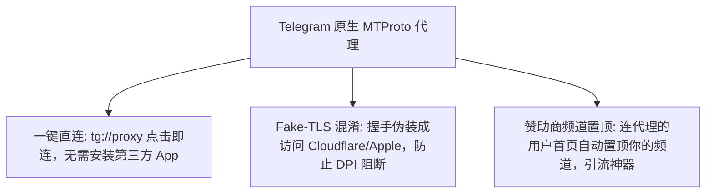
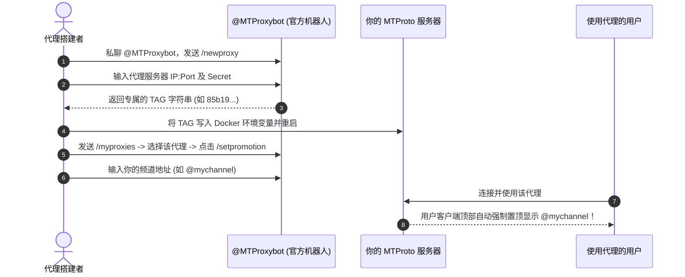

# Telegram MTProto 代理自建进阶：Fake-TLS 混淆、Docker 部署与赞助频道置顶完全指南

在 Telegram 的网络连接方案中，除了使用传统的 SOCKS5 / HTTP 代理之外，Telegram 官方创始人 Nikolai Durov 还专门为 Telegram 客户端设计了原生的 **MTProto 代理协议 (MTProxy)**。

自建 MTProto 代理不仅能获得最原生、最低延时的连接体验，更拥有两大杀手级特性：**使用 Fake-TLS 伪装混淆对抗 DPI 深度包检测**，以及**通过官方 @MTProxybot 在用户客户端会话顶部自动置顶你的赞助商频道 (Promoted Channel)**。

本文将为你详解 MTProto 代理的秘钥结构、Fake-TLS 混淆原理、Docker 容器化部署实战、赞助频道设置与服务器网络调优。

---

## 一、什么是 MTProto 代理？原生三大优势



1. **一键点击即连**：生成的代理链接格式为 `tg://proxy?server=...&port=...&secret=...`，用户在手机或电脑点击即可在 Telegram 内部激活，无需全局 VPN。
2. **Fake-TLS 伪装混淆**：通过在握手阶段伪装成标准的 TLS 1.3 协议，将 MTProto 代理流量伪装成访问知名网站（如 `cloudflare.com`），有效避开 ISP 防火墙的识别与封锁。
3. **赞助商频道置顶 (Promoted Channel)**：所有使用你该代理的用户，其 Telegram 聊天列表最上方会强制显示你指定的频道（带有 `Proxy Sponsor` 标识），带来海量的曝光与增粉流量。

---

## 二、秘钥格式拆解：普通秘钥 vs `ee` Fake-TLS 秘钥

MTProto 代理的安全性与防封能力完全取决于秘钥 (Secret) 的拼接格式：

| 秘钥类型 | 前缀与结构 | 防封混淆能力 | 推荐指数 |
|:---|:---|:---:|:---:|
| **Plain Secret** | `32位十六进制字符串` | 易被识别 | ❌ 不推荐 |
| **Padded Secret (`dd`)** | `dd` + `32位十六进制字符串` | 防止包长度分析 | ⚠️ 一般 |
| **Fake-TLS Secret (`ee`)** | `ee` + `32位十六进制` + `伪装域名 Hex` | 伪装 HTTPS 握手 | 🏆 **强力推荐** |

### 2.1 Fake-TLS 秘钥拼装原理
假设我们生成的 32 位随机 Hex 为 `00112233445566778899aabbccddeeff`，并希望伪装成访问 `cloudflare.com`：
1. 取 `cloudflare.com` 的十六进制编码：`636c6f7564666c6172652e636f6d`。
2. 添加 `ee` 混淆前缀，拼接三者：
   $$\text{Final Secret} = \text{"ee"} + \text{"00112233445566778899aabbccddeeff"} + \text{"636c6f7564666c6172652e636f6d"}$$
3. 拼装后的 60 位字符串即为支持 Fake-TLS 的完整秘钥！

---

## 三、Docker 容器化部署 MTProto 代理（Fake-TLS 实战）

推荐使用高性能、轻量级的 Docker 镜像搭建代理服务器。

### 3.1 生成随机秘钥与伪装域名 Hex
在 Linux 服务器终端执行：

```bash
# 生成 32 位随机 Hex 字符串
secret=$(head -c 16 /dev/urandom | xxd -ps)

# 获取 cloudflare.com 的 Hex 编码
domain_hex=$(echo -n "cloudflare.com" | xxd -ps)

# 拼接带有 ee 前缀的 Fake-TLS 秘钥
full_secret="ee${secret}${domain_hex}"

echo "你的 Fake-TLS 秘钥为: $full_secret"
```

### 3.2 `docker-compose.yml` 部署文件

创建 `docker-compose.yml`：

```yaml
version: '3.3'

services:
  mtproxy:
    image: sergeylyubka/mtproto-proxy:latest
    container_name: mtproto-proxy
    restart: always
    ports:
      - "443:443"
    environment:
      - SECRET=ee00112233445566778899aabbccddeeff636c6f7564666c6172652e636f6d
      # 如果获取到了 @MTProxybot 的 TAG，取消下一行注释并填入
      # - TAG=你的_TAG_字符串
```

启动容器：
```bash
docker-compose up -d
```

---

## 四、绑定 @MTProxybot 开启赞助商频道置顶 (Promoted Channel)

要让连上代理的用户聊天首页顶部置顶显示你的 Telegram 频道，需要绑定官方机器人：



### 绑定步骤小结：
1. 私聊官方机器人 [@MTProxybot](https://t.me/MTProxybot)。
2. 发送 `/newproxy` 指令。
3. 根据提示依次回复你的 `服务器IP:端口`（例如 `1.2.3.4:443`）和你的 `Secret`。
4. 机器人将生成并返回一串属于你的 **`TAG` 标记**。
5. 将 `TAG` 填入 Docker 的 `TAG` 环境变量并重新启动代理。
6. 回到 [@MTProxybot](https://t.me/MTProxybot)，发送 `/myproxies` -> 选择你的代理 -> 选择 **Set promotion** -> 输入你的频道链接（例如 `@tgwiki_cn`）。

---

## 五、服务器网络优化与防封指南

1. **端口推荐使用 `443` 或 `8443`**：将端口设置为常规 HTTPS 默认端口 `443`，伪装效果最好，不易引起异常流量阻断。
2. **开启内核 TCP BBR 加速**：
   ```bash
   echo "net.core.default_qdisc=fq" >> /etc/sysctl.conf
   echo "net.ipv4.tcp_congestion_control=bbr" >> /etc/sysctl.conf
   sysctl -p
   ```
3. **域名伪装 SNI 推荐**：选择连接稳定、全球广为人知的域名，如 `cloudflare.com` / `apple.com` / `microsoft.com` / `azure.com`。

---

## 六、常见问题排查 (FAQ)

### Q1: 客户端连接代理提示 `Ping 9999ms` 或无法连接？
- 检查 VPS 的安全组及防火墙（`ufw` / `iptables`）是否已放行 `443` 端口的 TCP 流量。
- 检查秘钥格式，确认带有 `ee` 前缀且十六进制总长度无遗漏。

### Q2: 连接代理后没有出现赞助置顶频道？
- 确认你已在 Docker 中配置了 `@MTProxybot` 给出的 `TAG` 环境变量并重启了容器。
- 置顶频道显示可能存在几分钟的缓存延迟，尝试在客户端中刷新或重新连接。

---

**相关阅读：**

- [代理配置与内置代理使用](./proxy.md) — 基础 SOCKS5 与内置代理设置
- [引流与推广实战指南](./promotion.md) — 利用赞助频道进行流量获取
- [频道运营全攻略](./createchannel.md) — 频道建群、数据分析与管理
- [高级隐私保护指南](./topics/privacy-advanced.md) — 网络反追踪与安全防护
