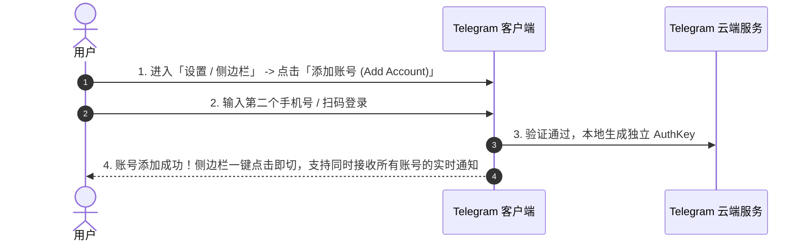
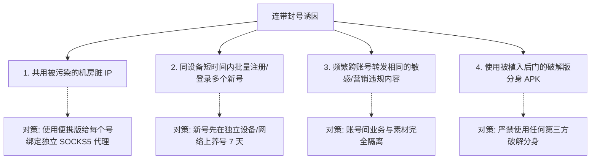

# Telegram 多账号管理与多开完全指南：官方切换、便携版多实例隔离、防关联与设备防封策略

随着 Telegram 逐渐承载工作协同、社群运营、跨境商务以及私人社交等多重角色，在同一台设备上管理多个 Telegram 账号已成为高频刚需。

然而，简单的账号切换如果操作不当，极易引发**通知混乱、数据串号、甚至是因设备/IP 指纹关联导致的“一死全死”连带风控封禁**。

本文将从官方内置切换配额、全平台原生及高级多开方案（Windows Portable 便携隔离、Android 应用分身、iOS 多包共存）、独立代理防关联配置，到多账号安全防封策略，为你提供一份严谨、专业的实操指南。

---

## 一、Telegram 多账号配额与管理方案全景

Telegram 原生支持在单个客户端内同时登录多个账号，无需反复登出：

```mermaid
graph TD
    A[Telegram 多账号需求] --> B[方案一: 客户端内置多账号]
    A --> C[方案二: 系统级应用分身 / 双开]
    A --> D[方案三: 独立便携版 (Portable tdata 隔离)]
    
    B --> B1[免费用户: 3 个账号 / Premium: 6 个账号]
    C --> C1[Android 工作资料 / iOS TestFlight 多包]
    D --> D1[Windows/Mac 多实例运行，独立进程与独立代理]
```

### 多账号登录容量对比表：

| 客户端类型 / 运行模式 | 最大支持账号数 | 进程与数据隔离级别 | 独立代理配置 | 适用场景 |
|:---|:---|:---|:---|:---|
| **官方 App (普通用户)** | 3 个 | 共享客户端缓存与代理 | ❌ 全局共用同一代理 | 日常轻度多账号切换 |
| **官方 App (Premium 会员)** | **6 个** | 共享客户端缓存与代理 | ❌ 全局共用同一代理 | 拥有会员的深度用户 |
| **Windows 便携版 (Portable)** | **无上限 (N开)** | 🟢 **100% 物理隔离 (`tdata`)** | ✅ **每个实例独立代理** | 运营团队 / 跨境电商 / 批量管理 |
| **第三方客户端 (Nagram/Neko)** | 10+ / 无限制 | 进程共享，数据沙盒隔离 | ✅ 支持单号绑定独立代理 | 极客 / 重度极速切换 |

---

## 二、官方原生多账号快速切换实操

在官方客户端中，你可以在不退出当前账号的情况下无缝添加新账号：



### 各平台操作入口：
- **iOS (iPhone/iPad)**：长按右下角 **「设置」** 图标，或进入「设置」-> 点击右上角「编辑」-> 点击 **「添加账号」**。
- **Android**：点击左侧三短线菜单 -> 点击当前用户名旁边的 **下拉箭头 ⌵** -> 点击 **「添加账号」**。
- **Desktop (Windows/Mac)**：点击左上角菜单 -> 点击个人头像旁边的下拉箭头 -> 点击 **「添加账号」**。

::: tip 💡 跨账号统一通知机制
在单客户端内登录多账号时，Telegram 会自动在后台为所有已登录账号保活。当其他非活跃账号收到新私聊或频道推送时，通知栏会明确标注接收账号的名称，点击该通知即可直接跳转至对应账号。
:::

---

## 三、进阶多开实战：实现 100% 物理隔离与独立运行

对于专业运营人员、出海商务或对隐私隔离有极高要求的用户，强烈推荐使用**进程与数据完全隔离的独立多开方案**。

### 3.1 Windows 便携版独立多实例隔离 (最推荐)
Telegram 官方桌面端提供了免安装的 **Portable（便携）版本**。通过复制便携文件夹，可以实现真正意义上的无限多开：

```bash
# 目录结构示例：
D:\Telegram_Work\
  ├── Telegram.exe
  └── tdata\               <-- 存放工作号 A 的登录凭证与缓存

D:\Telegram_Private\
  ├── Telegram.exe
  └── tdata\               <-- 存放私人号 B 的登录凭证与缓存
```

1. 前往 Telegram 官网下载 **Portable version (便携压缩包)**。
2. 将其解压到不同命名的文件夹（如 `TG_Account_01`、`TG_Account_02`）。
3. 分别双击运行各文件夹中的 `Telegram.exe`，每个程序将拥有完全独立的运行窗口、托盘图标与独立的 `tdata` 数据库。
4. **命令行多实例参数**：也可以给桌面快捷方式添加 `-many` 参数，强制允许同目录多开。

### 3.2 macOS 多应用共存方案
macOS 平台原生支持安装多种官方构建版本共存：
1. **App Store 版本**（基于 Swift 开发的 macOS 原生端）。
2. **官网 Direct DMG 版本**（Telegram Desktop Qt 版本）。
3. **PWA 网页应用**：使用 Chrome 或 Safari 将 [Telegram Web K / Web A](./web-k-a.html) 添加为独立独立窗口运行的 PWA 桌面应用。

### 3.3 Android 系统的应用分身与工作空间 (Work Profile)
- **品牌自带应用双开**：小米（应用双开）、华为（应用分身）、三星（安全文件夹 Secure Folder）。
- **Android 企业工作空间 (Shelter / Island)**：利用 Android 系统的 Work Profile 机制克隆一个运行在独立沙盒中的 Telegram，数据与主空间完全隔绝。

---

## 四、核心风控：多账号防关联与防连带封号指南

许多用户在同一设备上登录多个号后，一旦其中一个号被封，其他账号也会在数小时内遭遇“多米诺骨牌式”连带封停。这通常是由于触发了 Telegram 系统的**设备指纹与 IP 关联风控模型**。



### 4.1 独立代理分流 (IP 防关联)
- 在 Windows 便携版或支持单号代理的客户端（如 [Nagram](./nagram.html)）中，为每个账号配置**独立的住宅静态代理或独立 VPS MTProto 代理**。
- 严禁多个账号在同秒内通过同一机房劣质代理高频触发加群或私聊行为。

### 4.2 设备环境指纹隔离
- 避免在 10 分钟内在同一部手机上连续注册 3 个以上新账号。
- 新注册的账号建议在独立网络下保持正常使用（正常聊天、浏览频道）**“养号” 7~14 天**，然后再迁入常用多开环境。

### 4.3 警惕第三方“破解多开版”木马隐患
市面上部分宣称“破解无限多开”的第三方 APK / EXE 客户端，往往在底层篡改了通讯代码，会偷偷截取你的 `session key` 并上传至黑客服务器，甚至在后台利用你的账号群发诈骗广告，最终导致账号永久被封。**多开务必只采用官方便携版或开源可信客户端**。

---

## 五、多账号管理常见问题 (FAQ)

### Q1: 一个手机号可以注册多个 Telegram 账号吗？
**不行。** Telegram 严格遵循「一个有效手机号码 = 一个 Telegram 账号」的原则。若要拥有第二个账号，必须准备另一个实体手机号、[海外 eSIM 卡](./virtual-number.html) 或基于区块链的 [+888 匿名号码](./fragment.html)。

### Q2: 电脑便携版移动到其他电脑上，需要重新接收短信验证码吗？
**不需要。** Windows 便携版的所有登录凭证均加密保存在 `tdata` 文件夹内。只要整包复制到其他电脑上运行，即可保持登录状态直接使用，无需重新验证短信（此特性极方便备份，但也要求用户务必妥善保管好 `tdata` 文件夹防止泄露）。

---

**相关阅读：**

- [虚拟号码与海外卡完全指南](./virtual-number.md) — 注册多账号手机号获取渠道
- [账号防封与申诉完全指南](./banned.md) — 风控解封与合规使用技巧
- [第三方客户端对比与评测](./thirdparty.md) — Nagram、NekoX 多账号特色对比
- [Telegram 双重验证 2FA 完全指南](./2fa.md) — 强化所有多开账号的安全防护
