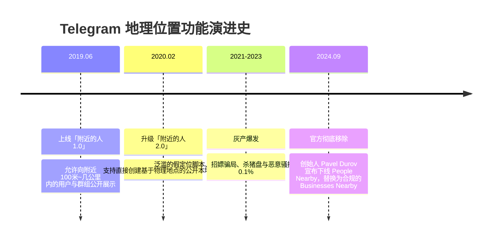
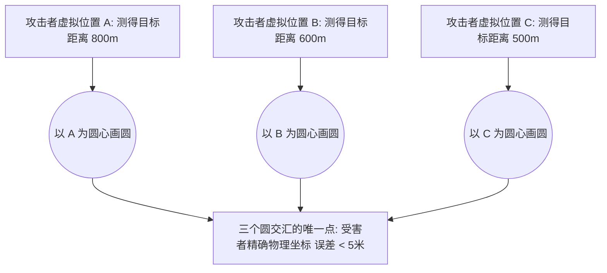
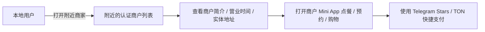

# Telegram“附近的人”下线与“附近商家”全景指南：历史演进、三角定位黑产揭秘与商业版地理引流

在 Telegram 的早期版本中，「附近的人 (People Nearby)」和「附近的群组」曾是一项基于手机 GPS 定位的陌生人社交功能。然而，由于该功能长期沦为灰黑产引流、电信诈骗以及用户真实物理地址泄露的温床，**Telegram 官方已于 10.15.0 版本（2024 年 9 月）正式下线了「附近的人」，并全面升级为合规的「附近的商家 (Businesses Nearby)」**。

本文将为你详解「附近的人」下线的底层原因、黑客利用“三角定位”反查真实住址的安全漏洞、常见骗局套路，以及商家如何利用全新「附近的商家」与 Mini App 获取本地客户。

---

## 一、「附近的人」功能演进与官方下线始末

### 为什么官方必须移除「附近的人」？
1. **真实用户使用率极低**：官方统计显示，该功能的真实正常用户活跃度不足 **0.1%**。
2. **沦为自动化垃圾机器人的温床**：大量诈骗团伙利用 GPS 虚拟定位软件，在各大城市繁华地段批量撒播成百上千个虚假账号，自动群发诈骗信息。
3. **严重的现实人身安全隐患**：通过计算距离偏差，恶意人员可以轻而易举精确定位到用户的**真实居住小区或办公室**。

---

## 二、深度技术揭秘：黑产如何利用「三角定位」反查你的真实住址？

许多用户以为只要不在个人资料里写名字，开启「附近的人」就是匿名的。然而，在密码学与地理信息安全领域，Telegram 早期的距离显示机制存在致命的 **三角测量 (Trilateration) 漏洞**：

### 三角定位破解原理：
1. Telegram 客户端会显示目标距离当前位置多少米（例如：`532 米`）。
2. 攻击者使用 GPS 欺骗工具，分别在三个不同经纬度采集目标账号的距离数据。
3. 将 3 组坐标与距离输入几何解算程序，**三个圆的唯一交点就是受害者的真实物理 GPS 坐标（精度可达 2~5 米）**！
4. 结合卫星地图，攻击者可直接锁定受害者所在的栋号甚至楼层。这也是官方最终痛下决心彻底移除该功能的核心诱因。

---

## 三、「附近的人」历史高发诈骗套路盘点

了解这些套路，能帮助你在其他社交平台或群组中识别类似的骗局：

| 骗局类型 | 典型话术与伪装 | 黑产运作手法 | 危害程度 |
|:---|:---|:---|:---:|
| **虚假招嫖 / 上门服务** | 美女头像、同城定位、低价诱惑 | 诱导下载木马 App、索要“定金/保证金/车费”，随后拉黑 | 🚨 极高（财产损失+隐私敲诈） |
| **同城私下换汇** | “高汇率现金换汇、同城面交” | 诱导先转账给虚拟账户，或安排同伙实施线下抢劫/假币诈骗 | 🚨 极高（资金安全风险） |
| **虚假外卖 / 违禁品交易** | 烟酒代购、虚假电子烟、跑腿代买 | 收取虚拟币或定金后直接失联 | ⚠️ 中等 |
| **杀猪盘交友引流** | “附近偶遇的高管/投资精英” | 建立虚假恋爱信任，诱导进入虚假投资平台炒币刷单 | 🚨 极高（倾家荡产） |

---

## 四、全新替代方案：「附近的商家 (Businesses Nearby)」完全指南

为了取代充满安全隐患的个人定位功能，Telegram 在 [Telegram Business 商业版](./business.html) 中推出了正规合规的 **「附近的商家 (Businesses Nearby)」**。

### 4.1 普通用户如何查找附近合法商户？
1. 进入 Telegram 搜索栏或商业板块。
2. 允许 Telegram 获取一次性大致位置（无需常驻后台定位）。
3. 浏览附近经过企业认证的餐馆、零售店、咖啡厅及服务机构，直接查看产品目录并下单。

### 4.2 实体店商家如何入驻「附近商家」引流？
如果你拥有实体店铺或跨境本地业务：
1. 开启 [Telegram Premium](./premium.html) 并激活 [Telegram Business 商业功能](./business.html)。
2. 进入 `设置` -> `Telegram 商业版` -> **`位置 (Location)`**：
   - 准确填写店铺的物理地址或在地图上拾取坐标。
   - 填写 **`营业时间 (Opening Hours)`**（如 09:00 - 22:00）。
3. 配置 [商业快速回复](./business-crm.html) 与自动欢迎语。
4. 关联店铺的 [Telegram Mini App](./topics/game/miniapp-dev.html) 电子商城，实现顾客进店即看菜单、即时咨询与星币（Stars）收款。

---

## 五、Telegram 地理位置隐私安全防御指南

为了确保个人定位隐私绝对不被窥探，建议立即检查以下设置：

### 1. 严格管控手机系统级定位权限
- **iOS (iPhone)**：进入 `系统设置` -> `隐私与安全性` -> `定位服务` -> `Telegram` -> 勾选 **「永不 (Never)」** 或 **「使用 App 期间」**，并**关闭「精确位置 (Precise Location)」**。
- **Android**：进入 `系统设置` -> `应用管理` -> `Telegram` -> `权限` -> 将位置权限设置为 **「仅在使用中允许」** 并关闭高精度定位。

### 2. 谨慎使用实时位置共享 (Live Location)
在私聊或群组中向好友发送定位时：
- 如非必要，只发送**静态固定位置**，避免开启长达数小时的「实时动态位置 (Live Location)」。
- 随时在聊天窗口顶部点击红条「停止共享位置」。

---

## 六、总结

Telegram 下线「附近的人」并转向「附近商家」，标志着 Telegram 正式告别了早期野蛮粗放的陌生人交友模式，迈向更加合规、安全与商业化的 Web3 生态。

对于普通用户，**无需再寻找任何“开启附近的人”的偏门插件（99% 为恶意木马）**；对于商户而言，充分利用「附近商家」与 Mini App 才是抢占本地流量的正确路径。

---

**相关阅读：**

- [Telegram 商业版 (Business) 深度指南](./business.md) — 位置、营业时间与客户管理
- [商业客服 CRM 与多坐席系统搭建](./business-crm.md) — 团队客服协同与自动流转
- [高级隐私与反追踪完全指南](./topics/privacy-advanced.md) — 零数据泄露的安全配置
- [Telegram 常见诈骗手段与防骗指南](./scam.md) — 识别社工与钓鱼套路