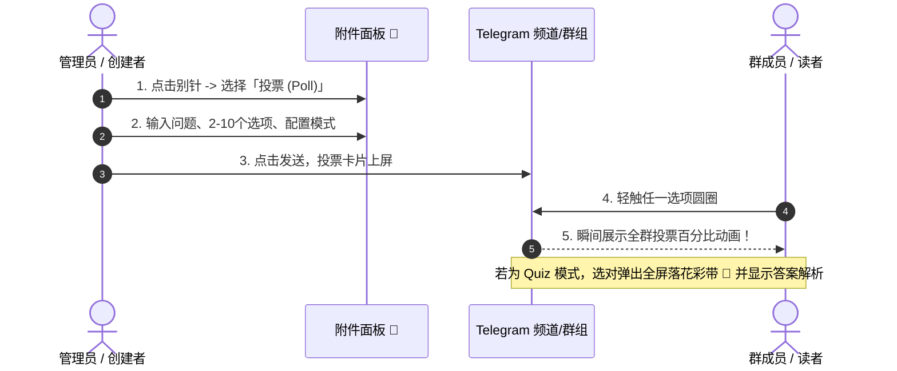
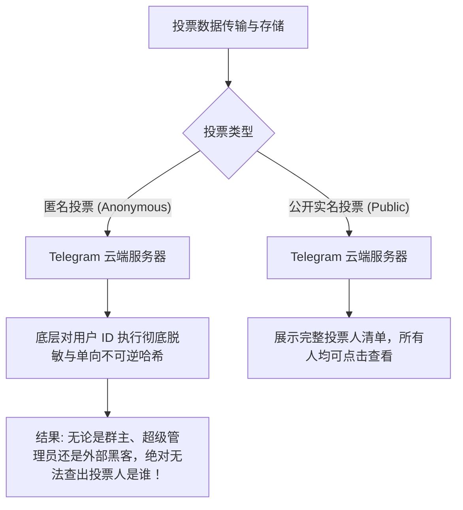

# Telegram 投票 (Poll) 与互动测验 (Quiz) 完全指南：匿名表决、多选调研、答题竞猜与社群促活实战

在社群运营与频道内容分发中，单向发送长篇大论往往很难激起读者的发言欲望。而 Telegram 官方原生集成的 **投票功能（Polls）与小测验模式（Quiz Mode）**，凭借“**零操作门槛（点击即参与）、多端实时同步、数据百分比动态渲染**”的特点，成为提升群组活跃度与用户粘性的最强催化剂。

据统计，在频道或群组推文中加入投票，其**互动转化率通常是纯文字推文的 5 到 10 倍**。

本文将由浅入深解析 Telegram 投票的三大核心模式、匿名与实名的隐私边界、Quiz 答题彩带与解释弹窗的高阶玩法、结合 Bot API 自动化监听开发，以及自媒体作者的促活心法。

---

## 一、Telegram 投票系统的三大核心模式全景

```mermaid
graph TD
    A[Telegram 投票系统] --> B[模式一: 标准投票 (Regular Poll)]
    A --> C[模式二: 多项选择 (Multiple Answers)]
    A --> D[模式三: 小测验模式 (Quiz Mode)]

    B --> B1[单选机制 / 表达明确态度]
    B --> B2[支持随时长按「撤回投票 (Retract Vote)」]
    
    C --> C1[允许多选 / 需求与偏好广泛调研]
    
    D --> D1[单选且有唯一「标准答案」]
    D --> D2[选择即锁定，不可撤销]
    D --> D3[选对触发落花彩带特效 🎉 / 附带 200 字解析说明]
```

### 三大模式关键参数与适用场景对照表：

| 投票类型 | 投票人隐私 | 允许选项数 | 撤回修改 | 正确答案标记 | 最佳实战场景 |
|:---|:---:|:---:|:---:|:---:|:---|
| **匿名投票 (Anonymous)** | 🟢 100% 匿名 | 2 ~ 10 项 | ✅ 允许长按撤回 | ❌ 无 | 敏感意见征集、行情多空博弈、员工内部匿名表态 |
| **公开实名投票 (Public)** | 🟡 全员可见姓名 | 2 ~ 10 项 | ✅ 允许长按撤回 | ❌ 无 | 线下活动报名、团队任务分工、内部投票决策 |
| **小测验模式 (Quiz Mode)** | 匿名或公开可选 | 2 ~ 10 项 | ❌ **不可撤销** | ✅ **拥有标准答案** | 行业知识科普、产品拉新竞猜、粉丝知识答题有奖活动 |

---

## 二、如何发起投票？全平台手把手实操指南

### 2.1 移动端（iOS / Android）操作步骤
1. 打开任意群组（Group）或你拥有管理权限的频道（Channel）。
2. 点击输入框旁的 **「附件 / 别针 (Paperclip / 📎)」** 图标。
3. 在弹出的附件面板中，选择 **「投票 (Poll)」** 图标。
4. **编辑内容**：
   - 输入你的 **问题 (Question)**（最多 300 字符）。
   - 添加 **选项 (Options)**（至少 2 项，最多 10 项，每项最多 100 字符）。
5. **配置投票选项**：
   - **匿名投票 (Anonymous Voting)**：默认开启。关闭后变为全员公开可见的实名投票。
   - **多项选择 (Multiple Answers)**：勾选后允许参与者同时勾选多项。
   - **小测验模式 (Quiz Mode)**：勾选后，必须在列表中**点击勾选一个正确选项**，并在下方填写答错时弹出的「解释说明 (Explanation)」（最多 200 字符）。
6. 点击右上角 **「发送 (Create / Send)」**，投票即刻全网发布！



### 2.2 桌面端（Windows / Mac / Desktop）操作步骤
- **方式一**：在群组界面点击右上角「三点菜单 (⋮)」-> 选择 **「新建投票 (Create Poll)」**。
- **方式二**：鼠标悬停在输入框左下角的大头针图标上，在弹出菜单中点击 **「Poll」**。

---

## 三、进阶高阶玩法：打造万人互动的 Quiz 知识竞赛

小测验模式（Quiz Mode）是教育培训、区块链项目方进行科普与空投答题拉新最喜爱的功能：

```mermaid
graph LR
    Q[题目: 哪一年 Telegram 诞生?] --> A1[选项 A: 2011年]
    Q --> A2[选项 B: 2013年 (正确答案)]
    Q --> A3[选项 C: 2015年]
    
    A2 -.-> Win[触发: 彩带飞舞 🎉 + 绿色对勾]
    A1 & A3 -.-> Lose[触发: 红色叉号 ❌ + 震动 + 弹出解析灯泡 💡]
    Lose --> Exp[显示解析: Telegram 由 Durov 兄弟于 2013 年 8 月推出...]
```

### 测验模式的细节把控：
1. **防作弊锁定**：在 Quiz 模式下，用户一旦手滑选中任一答案，系统会**立刻判定并锁定，无法重新选择，也无法撤销投票**。这极大保证了知识竞答的真实公平性。
2. **专属解析说明灯泡 (Explanation Bulb)**：
   - 答题完毕后，题目上方会出现一个醒目的 💡 灯泡图标。
   - 点击灯泡会弹出一个富文本浮层，展示管理员预先撰写的解析文字，这是**向粉丝深入科普行业知识、植入品牌故事**的最佳黄金位。
3. **配合官方 [@QuizBot](https://t.me/QuizBot)**：
   - 如果你想搞一套长达 10~20 道题的连续闯关竞赛，可私聊 Telegram 官方机器人 [@QuizBot](https://t.me/QuizBot)，由其生成成套的倒计时答题卡并统计积分排行榜。

---

## 四、安全与隐私真相：匿名投票真的绝对安全吗？

很多用户在敏感话题投票时最大的顾虑是：**群主或管理员能不能通过后台查出我投了谁？**



### 隐私安全铁律：
1. **密码学级别的匿名保证**：在开启「匿名投票」后，Telegram 服务器在记录数据时仅累加票数计数器，不会将选项与你的 `User ID` 建立公开关联。**任何声称能付费破解 Telegram 匿名投票记录的软件，100% 为钓鱼诈骗！**
2. **公开投票的查看方式**：在公开投票中，任何人点击投票卡片下方的 **「查看结果 (View Results)」**，即可看到各选项下所有投票人的头像与昵称。涉及隐私站队的话题，创建者务必记得勾选「匿名」。

---

## 五、自媒体与社群运营：投票 10 倍促活心法

资深社群专家总结的**高参与度投票设计三原则**：

1. **降低认知负荷，选项不超过 4 个**：
   - 虽然支持最多 10 个选项，但选项越多，用户决策疲劳越高。日常互动建议精炼为 2 到 4 个高对比度选项（如：“看涨 / 看跌 / 观望”）。
2. **制造观点碰撞与站队认同**：
   - 提出富有争议性或趋势性的开放话题（例如：*“苹果下代旗舰砍掉实体按键，你支持吗？”*），激发粉丝用投票表达立场的冲动。
3. **投票结果反哺后续内容讨论**：
   - 投票发起 24 小时后，管理员点击 **「停止投票 (Stop Poll)」** 锁定最终数据。
   - 将最终的百分比饼图或柱状图截图，重新发布一条分析推文：“*昨日投票显示，78% 的读者认为……*”，实现单次话题的**二次流量裂变**。

---

## 六、常见问题 (FAQ)

### Q1: 投票发出后，还可以修改问题或选项文字吗？
**不能。** 为了防止创建者在大家投票后恶意篡改问题（例如把“支持”暗中改成其他含义），Telegram 严格禁止对已发出的投票进行任何文本编辑。如需修改，只能删除后重新发起。

### Q2: 怎么彻底结束并锁定投票结果？
长按或鼠标右键点击投票消息 -> 选择 **「停止投票 (Stop Poll)」**。停止后，所有人均无法再点击投票或更改选项，投票卡片上会清晰标注为已截止状态。

---

**相关阅读：**

- [频道评论与讨论组完全指南](./comment.md) — 配合投票引发读者深度长文讨论
- [群组慢速模式完全指南](./slowmode.md) — 投票发布期间维持群聊发言秩序
- [Telegram 自动化工作流与机器人接入](./topics/automation/automation-guide.md) — 监听 PollAnswer 回调
- [频道运营与精准引流全攻略](./promotion.md) — 利用互动投票加速自然增长
