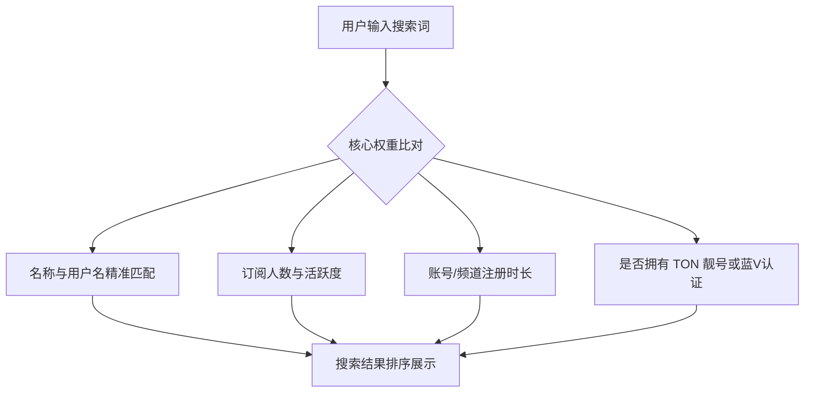

# Telegram 频道与群组引流推广与内容分发实战指南

在 Telegram 上创建了一个频道或群组后，如何获取第一批订阅者？如何打破“信息孤岛”，让更多人看到你的内容？与传统的社交媒体（如微信公众号、小红书等）拥有平台算法推荐不同，**Telegram 是一个去中心化、无推荐算法的通讯软件**。

这意味着，如果你不做推广，你的频道将永远只有自己一个人。本文将为你深度解析 Telegram 的流量分发逻辑，手把手教你如何利用内置搜索 SEO、跨平台分发、共享文件夹以及裂变活动实现零成本拉新，并指出运营中的防封号红线。

---

## 一、Telegram 内置流量获取：全局搜索 SEO 实战

Telegram 最直接的官方自然流量入口是**全局搜索 (Global Search)**。当用户在搜索框输入关键词时，系统会返回匹配的公开群组和频道。通过优化你的频道属性，可以显著提升在搜索结果中的排名。

### 1.1 命名与用户名的强匹配 (Title & Username)
- **频道名称 (Title)**：必须包含你的核心业务词。例如，相比于单纯命名为“小明的日常”，命名为“小明 | 跨境电商与 ChatGPT 搞钱日常”在用户搜索“ChatGPT”或“跨境电商”时更容易被展现。
- **用户名 (Username / ID)**：这是搜索匹配权重最高的一项。如果你的 ID 是 `@chatgpt_zh`，在搜索 `chatgpt` 时其权重将远高于简介中写了 `chatgpt` 的普通频道。
- **Fragment 靓号增权**：通过 [Fragment 交易平台](./fragment.html) 购买并绑定的稀有短用户名或行业词 ID（如 `@trade`），在官方搜索算法中拥有天然的加权和防抢占属性。

### 1.2 简介 (Description) 的关键词密度
- 在频道的「简介」中，尽可能合理自然地堆叠 3-5 个用户可能会搜索的关联词或同义词。
- 保证简介排版美观（可参考 [简介与排版教程](./bio-editor.html)），并附带联系人或官网外链，增加专业度。

### 1.3 核心排名权重指标解析
要想在热门关键词下拿到前三名，你需要优化以下指标：
1. **订阅人数 (Subscriber Count)**：目前依然是搜索排序的最基础门槛（但切忌刷僵尸粉，见后文避坑）。
2. **阅读率与互动率 (View Count & Reactions)**：新帖发布后的平均阅读量和表情表态互动数，代表了频道的真实活跃度，低活跃度的“死频道”在排序中会被降权。
3. **频道注册时长 (Channel Age)**：历史悠久、无违规记录的老频道在搜索中权重极高。
4. **防作弊算法 (Antispam Filters)**：Telegram 针对频繁短时间内暴涨订阅、阅读比例极不协调的频道会自动判定为“刷量”，不仅会在全局搜索中进行屏蔽（Search Ban），严重时会直接强制销号。

---

## 二、跨平台内容分发与引流策略

由于 Telegram 内部缺乏内容广场，大部分成功的电报主都会选择“墙外开花墙内香”的策略，即**在其他高权重平台输出内容，将流量沉淀至 Telegram**。

### 2.1 外部高权重平台布局
- **X (Twitter)**：X 是与 Telegram 用户重合度最高的社交平台。可以通过在热门推文下评论、发布垂直领域 Thread（长推文），并在结尾附带 Telegram 链接引流。
- **YouTube**：YouTube 视频在搜索引擎中的权重非常高。在制作技术教程、软件评测或项目分析视频时，将你的 Telegram 频道作为“资源包下载地址”或“答疑交流群”放在置顶评论和视频描述中。
- **个人独立博客 (SEO)**：编写高质量的专业文章，通过百度、Google 的自然搜索（SEO）获取流量。在文章中插入“获取最新通知，请加入我们的 [Telegram 频道](https://t.me/yourusername)”字样。

### 2.2 外链跳转格式优化
为了给用户提供最丝滑的点击体验，请根据场景选择链接格式：
- `https://t.me/yourusername`：标准的网页跳转格式，点击后会拉起客户端。
- `tg://resolve?domain=yourusername`：直接拉起 App 的原生链接格式，适合嵌入在 App 或特定的 Markdown 文本中。
- `https://t.me/yourusername?start=xxx`：配合 [Telegram Business 商业版](./business.html) 的对话链接，用户点击后不仅会拉起私聊，还会预填特定的问候语，方便分流和广告效果分析。

---

## 三、电报特色引流法：共享文件夹与裂变

Telegram 拥有一些特有的社交玩法，利用得当可以带来爆发式的裂变增长。

### 3.1 共享文件夹 (Shareable Chat Folders) 裂变
- **做法**：参考 [聊天分组与共享文件夹指南](./folder.html)。你可以制作一个名为“跨境电商必备 10 大频道”的共享文件夹，把你自己的频道作为主推，打包另外 9 个同行业的中小频道。
- **分发**：生成 `https://t.me/addlist/xxxx` 的共享链接后，到各大社群和论坛去推广该文件夹。
- **裂变**：因为用户只需点击一次链接，就可以同时订阅文件夹内的所有频道，转化率极高。你可以联合其他群主一起互相推广这个文件夹，实现联合涨粉。

### 3.2 友情链接互推 (Cross Promotion)
- 寻找与你粉丝量相当、内容互补但没有直接竞争关系的频道进行“友情互推”。
- **推荐格式**：互推内容切忌生硬广告，最好是编写一段干货推荐语，将对方频道以超链接形式藏在文本中，或者在周末进行“优质频道联合推荐”排版群发。

### 3.3 抽奖与助推活动 (Giveaways & Boosts)
- **Telegram 官方 Giveaways**：你可以通过赠送 Telegram Premium 会员的形式发起抽奖。
  - **设置门槛**：可以设置参与抽奖的前提条件是“必须订阅我的频道”或“同时订阅我合作的另外几个频道/群组”。
  - **效果**：抽奖由 Telegram 官方智能合约自动开奖，公平性极高，能够吸引大量真实用户为了免费 Premium 会员而订阅你的频道。同时，这也能够为你的频道累积 [助推 (Boost) 值](./boost.md)，解锁发动态等高级功能。

---

## 四、主流中文导航站收录申请

许多电报新手会通过专门的导航网站寻找资源。主动向这些网站提交你的频道，能够获取非常精准的意向流量。

- **主流导航站**：以 **TGNAV (电报宝典主站导航)** 等知名的分类导航网站为主。
- **收录申请技巧**：
  1. 申请前确保频道已经发布了**至少 10 篇以上高质量内容**，一无所有的空白频道通常会被拒绝。
  2. 准备一段精简、准确的标签和描述。
  3. 按照导航站规范，在你的频道内放置该导航站的友情链接以作为“反向链接”，增加通过率。

---

## 五、运营避坑与防封号警示

在急于获客的过程中，许多新手会踩入违规红线，导致频道被封禁或屏蔽。

::: danger 🚨 运营高危红红线（切勿触碰）
1. **疯狂主动拉人 (Spam Invite)**：虽然群组允许群主主动拉人进群（新群可手动拉最多 200 人），但如果被拉的人频繁点击“举报垃圾信息 (Report Spam)”，你的账号将立即面临 [私聊受限](./spam.html)，严重时你的群组会被官方直接解散。
2. **刷死粉/假人 (Fake Members)**：
   - 刷僵尸粉虽然能短时间让数据好看，但会导致频道**阅读率极低**。
   - Telegram 官方拥有非常严苛的清洗算法，会定期大批量销毁僵尸账号。你的频道订阅数可能会一夜暴跌。
   - 最致命的是，刷量频道会被直接**剔除全局搜索结果**，永远无法获取自然搜索流量。
3. **使用自动发广告群发器**：使用修改版客户端或群发软件在各个大群里无脑刷小广告。这不仅会被各大群管机器人（如 Rose）秒踢秒封，你的号也会在几分钟内被 Telegram 官方服务器永久销号。
:::

---

## 六、总结：健康增长的心法

- **内容为王**：引流技巧只是放大器。如果你的频道每天只发一些无意义的垃圾广告或拼凑的内容，即使用户被引流过来，也会在几秒钟内开启“免打扰”并很快退订。
- **持续更新与互动**：保持合理的更新频率，并建议 [在频道内开启评论区](./comment.html) 与 [创建话题群组](./forum.md)，建立高粘性的读者社群。
