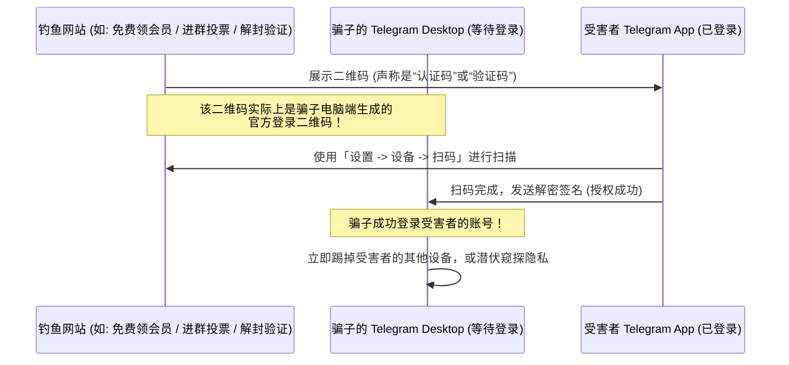

# Telegram 扫码登录与多设备会话管理安全防范指南

Telegram 是一款真正的云存储聊天工具，支持多端同时在线（手机、平板、电脑、网页端）。为了免去在电脑端输入手机号和等待验证码的繁琐，Telegram 提供了**扫码登录**功能。

然而，便捷的背后也隐藏着安全风险。扫码登录本质上是**授权一个新设备读取你的所有云端聊天记录**。本文将详解扫码登录的标准步骤、活动会话管理、扫码劫持骗局机制，以及如何防范盗号。

---

## 一、扫码登录标准操作步骤

### 1.1 手机端扫码登录桌面版 (Telegram Desktop) / 网页版 (Web)
这是将电脑端连接到手机账号最安全、最快捷的方法：

1. 在电脑上打开 **Telegram Desktop** 或访问官方网页版（如 `web.telegram.org`）。
2. 界面会默认展示一个二维码（QR Code）。
3. 拿起你的手机，打开 Telegram 客户端，进入 **「设置 (Settings)」** -> **「设备 (Devices)」**。
4. 点击 **「关联桌面设备 (Link Desktop Device)」**，此时手机会启动专用相机扫码框。
5. 对准电脑屏幕上的二维码扫描，即可瞬间登录成功，聊天记录将自动开始同步。

::: tip 💡 无法使用内置扫码怎么办？
如果手机摄像头损坏或系统权限受限，可以在电脑登录界面点击 **“使用手机号登录 (Log in using phone number)”**，输入手机号后，在手机端的 Telegram 官方系统通知中接收验证码登录（切勿将此验证码提供给任何人）。
:::

---

## 二、多设备会话（设备）审计与管理

在 Telegram 中，每一次成功的登录都会创建一个**活动会话 (Active Session)**。你必须定期对其进行审计，确保没有未知设备潜伏在你的账号中。

### 2.1 审计活动设备路径
- 打开手机端 Telegram -> **「设置 (Settings)」** -> **「设备 (Devices)」**。
- 在这里，你会看到当前登录此账号的**所有设备列表**：

```markdown
设备列表会详细显示每个设备的：
1. 设备类型及系统（如：MacBook Pro, Windows 11, iPhone 15 Pro）
2. 客户端版本（如：Telegram Desktop 5.15.3, Telegram iOS 11.2）
3. 登录时的 IP 地址（如：198.51.100.42）
4. 物理地理位置（根据 IP 解析出的国家/城市）
5. 最后活跃时间（如果显示 "Online"，代表当前正在使用）
```

### 2.2 强制下线（终止）异常设备
如果发现列表中有不认识的设备、异常 IP 地址或来自陌生国家/城市的登录信息：
1. 点击该异常设备。
2. 点击红色的 **「终止会话 (Terminate Session)」** 按钮，该设备将被瞬间强制踢下线，且其本地缓存的密钥失效，无法再同步新消息。
3. 如果情况紧急，可点击 **「终止其他所有会话 (Terminate All Other Sessions)」**，瞬间将除当前操作手机外的所有其他设备全部踢下线。

### 2.3 设置自动终止（超时注销）
为了防止在公共电脑或旧手机上登录后忘记注销，你可以设置不活跃超时时间：
- 在「设备」设置页面，找到「自动终止不活跃会话 (If inactive for...)」。
- 可选择：**1周、1个月、3个月、6个月**。若某台电脑在此时间内未与服务器产生交互，将自动被服务器踢下线。

---

## 三、警惕“扫码授权”与会话劫持骗局

扫码登录是目前黑客/骗子盗取 Telegram 账号最常用的手段。由于它绕过了“验证码输入”，很多安全防范意识低的用户极易中招。

### 3.1 骗局机制：假活动，真扫码



1. **诱饵**：骗子搭建网页，声称“免费赠送 Telegram Premium”、“群组限制解除核验”、“网络投票”或“防封锁安全认证”。
2. **伪装二维码**：网页上会显示一个二维码，诱导你用 Telegram 手机端去扫一扫。**这个二维码根本不是什么“活动码”，而是骗子在他们自己的服务器/电脑上，通过 Telegram 官方客户端申请登录时所生成的「登录二维码」！**
3. **完成授权**：当你使用手机的「关联设备」扫描该码并确认后，你就把你的账号登录权送给了骗子。骗子登录后，会第一时间修改你的 2FA 密码，甚至强制踢掉你的手机，彻底霸占账号。

### 3.2 黄金防盗规则：三要三不要
- ❌ **不要** 使用手机 Telegram 中的「设置 -> 设备 -> 扫描二维码」去扫描任何网页上的所谓“活动码”、“投票码”或“验证码”。那个扫码框**只能且唯一**用于登录你自己的电脑客户端。
- ❌ **不要** 忽视扫码时手机弹出的安全警告。
- ❌ **不要** 相信任何官方人员会让你扫码来“解除限制”或“自证安全”。
-  **要** 在扫码时看清手机屏幕上的设备提示，如果提示登录“未知设备/未知IP”，立即点击取消。
-  **要** 开启两步验证（2FA，见下文）。
-  **要** 养成定期清理「活动设备」的习惯。

---

## 四、安全升级：2FA 两步验证的护盾作用

为什么开启 **两步验证 (2FA, Two-Step Verification)** 至关重要？

- **防护机理**：当你的账号开启了 2FA（即设置了一个独立的云端静态密码），即使骗子诱骗你扫描了登录二维码，或者通过截获验证码尝试登录，Telegram 也会在最后一步强制要求输入 2FA 密码。
- **阻断盗号**：由于骗子不知道你的 2FA 密码，登录过程会卡在最后一步，从而彻底宣告盗号失败。
- **配置方法**：请参阅本知识库 [两步验证安全设置完全指南](./2fa.html) 进行配置。

---

**相关阅读：**

- [账号被盗与钓鱼紧急自救指南](./hacked.html) — 强退异常设备、重置两步验证密码与申诉挽救

