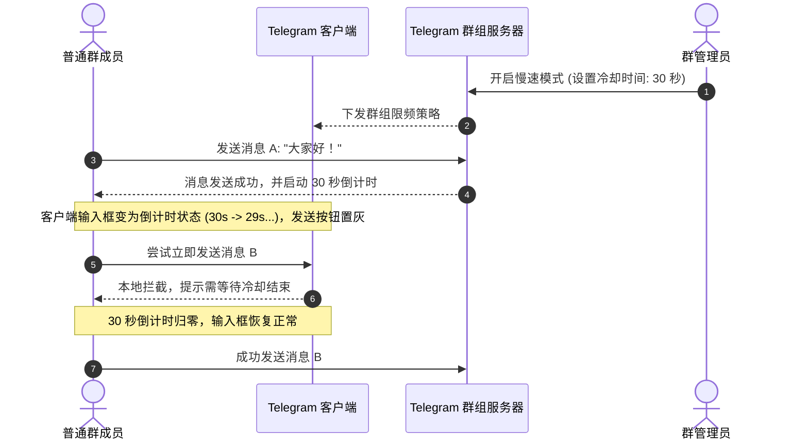
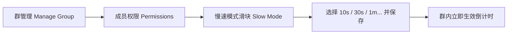

# Telegram 群组慢速模式 (Slow Mode) 完全指南：防刷屏、AMA控场与社群秩序调优

在管理千人乃至数十万人的 Telegram 超级群组时，管理员常常面临两大痛点：一是**垃圾广告机器人瞬时发起几百上千条的“爆群”轰炸**；二是**在新品发布、行业重磅热点或嘉宾 AMA（Ask Me Anything）问答期间，群友发言过快导致关键信息瞬间被淹没**。

为了兼顾聊天自由度与群聊秩序，Telegram 官方原生推出了 **慢速模式 (Slow Mode)**。开启后，群成员在发送一条消息后，必须等待指定的冷却倒计时结束才能发送下一条。

本文将由浅入深解析慢速模式的生效机制、各时间档位的最佳实战场景、管理员与机器人的豁免权限、Bot API 动态自适应控水方案，以及如何平衡“防刷屏”与“社群活跃度”。

---

## 一、慢速模式生效机制与交互全景

慢速模式是作用于整个群组的全局限频机制：



### 关键特性与细节规则：
1. **倒计时触发时机**：只要用户成功发出一条文本、图片、视频、贴纸或语音，输入框就会立即开始倒计时。
2. **编辑与撤回不重置冷却**：编辑已发送的消息或撤回消息**不会**重置或提前解除倒计时，有效防止黑产利用“发了秒删”逃避限制。
3. **针对单用户独立计时**：每个成员的倒计时彼此独立，互相不影响，保证不同群友可以平行发言。
4. **话题群组 (Topics) 全局生效**：在开启了论坛话题的大型群组中，慢速模式默认在所有话题中同步生效。

---

## 二、六大冷却时间档位的实操选型指南

Telegram 官方提供了 6 种预设冷却间隔，不同的时长适用于截然不同的社群生命周期：

| 冷却时长档位 | 聊天节奏 | 推荐适用场景 | 活跃度影响 |
|:---|:---|:---|:---:|
| **10 秒** | 轻微约束 | 万人日常活跃大群、防轻度刷屏与手抖重复发帖 | 🟢 极低（群友几乎无感知） |
| **30 秒** | 舒适有序 | 官方公告讨论群、行情波动期技术交流群 | 🟡 适中（保证每条观点完整度） |
| **1 分钟** | 思考型交流 | 深度观点探讨、研讨型小组、防止情绪化对骂 | 🟡 略有抑制 |
| **5 分钟** | 强力控水 | 重大突发新闻发布期、行情极端暴跌暴涨期的恐慌控盘 | 🔴 明显受限 |
| **15 分钟** | 准公告模式 | 嘉宾在线访谈直播、AMA 提问征集、活动抢楼 | 🚨 重度限制（成员发帖极慎重） |
| **1 小时** | 极度严格 | 官方只读社群但允许会员打卡、每日精选发言群 | ⛔ 仅保留最低限度发帖权 |

---

## 三、管理员如何正确开启与配置？

### 3.1 手机端（iOS / Android）设置步骤
1. 打开群组，点击群组顶部头像进入群资料页。
2. 点击右上角 **「编辑 (Edit / ✏️)」** -> 选择 **「权限 (Permissions)」**。
3. 滑动到底部找到 **「慢速模式 (Slow Mode)」** 滑块。
4. 拖动滑块选择所需时间（关闭 / 10s / 30s / 1m / 5m / 15m / 1h）。
5. 点击右上角「完成/勾选」保存。

### 3.2 桌面端（Windows / Mac）设置步骤
1. 打开群组 -> 点击右上角「⋮」菜单 -> **「管理群组 (Manage Group)」**。
2. 进入 **「权限 (Permissions)」** -> 将底部的 **Slow Mode** 拖动至指定秒数。
3. 点击 **保存 (Save)** 即可全员即时生效。



---

## 四、豁免权限与机器人自动化调控

### 4.1 谁不受慢速模式限制？
- **群主 (Owner)** 与 **所有拥有「管理员权限」的成员**：在群内发言永远不触发倒计时。
- **具备管理员身份的机器人 (Bots)**：管理机器人可以毫无延迟地发送迎新语、告警提醒和定时公告。

### 4.2 结合 Bot API 实现「消息密度动态自适应调控」
高阶社群运营不会全天候死板开启 1 分钟慢速模式，而是采用**动态水闸机制**：

```mermaid
graph TD
    Monitor[监控服务: 实时统计群内每分钟发帖量] --> Check{发帖速度 > 60条/分?}
    Check -- 是 (检测到刷屏/热点突发) --> Enable[自动调用 setChatPermissions 开启 30秒 慢速]
    Check -- 否 (聊天频率恢复正常) --> Disable[自动重置慢速模式为 0秒 (关闭)]
```

通过调用 Telegram Bot API 的 `setChatPermissions` 接口，可以在脚本中灵活调整 `slow_mode_delay` 字段：

```bash
# 示例：通过 Bot API 将群组慢速模式动态调整为 30 秒
curl -X POST "https://api.telegram.org/bot<YOUR_BOT_TOKEN>/setChatPermissions" \
     -H "Content-Type: application/json" \
     -d '{
       "chat_id": "-1001234567890",
       "permissions": {
         "can_send_messages": true,
         "can_send_media_messages": true
       },
       "slow_mode_delay": 30
     }'
```

---

## 五、运营哲学：如何平衡“防刷屏”与“社群活跃度”？

很多新手管理员一遇到广告就直接开启 5 分钟甚至 15 分钟慢速模式，结果不到一周群内鸦雀无声，彻底沦为“死群”。资深文案与社群专家建议遵循以下**控场三法则**：

1. **组合拳防御，不要单靠慢速模式**：
   - 防广告机器人的核心在于：**开启进群验证码 (Captcha)**（拦截 95% 自动化脚本）+ **关键词/链接黑名单**（拦截违规内容）+ **10秒慢速模式**（限制残存漏网之鱼的爆发力）。
2. **提前发群公告告知冷却原因**：
   - 在开启 30 秒以上慢速模式前，由管理机器人自动置顶通知：“当前群内讨论激烈，已临时开启 30 秒发言保护，保障大家消息可读性，活动结束后恢复。”
3. **阶梯退场机制**：
   - 突发热点或爆群平息后，管理员应及时将时长从 30s 降回 10s 或完全关闭。

---

## 六、常见问题 (FAQ)

### Q1: 开启慢速模式后，群成员还可以撤回刚发出的消息吗？
**可以。** 只要群权限允许，群成员仍可在时限内撤回自己的消息，但撤回后原本触发的倒计时**依然不会消失**，必须等待倒计时归零才能重新发送。

### Q2: 为什么我是普通群员，在某个话题里发了一条消息，去另一个话题也不能发？
Telegram 的慢速模式是**基于账号与整个超级群组绑定的**。只要你在该群的任意话题内发送了内容，你的账号便会在全群进入冷却期，无法在倒计时期间切换到其他话题“换地方刷屏”。

---

**相关阅读：**

- [Telegram 群组管理完全指南](./managegroup.md) — 权限分配、管理架构与秩序维护
- [群组验证与反垃圾机器人配置](./topics/bot/verify.md) — 进群验证码与广告过滤
- [Rose 机器人高级防刷屏教程](./topics/bot/rose-advanced.md) — Flood 控制与智能防爆群
- [话题群组 (Forum Topics) 指南](./forum.md) — 超级群组分类分流体系
