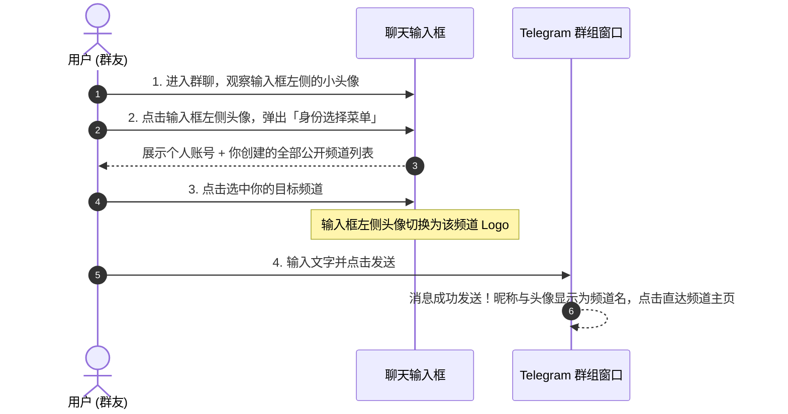

# Telegram 以频道身份在群组发言完全指南：匿名马甲、品牌引流与群管防刷攻防实战

在 Telegram 的社群交流中，如果你既想参与热门群组的讨论，又**不想暴露私人账号的手机号、用户名或在线状态**，或者希望**在发言时自然为自己的频道带来曝光与新订阅**，Telegram 提供的 **「以频道身份发言 (Send as Channel)」** 功能是一项绝佳的利器。

当使用频道身份发言时，你在群内的头像和昵称会完全显示为你的「公开频道」，群友点击你的头像会直接跳转至你的频道主页，实现“发言即引流”的效果。

本文将为你详解以频道身份发言的权限规则、多端实操切换步骤、管理员匿名机制、群管机器人（Rose / Combot）的拦截防御原理，以及合规引流防封攻略。

---

## 一、以频道身份发言的核心机制与类型

在 Telegram 生态中，以非个人名义发言主要分为两种截然不同的场景：

```mermaid
graph TD
    A[以非个人身份在群聊发言] --> B[场景一: 以自身公开频道发言 (Send as Channel)]
    A --> C[场景二: 群管理开启「保持匿名」 (Remain Anonymous)]
    
    B --> B1[展示你的个人公开频道名与头像]
    B --> B2[点击直接跳转至你的专属频道]
    B --> B3[适用于: 个人隐私保护 / 品牌与自媒体引流]
    
    C --> C1[直接以当前群组本身的名称发言]
    C --> C2[带有「Group Admin」徽章]
    C --> C3[适用于: 群主/客服隐藏真实个人号维持权威]
```

### 两种模式核心区别表：

| 维度 | 以公开频道身份发言 (Send as Channel) | 群管理「保持匿名」 (Remain Anonymous) |
|:---|:---|:---|
| **显示名称与头像** | 你的公开频道名称与头像 | 当前群组本身的名称与头像 |
| **点击头像跳转去向** | **跳转至你的公开频道主页**（吸引关注） | 跳转至当前群组的资料简介 |
| **生效范围** | 你加入的所有允许该权限的第三方超级群 | 仅在你拥有管理权限的特定群组内 |
| **准入门槛** | 需为公开频道的创建者 (Owner)，外部群通常需 Premium | 群主在该群的管理员权限处单独勾选 |
| **主要目的** | **个人隐私隔离、品牌传播、频道引流** | **管理防骚扰、统一官方客服形象** |

---

## 二、使用频道身份发言的准入条件与实操步骤

### 2.1 必备准入前提
1. **必须是公开频道 (Public Channel) 的创建者 (Owner)**：
   - 私密频道 (Private Channel) 不支持作为发言身份。
   - 你必须是频道的 **创建者（创建人）**，仅作为频道的普通管理员无法使用该功能。
2. **会员权限与群组规则**：
   - 在频道的**官方关联讨论群**中：创建者即便没有会员也可自由使用该频道身份发言。
   - 在**外部第三方公开群组**中：通常需要账号拥有 [Telegram Premium 会员](./premium.html)，且目标群组未开启「禁止频道身份发言」的群权限。

### 2.2 多端切换身份实操



- **iOS / Android 移动端**：
  进入群组聊天界面，查看文字输入框左侧（表情图标旁）。如果支持该功能，会显示一个圆形小头像，点击即可展开身份切换菜单。
- **Desktop 桌面端**：
  在电脑版 Telegram 聊天输入框左侧，同样点击小头像图标，在下拉列表中选择你的频道。

::: tip 💡 如果输入框左侧没有头像图标？
1. 确认你创建的频道是公开频道（拥有唯一的 `@username`），且没有被封禁。
2. 确认当前群组不是仅限管理员发言的群，且群管理员未在群权限中禁用「发送其他消息」或拉黑频道身份。
3. 重启 Telegram 客户端或更新至最新版本。
:::

---

## 三、群管防线：群主与机器人如何防御“频道马甲”刷屏？

以频道身份发言虽然方便，但也常被黑产广告团队利用：他们注册大量名字带有诱导广告的公开频道（例如《xx同城交流》、《低价代购》），在各大技术交流群频繁发言，以此规避个人封禁。

为此，群组管理员通常会采取以下手段进行防御：

```mermaid
graph TD
    Attack[恶意黑产利用频道马甲在群内发广告] --> Defense{群管防御策略}
    
    Defense --> D1[手段 1: 直接封禁该频道 (Ban Channel)]
    Defense --> D2[手段 2: 使用管理 Bot 开启全群锁定]
    Defense --> D3[手段 3: 原生权限关闭发送媒体]
    
    D1 -.-> R1[效果: 该频道被拉黑，其所有管理者均无法再用该频道发言]
    D2 -.-> R2[效果: Rose 机器人自动检测 sender_chat 并秒踢/秒删]
    D3 -.-> R3[效果: 限制非认证成员发链接与图文]
```

### 3.1 直接封禁特定频道 (Ban Sender Chat)
在 Telegram Bot API 中，以频道发送的消息其消息体包含 `sender_chat` 属性。管理员在群内右键长按该条消息 -> 选择 **「封禁 (Ban)」** 时，**Telegram 封禁的是整个频道 ID**。被封后，不仅当前账号，该频道的其他管理员也无法再以此频道在该群发帖。

### 3.2 使用 Rose 机器人一键拦截所有频道马甲
在群内添加管理机器人 [@MissRose_bot](https://t.me/MissRose_bot)，发送以下指令：

```text
/lock anonchannel
```

- **生效效果**：开启后，任何非管理员尝试以频道身份在群内发送消息，Rose 都会在**毫秒级自动删除该消息**，并发送警告提示其切换回个人账号。

---

## 四、自媒体与出海引流：频道身份发言的“黄金法则”

如果你希望借助频道身份在友邻群组中获得精准用户关注，请遵守以下**高情商发帖三原则**，避免被秒踢封禁：

1. **输出专业价值，严禁硬广刷屏**：
   - 绝不要直接在群内发送“欢迎关注我的频道”、“点击看最新资源”等广告话术。
   - 应该以行业专家身份，在群友提问时提供详尽、专业的干货解答。群友觉得你的回答极其专业，自然会主动点击你的头像进入你的频道阅读更多深度文章。
2. **频道昵称与头像力求自然**：
   - 避免在频道名中夹带特殊符号、火星文或带有明显的联系电话/链接。一个设计精美、格调高雅的频道 Logo 会大幅提高群友的主动点击率。
3. **尊重目标社群的群规**：
   - 如果某个社群明确禁止频道马甲发言，进群时请主动切换回个人账号，遵守群聊秩序才能建立长久合作。

---

## 五、常见问题 (FAQ)

### Q1: 以频道身份发言，群主能查出我的真实个人账号吗？
**普通群管理员查不出来。** 消息表面上只绑定了频道的 `Channel ID`，普通管理在客户端界面中无法看到背后的真实个人账号。但请注意：Telegram 官方后台依然记录了频道的 Owner ID，如果涉及严重违法欺诈，官方安全团队依法可以定位到创建者的原账号。

### Q2: 为什么我的公开频道在有的群能选，在有的群选不了？
部分大型超级群在群权限设置中关闭了「发送其他类型的消息 (Send Other Media)」权限，或者当前群组被开启了严格的反广告拦截，此时客户端会自动隐藏非绑定的频道选项。

---

**相关阅读：**

- [创建公开频道完全指南](./createchannel.md) — 抢注靓号与设置频道公网链接
- [Telegram 引流与推广实战指南](./promotion.md) — 多渠道获客与精准粉丝转化
- [群组管理与反垃圾全攻略](./managegroup.md) — 超级群权限配置与管理架构
- [Telegram Premium 会员特权盘点](./premium.md) — 解锁商业与进阶特权
