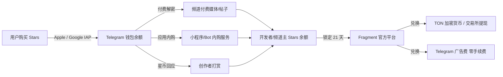
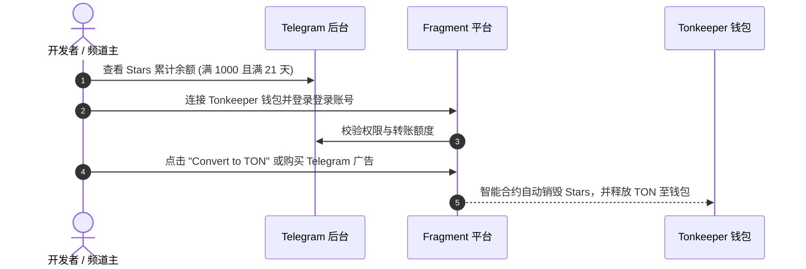

# Telegram Stars 星币完全指南：充值使用、内购接入、频道打赏与提现兑换

**Telegram Stars（星币）** 是 Telegram 官方于 2024 年推出的内购数字生态资产。通过符合 Apple App Store 与 Google Play 内购政策的规则设计，Stars 为 Telegram 上的小程序开发者、Bot 开发者以及频道创作者提供了一套合规且无缝的变现结算体系。

本文将为你全面解析 Stars 的充值技巧、创作者打赏与付费媒体配置、开发者 API 接入代码，以及如何将积累的 Stars 提现为 TON 代币或转换为广告费。

---

## 一、什么是 Telegram Stars（星币）？

Telegram Stars 是 Telegram 平台唯一的原生内购虚拟代币（代号 `XTR`）。



### 1.1 核心应用场景
1. **小程序/游戏数字商品购买**：购买游戏道具、解锁软件 VIP 会员或付费工具。
2. **频道付费媒体 (Paid Media)**：频道主对高价值图片或视频设置星币解密，用户支付 Stars 后方可解锁查看。
3. **星币回应打赏 (Star Reactions)**：读者在频道消息下方给创作者打赏 Stars。
4. **星币抽奖与助推 (Giveaways & Boosts)**：频道主使用 Stars 举办抽奖，或通过获得星币打赏提升频道 Boost 助推等级（每打赏 500 Stars，频道自动获得 1 个 Boost）。

---

## 二、普通用户：Stars 购买与充值教程

### 2.1 移动端内购充值 (App Store / Google Play)
在 iOS 或 Android 客户端中直接购买：
- **操作路径**：`设置 (Settings)` -> `数据与存储 (Data and Storage)` -> `星币 (Telegram Stars)` -> 选择购买数量。
- **价格说明**：由于 Apple 和 Google 抽取 30% 的内购服务费，在移动端直接充值单价稍高（约 50 Stars ≈ $0.99 美元）。

### 2.2 优惠充值渠道 (Fragment / 桌面端)
如果你希望避免 App Store 的 30% 溢价，可以通过去中心化或网页端优惠买币：
1. **通过 Fragment 官方充值**：访问 [fragment.com/stars](https://fragment.com/stars)，连接你的 TON 钱包（如 Tonkeeper），直接使用 TON 购买 Stars，单价更低且支持大额充值。
2. **桌面端与 Web 端**：在 Telegram Desktop 或网页端直接绑定信用卡通过 Stripe/Payment 机器人购买。

---

## 三、频道主与创作者：变现与打赏设置

### 3.1 发布付费媒体 (Paid Media)
频道主可以将独家视频、高清照片、电子书或研报设置为付费内容：
- **设置方式**：在发布媒体文件时，点击媒体右上角的 **「三个点/设置」** -> 选择 **「限制为付费内容 (Require Stars)」** -> 输入解锁所需的 Stars 数量（范围 1 ~ 2,500 Stars）。
- **用户视角**：未付费前，媒体文件会显示高模糊遮罩与锁头图标，用户点击后弹窗确认支付 Stars，支付成功即刻永久解锁。

### 3.2 开启星币回应打赏 (Star Reactions)
让订阅者能够直接赞赏你的优质文章：
- **开启路径**：进入「频道设置」 -> **「反应 (Reactions)」** -> 开启 **「星币回应 (Star Reactions)」**。
- **收益归属**：读者被打赏的 Stars 100% 计入频道主的公会/收益账户。

---

## 四、开发者：Bot & Mini App 内购接入代码实战

Telegram Bot API 内置了全套基于 `XTR` 货币的结算发票系统。

### 4.1 发起 Stars 支付发票 (Python 示例)

在 `python-telegram-bot` 框架中，创建 Stars 订单只需将 `currency` 设为 `"XTR"`，且将 `provider_token` 留空：

```python
from telegram import Update, LabeledPrice
from telegram.ext import ApplicationBuilder, CommandHandler, PreCheckoutQueryHandler, ContextTypes

async def send_stars_invoice(update: Update, context: ContextTypes.DEFAULT_TYPE):
    chat_id = update.effective_chat.id
    title = "VIP 月度会员"
    description = "解锁 AI 机器人的无限制对话高级功能"
    payload = "user_vip_subscription_001" # 自定义内部订单 ID
    currency = "XTR" # Telegram Stars 专属货币代码
    price = 100 # 需支付的 Stars 数量 (100 Stars)
    
    prices = [LabeledPrice("VIP Membership", price)]

    # 注意：使用 Stars 时，provider_token 必须留空或填入 ""
    await context.bot.send_invoice(
        chat_id=chat_id,
        title=title,
        description=description,
        payload=payload,
        provider_token="",
        currency=currency,
        prices=prices
    )

async def precheckout_callback(update: Update, context: ContextTypes.DEFAULT_TYPE):
    query = update.pre_checkout_query
    # 必须在 10 秒内响应预结账查询，确认库存与订单合法性
    if query.invoice_payload != "user_vip_subscription_001":
        await query.answer(ok=False, error_message="商品已售罄或订单无效")
    else:
        await query.answer(ok=True)

def main():
    app = ApplicationBuilder().token("YOUR_BOT_TOKEN").build()
    app.add_handler(CommandHandler("buy", send_stars_invoice))
    app.add_handler(PreCheckoutQueryHandler(precheckout_callback))
    app.run_polling()

if __name__ == '__main__':
    main()
```

### 4.2 Web App / Mini App 端拉起支付
在前端 React/Vue 中，通过调用 Official JS SDK 拉起原生产极简支付弹窗：

```javascript
// 在 Telegram Mini App 前端拉起 Stars 支付
const invoiceUrl = "https://t.me/$invoice_link_generated_from_bot";

Telegram.WebApp.openInvoice(invoiceUrl, (status) => {
  if (status === 'paid') {
    console.log('用户支付成功！');
    // 刷新前端用户权限状态
  } else if (status === 'cancelled') {
    console.log('用户取消了支付');
  } else {
    console.error('支付失败：', status);
  }
});
```

---

## 五、收益结算与 Fragment 提现至 TON

当你作为开发者或频道主积累了 Stars 之后，可以通过 Telegram 官方合规区块链平台 **Fragment** 进行兑换变现。



### 5.1 提现核心规则
1. **最低提现门槛**：账户余额需达到 **1,000 Stars**。
2. **21 天冻结锁定期 (Holding Period)**：收到用户的 Stars 后，出于防信用卡欺诈和退款保护，款项须在账户中停留 **21 天** 后方可转换为可提现状态。
3. **换算汇率**：开发者提现时，Telegram 官方结算汇率约为 **100 Stars ≈ 1.30 ~ 1.50 美元**（实际以 TON 实时币价与兑换比例为准）。

### 5.2 提取步骤
1. **检查可提现余额**：
   - 频道主：进入「频道设置」 -> 「统计与收益」 -> 「Stars」。
   - Bot 开发者：私聊 [@BotFather](https://t.me/BotFather) -> 点击 `/mybots` -> 选择对应机器人 -> 「Bot Settings」 -> 「Payments」 -> 「Stars Revenue」。
2. **绑定 Fragment**：在浏览器打开 [fragment.com](https://fragment.com)，点击右上角 **Connect TON Wallet** 并扫码连接你的 Tonkeeper 钱包。
3. **兑换 TON 或转换为广告**：
   - **兑换为 TON**：点击 **Convert to TON**，确认授权后智能合约会将 Stars 销毁并实时把 TON 代币发放至你的钱包。随后可转入 OKX/Binance 等交易所变现。
   - **免手续费转广告费**：选择 **Buy Telegram Ads**，可以将 Stars 以 30% 额外的折扣直接充值入 Telegram 广告平台投放广告，无任何损耗。

---

## 六、常见问题 FAQ

### Q1：Stars 会过期吗？
**不会。** 无论是用户充值的还是创作者获得的 Stars，均永久存放在 Telegram 账户与公会余额中，不会过期。

### Q2：为什么用户购买 100 Stars 花了 $2 美元，但创作者提现 100 Stars 只拿到约 $1.3 美元？
中间的差价主要是 **Apple/Google 商店强行扣除的 30% 应用内购买渠道费**，以及必要的网络交易转账成本。为了减少损失，建议引导用户优先在网页端或使用 Fragment / PremiumBot 购买 Stars。

### Q3：如果用户在苹果应用商店退款，Stars 会怎样？
如果用户向 Apple 发起恶意退款，Telegram 会自动扣回对应的 Stars 余额。若你的账户余额不足，账户可能暂时变成负数，因此 21 天的保护期就是为了防止恶意的撤单欺诈。

---

**相关阅读：**

- [Fragment 交易平台完全指南](./fragment.md) — 靓号交易、+888 匿名号与 Stars 提现
- [频道变现完全指南](./monetization.md) — 广告分成、付费订阅与全方位变现
- [API 开发者入门](./api-intro.md) — Bot API 接口与发票支付
- [Telegram Mini App 开发实战](./topics/game/miniapp-dev.md) — 打造支持 Stars 支付的小程序
