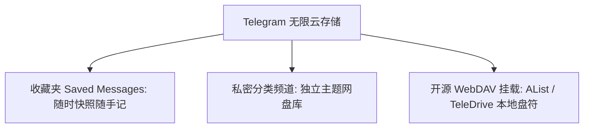
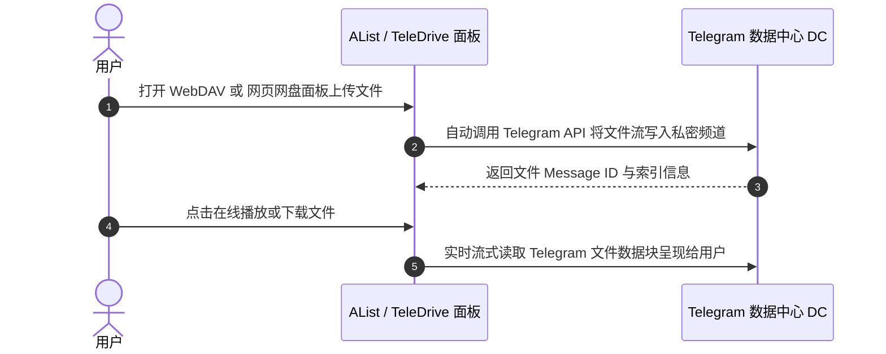

# Telegram 个人无限云盘、无限大文件存储、网盘挂载与传输限制解除完全指南

与其他即时通讯工具严格限制文件过期时间或存储空间不同，Telegram 为所有用户提供了**真正意义上的免费无限云存储空间**。只要你的 Telegram 账号正常存在，存入的消息、图片、视频与文件将永远保存在云端数据中心，且不计入手机本地空间。

本文将为你详解 Telegram 云存储的核心配额规则、原生私人知识库搭建、开源网盘工具（AList / TeleDrive）挂载实战、超大文件切片上传以及文件下载加速技巧。

---

## 一、Telegram 无限云存储核心规则

Telegram 的云存储服务在容量与文件格式上没有任何人为封顶：

| 维度 | 普通免费用户 | Premium 会员用户 |
|:---|:---|:---|
| **单文件上传上限** | **2 GB** | **4 GB** |
| **总存储容量上限** | ♾️ **无限 (Unlimited)** | ♾️ **无限 (Unlimited)** |
| **文件保存时间** | **永久有效**（不自动过期） | **永久有效** |
| **文件格式类型** | 任何格式 (ZIP / ISO / MKV / PDF...) | 任何格式 |
| **下载传输带宽** | 标准高速带宽 | 优先保障最高带宽 |



---

## 二、原生用法：打造私人分类知识库与文件仓库

### 2.1 收藏夹 (Saved Messages) 高级分类
在 Telegram 中，你可以将任何聊天窗口的消息或文件转发给 **「收藏夹 (Saved Messages)」**：
- **置顶关键凭证**：长按置顶（Pin）重要文件，最多可置顶 5 条核心消息。
- **运用 `#标签` 分类**：为上传的文件附带带井号的标签（例如：`#合同`, `#照片`, `#书籍`, `#视频`）。搜索时只需点击标签，即可瞬间过滤出特定类型的文件。

### 2.2 建立独立主题的私密频道（私人网盘）
为了防止收藏夹混杂过多内容，更优雅的方案是**按主题建立私密频道**：
1. 点击创建新频道 -> 选择 **「私密频道 (Private Channel)」**。
2. 保持你为频道中**唯一的成员**。
3. 创建多个特定主题频道（例如：《电子书分类库》、《无损音乐合集》、《照片离线备份》）。
4. 你甚至可以在频道中开启 [话题分类 (Topics)](./forum.html)，在单频道内部建立文件夹式的子目录。

---

## 三、开源工具挂载实战：将 Telegram 变成通用网盘

借助开源社区工具，你可以把 Telegram 的无限存储挂载为类似于 Google Drive 或本地硬盘一样的 Web 界面。



### 3.1 使用 AList 挂载 Telegram 为本地 WebDAV 盘符
[AList](https://alist.nn.ci/) 是一款支持多种存储的通用网盘汇总工具。
1. 在服务器或本地电脑上运行 AList。
2. 进入 AList 后台 -> `存储` -> `添加` -> 选择 **`Telegram`**。
3. 填入你申请的 `api_id` 与 `api_hash`，以及存放文件的私密频道 ID。
4. 保存后，你即可通过 WebDAV 将 Telegram 存储空间直接映射为 Windows 资源管理器或 Mac Finder 中的**本地虚拟硬盘**！

### 3.2 TeleDrive / tg-drive 网页网盘面板
如果你需要一个类似于阿里云盘的现代 Web 界面，可以使用 [TeleDrive](https://github.com/m-rubi/teledrive) 开源项目。它能直接在浏览器中展示 Telegram 频道内的文件、文件夹目录，并支持视频在线播放。

---

## 四、超大文件 (大于 2GB / 4GB) 切片上传与还原

当遇到 10GB 以上的 4K 电影或大型安装包时，需要先使用压缩/分卷工具切片后再上传。

### 4.1 使用 7-Zip 切片 (Windows)
1. 右键大文件 -> `7-Zip` -> `添加到压缩包...`。
2. 在 **「切分成分卷，字节」** 输入框中，填入 `2000M`（普通账号）或 `4000M`（Premium 账号）。
3. 点击确定，生成 `.7z.001`, `.7z.002` 分卷文件，分别上传至频道。

### 4.2 使用命令行切片 (Linux / Mac)
```bash
# 将 8GB 的 large_file.iso 切分为 2GB 的分卷
split -b 2000m large_file.iso part_file_

# 解压合并恢复文件
cat part_file_* > large_file.iso
```

---

## 五、大文件下载加速与本地存储管理

### 5.1 防止手机本地存储空间爆满
由于 Telegram 网页与客户端在播放音视频时会自动下载文件到本地缓存，建议立即进行以下配置：
- 进入 `设置` -> `数据与存储` -> `存储用量 (Storage Usage)`。
- 将 **「保留媒体 (Keep Media)」** 设置为 **`3天`** 或 **`1周`**。
- 设置自动清理上限，避免 Telegram 占用几十上百 GB 的手机空间。

### 5.2 大文件多线程下载加速
在电脑端下载超大文件时，推荐结合 [第三方客户端](./thirdparty.html)（如 64Gram / Unigram）或使用多线程下载工具获取流媒体链接，以提升下载并发速度。

---

## 六、云盘安全与版权避坑规则

1. **绝对不要在公开频道存储版权文件**：如果在公开频道上传未授权的电影、软件或音乐，容易触发 DMCA 版权下架投诉，导致频道被限制或封禁。
2. **私密频道安全度极高**：个人备份建议一律保存在 **私密频道 (Private Channel)** 中。
3. **开启 2FA 两步验证密码**：云盘数据与 Telegram 账号绑定，务必开启 [两步验证 (2FA)](./2fa.html)，防止账号在其他设备被盗导致数据泄露。

---

**相关阅读：**

- [聊天分组与文件夹](./folder.md) — 深度管理聊天与私人文件频道
- [离线数据导出指南](./data-export.md) — 全量导出 Telegram 聊天与媒体文件
- [基础下载与缓存清理](./download.md) — 存储空间优化与下载限制
- [资源下载完全指南](./topics/resource/download-complete.md) — 媒体提取与文件合并
