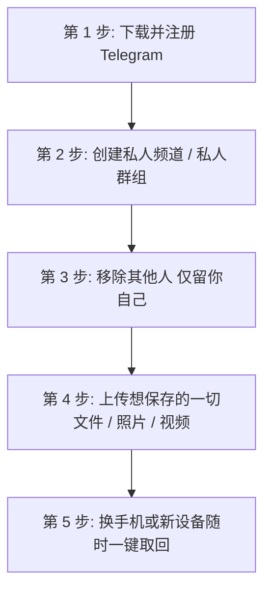

# Telegram 免费无限云盘使用小窍门与避坑指南：私人频道网盘、2FA防丢失与大文件备份

最近在社交平台[ X (Twitter) ](https://x.com/hasenbalg673018)上，一个用 Telegram 当免费无限云盘的「生活小技巧」引起了广大网友的热议（[原帖链接](https://x.com/ccxxhmbb/status/2090363510811394335)）。这个方法简单到让人拍案叫绝，特别适合经常更换手机、担心本地文件丢失、或者不想每月支付 iCloud/百度网盘高额续费的用户。

本文将为你整理这个生活小窍门的全套操作步骤、网友真实反馈的避坑提醒、国内替代方案对比以及进阶网盘挂载玩法。

---

## 一、生活小窍门：5 步打造你的专属无限云盘

把 Telegram 当成网盘，核心在于利用 Telegram **“跨设备云端实时同步、单文件最大支持 2GB（大会员 4GB）、总容量完全不设限”** 的官方特性。



### 极简操作步骤：

1. **下载与准备**：下载并注册 Telegram（建议使用 [海外卡/虚拟号](./virtual-number.html)，并配置好 [隐私防护](./privacy.html)）。
2. **创建一个私人频道/群组**：点击新建 -> 选择 **「私密频道 (Private Channel)」** 或私人群组。
3. **移除所有人，仅留你自己**：确保这个空间 100% 独立私密，没有其他任何成员。
4. **上传你想保存的一切**：文件、笔记、高清照片、长视频、工作文档……想存什么就存什么。
5. **随时随地跨端取回**：以后换手机、手机意外丢失、或者换电脑，只要重新登录你的 Telegram 账号，所有文件立刻重新下载回来。

::: tip 💡 为什么比传统网盘更好用？
- **零费用**：不需要付费订阅会员。
- **跨平台方便**：iOS、Android、Windows、Mac、iPad 甚至是[网页版 (Web K/A)](./web-k-a.html) 都可以毫秒级同步。
- **无格式限制**：ZIP、ISO、MKV、PDF 等格式均支持原格式无损存储。
:::

---

## 二、补充小提醒（来自网友真实反馈与避坑指南）

虽然这个小窍门体验极佳，但在实际使用时，一定要注意以下几点，避免造成文件丢失或登录困境：

### 1. 注意长期不活跃的清理机制 ⚠️
Telegram 官方规定：如果一个账号**长期未登录（默认 6 个月）**，账号将被系统自动销号注销，届时名下的所有聊天记录和私人频道都将随之永久清空！
- **避坑建议**：建议至少每 1-2 个月登录一次账号。对于极其重要、不可替代的个人核心文件（如户口本照片、毕业证扫描件），**切勿作为唯一备份**，务必在本地电脑或硬盘中另存一份。

### 2. 提前绑定邮箱与开启两步验证 🔑
部分国内号码（+86）在换手机或重新登录时，可能会遇到运营商拦截 SMS 验证码的问题（详见 [收不到验证码排查](./notcomesms.html)）。
- **避坑建议**：在存入文件前，务必进入 `设置` -> `隐私与安全` 开启 [两步验证 (2FA密码)](./2fa.html)，并绑定 [邮箱登录](./emaillogin.html)。这样后续即使收不到短信，也能通过邮箱与密码安全登录。

### 3. 国内免翻墙替代方案参考 🇨🇳
如果在国内使用网络不方便、不想配置代理工具：
- **QQ 群文件/群文档**：可以新建一个只有你自己的私人 QQ 群。单个 QQ 群提供约 **10 GB** 的免费群文件空间，满了之后直接新建下一个新群。这种方法不需要翻墙，同样能达到临时云盘的效果。

---

## 三、进阶玩法：分类管理、超大文件切片与网盘挂载

对于有更高要求的重度用户，还可以尝试以下进阶玩法：

### 3.1 标签 `#分类` 与主题论坛化
- **运用 `#标签` 搜索**：在上传文件时附带标签（例如：`#合同`, `#相册`, `#电子书`, `#学习资料`）。搜索时点击标签即可快速筛选。
- **开启频道话题 (Topics)**：在频道设置中开启 [话题论坛功能](./forum.html)，在单频道内部建立《照片区》、《软件库》、《电影区》等文件夹式的子目录。

### 3.2 超大文件切片 (大于 2GB/4GB)
遇到超过 2GB（或 Premium 会员 4GB）的大型安装包或 4K 电影时：
- **Windows (7-Zip)**：压缩时选择「切分成分卷」，大小设置为 `2000M`。
- **Mac/Linux (命令行)**：
  ```bash
  split -b 2000m large_file.zip part_file_
  ```
  上传生成的多个切片文件，还原时执行 `cat part_file_* > large_file.zip` 即可。

### 3.3 使用 AList 将 Telegram 挂载为本地网盘
借助开源工具 [AList](https://alist.nn.ci/)，可以将你的 Telegram 私人频道存储空间映射为 Windows 资源管理器或 Mac Finder 中的**本地虚拟硬盘**，直接双击在线播放视频或打开文档。

---

## 四、总结

把 Telegram 当成免费无限云盘，非常适合存放**临时大文件、学习资料、跨设备传输文件以及日常生活备份**。

只要你做好 **“开启 2FA + 绑定邮箱 + 定期登录活跃”** 三件套，Telegram 绝对是你手里最强大、最顺手的免费无限云端宝库！

---

**参考与相关阅读：**

- [原帖出处 (X / Twitter @ccxxhmbb)](https://x.com/ccxxhmbb/status/2090363510811394335)
- [收藏夹 (Saved Messages) 技巧](./favourite.md) — 官方原生快捷存储
- [离线数据导出指南](./data-export.md) — 将云盘文件全量备份到本地电脑
- [网页版 Web K / Web A 教程](./web-k-a.md) — 免客户端在浏览器直接使用
- [两步验证 2FA 完全指南](./2fa.md) — 保护你的网盘账号安全
