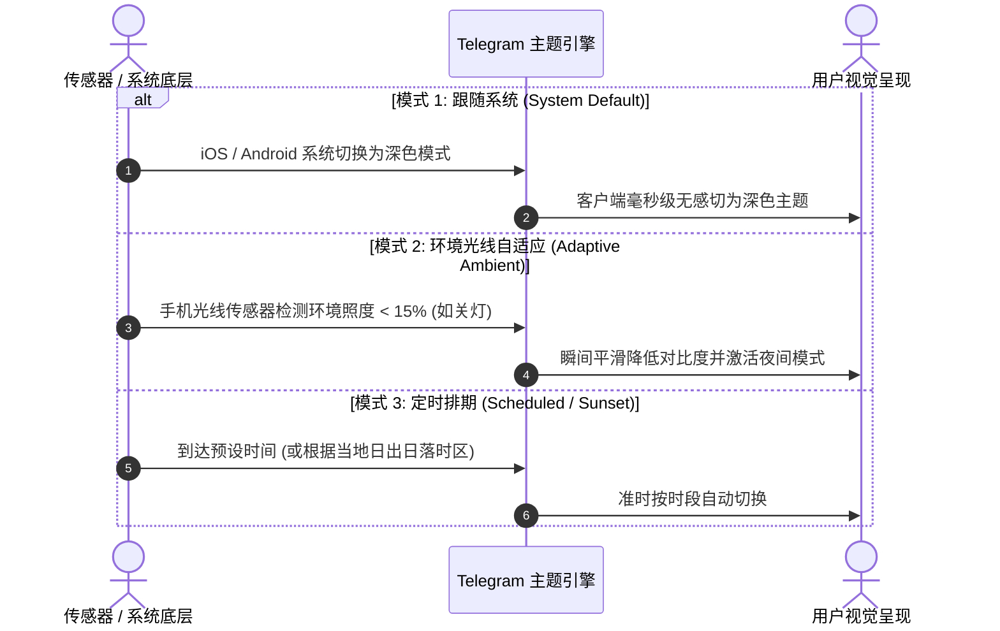
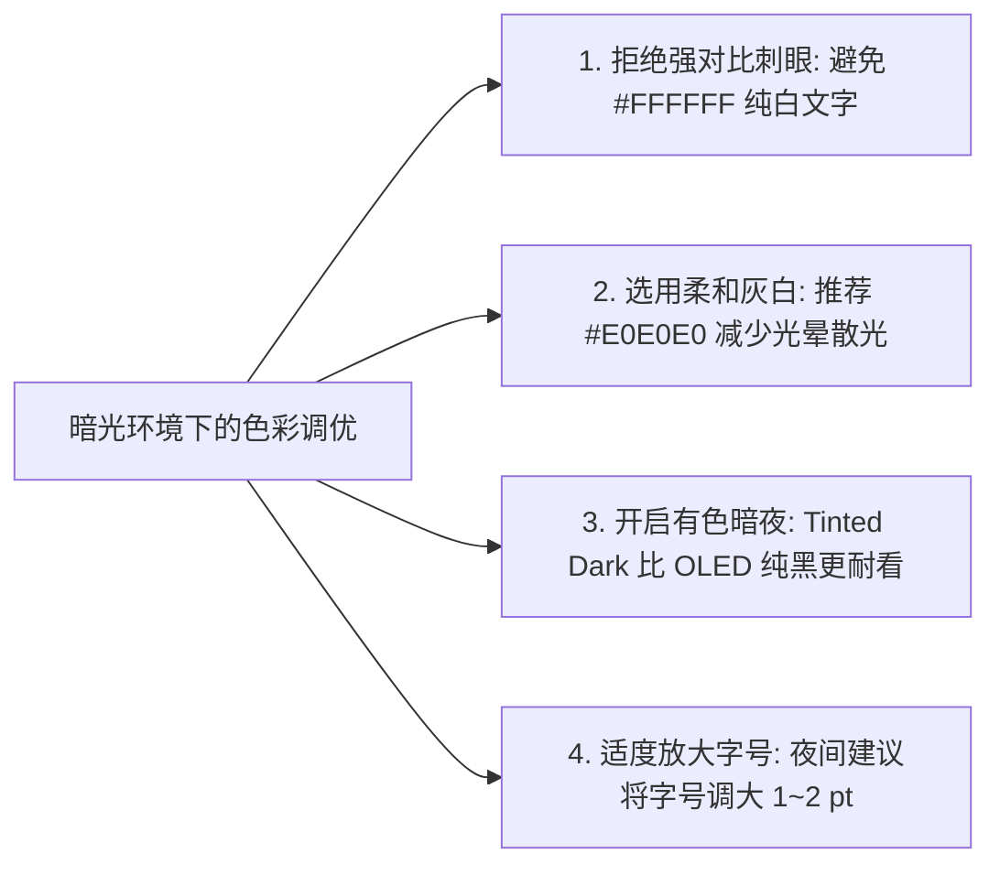

# Telegram 主题皮肤与外观美化完全指南：夜间模式、OLED纯黑、壁纸动效与视觉调优

在即时通讯应用中，Telegram 以其**极高自由度的视觉定制能力**闻名：不仅支持从字体大小、气泡圆角、强调色（Accent Color）到聊天背景的一体化定制，还具备**系统级自动夜间模式、双向私聊同步主题，以及针对 OLED 屏幕的极致黑省电算法**。

无论你是追求极简纯黑护眼的办公族，还是喜爱炫酷动效的视觉极客，都可以将 Telegram 调优为最符合个人审美的交互界面。

本文将为你深度拆解全平台客户端的外观设置、自动夜间模式的触发机制、OLED 护眼防眩光色彩哲学、私聊专属主题同步，以及第三方主题资源的甄别技巧。

---

## 一、Telegram 外观美化系统全景

```mermaid
graph TD
    A[Telegram 外观定制系统] --> B[色彩主题体系 (Color Themes)]
    A --> C[自动夜间模式 (Auto-Night Mode)]
    A --> D[聊天背景与动态视差 (Chat Wallpapers)]
    A --> E[排版与微交互细节 (Typography & Layout)]

    B --> B1[经典 / 日间 / 深色 (暗蓝) / 夜间 (OLED纯黑)]
    C --> C1[系统跟随 / 光线传感器自适应 / 定时日落切换]
    D --> D1[模糊滤镜、重力感应视差晃动、私聊双向主题]
    E --> E1[消息文字字号、气泡圆角半径、双击快捷反应]
```

### 四大官方核心预设主题特性对比：

| 主题名称 | 界面基调 | 核心主色调 (Hex) | 屏幕硬件适配 | 最佳使用场景 |
|:---|:---|:---|:---|:---|
| **经典 (Classic)** | 浅灰白底 | `#FFFFFF` / `#E4ECF2` | LCD / 高亮环境 | 传统桌面办公、明亮日光下清晰阅读 |
| **日间 (Day)** | 纯白纯净 | `#FFFFFF` / `#F0F2F5` | 全平台高刷屏 | 极简主义、与 iOS/macOS 浅色风格深度融合 |
| **深色 (Dark / Tinted)** | 暗灰暗蓝 | `#18222D` / `#212D3B` | 泛用暗光环境 | 舒适度极高，防刺眼且保留丰富的层次阴影 |
| **夜间 (Night / OLED)** | **极致纯黑** | **`#000000`** | **OLED / AMOLED 屏幕** | **深夜黑暗环境护眼、OLED 像素彻底熄灭极度省电** |

---

## 二、自动夜间模式 (Auto-Night Mode)：三大智能切换策略

手动来回切换深色浅色极为繁琐。Telegram 提供了业内最智能的自动夜间模式系统：



### 设置路径与模式选型：
1. 打开 Telegram，进入 `设置 (Settings)` -> `外观 (Appearance)`（或 Android 端的 `聊天设置 Chat Settings`）。
2. 点击 **「自动夜间模式 (Auto-Night Mode)」**，选择适合你的策略：
   - **跟随系统 (System)**：**最推荐**。与 iPhone / Android 系统的全系统深色模式联动，白天浅色、日落深色。
   - **环境光自适应 (Adaptive)**：利用手机屏幕顶部的环境光照感应器。只要走进昏暗房间或深夜关灯，Telegram 会在 1 秒内自动变暗，走出房间又自动恢复。
   - **定时切换 (Scheduled)**：可自定义具体的开启时间段（例如每日 `22:00` 至次日 `07:00`），或根据地理位置自动匹配当地日落时刻。

---

## 三、聊天背景与动态视差深度定制

除了应用框架颜色，聊天对话界面的背景图同样支持丰富的视觉调优：

### 3.1 模糊与动态视差 (Blurred & Motion)
- **模糊特效 (Blurred)**：当你选用一张色彩丰富的风景摄影或插画作为聊天背景时，开启「模糊」后，背景会自动转化为柔和的毛玻璃渐变色，**避免复杂的背景线条干扰白色文字气泡的阅读可读性**。
- **动态视差 (Motion)**：开启后，利用手机陀螺仪实现轻微的重力晃动视差，随着手机倾斜角度改变，背景产生微微悬浮的立体景深感。

### 3.2 私聊专属双向主题 (Chat Themes for Both)
如果你希望为你和密友、伴侣的专属私聊打造独一无二的氛围感：
1. 打开任意单人私聊会话。
2. 点击顶部对方头像 -> 点击右上角「⋮ / …」菜单 -> 选择 **「更改颜色 / 更改主题 (Change Theme)」**。
3. 挑选预设的专属渐变主题与配套背景。
4. 点击应用：**对方的手机客户端会同步弹出提示，双方该对话将同时变更为此主题**，打造专属私密仪式感！

---

## 四、色彩心理学与护眼哲学：如何避免视觉疲劳？

许多用户深夜喜欢直接开“纯白文字 + 极致纯黑”模式，但如果不合理搭配，极易引发视觉疲劳：



### 资深专家视觉调优建议：
1. **OLED 省电 vs 视觉舒适度的平衡**：
   - **OLED 纯黑 (`#000000`)**：由于屏幕黑色像素点彻底关闭，省电效果最拔群，但白色文字在纯黑背景下容易产生“光晕效应（Halation）”，对有轻度散光的用户容易造成重影疲劳。
   - **深色灰蓝 (`#18222D`)**：背景带有极其微弱的墨水蓝调，文字与背景的过渡更平滑自然，长时间阅读技术长文或海量聊天记录更舒适。
2. **气泡圆角与文字字号优化**：
   - 在外观设置中，将 **「气泡圆角 (Corner Radius)」** 设置在 `12px ~ 16px`，整体视觉更现代、更具亲和力。
   - 文字大小根据屏幕 DPI 适当放大，确保在臂长阅读距离下不眯眼。

---

## 五、常见问题与安全避坑 (FAQ)

### Q1: 导入第三方主题文件会有中毒或木马风险吗？
**不会有代码执行风险。** Telegram 的主题文件（如 `.tdesktop-theme` 或 `.attheme`）本质上是纯文本的配色参数表（键值对）打包而成的配置归档，不具备可执行脚本权限。
::: tip ⚠️ 唯一需要警惕的隐患
部分恶意推广者会在主题背景图片中通过水印印制仿冒钓鱼网站域名，诱导用户访问外部欺诈网站。只要不轻信背景图上的违规小广告，主题本身绝对安全。
:::

### Q2: 为什么更换了主题后，手机发烫或掉帧？
在部分老旧机型上，同时开启**超高清动效背景 + 聊天视差晃动 (Motion) + 毛玻璃实时模糊**可能会占用较多 GPU 渲染资源。如遇掉帧，在外观设置中关闭「模糊」与「动态」即可恢复丝滑。

---

**相关阅读：**

- [主题与界面美化进阶指南](./theme-advanced.md) — 动态夜间模式、自制主题包与代码级参数解析
- [Telegram 中文语言包安装](./language.md) — 客户端全界面汉化教程
- [内置多标签浏览器完全指南](./browser.md) — 即时预览 (Instant View) 与 Web3 浏览
- [隐藏功能与高手技巧大全](./power-tips.md) — 30+ 效率与隐私调优秘技
