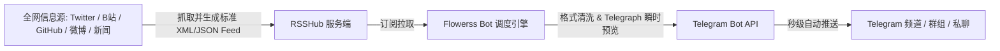
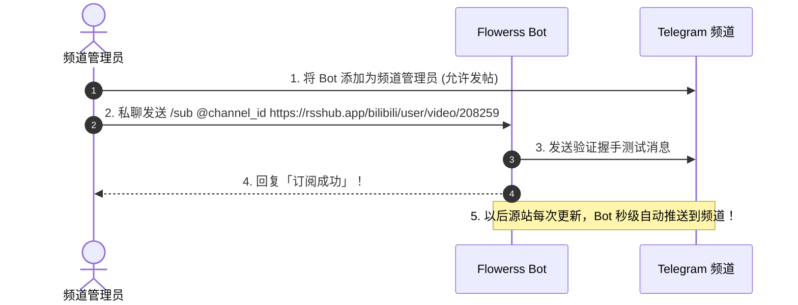

# Telegram RSS 订阅与全网监控完全指南：Flowerss Bot + RSSHub 搭建与频道全自动推流实战

在运营 Telegram 资讯频道、技术社群或打造个人全网监控看板时，**全自动信息流抓取与即时推流**是解放双手的终极利器。

传统的公共 RSS 机器人往往面临延迟高（15~30分钟抓取一次）、订阅数量受限、广告多且经常宕机的问题。而通过自建 **[Flowerss Bot](https://github.com/indes/flowerss-bot)**（高性能 Golang RSS 机器人）配合 **[RSSHub](https://docs.rsshub.app/)**（万物皆可 RSS 生成器），你可以轻松实现：**全网无死角监控（B站、Twitter/X、微博、GitHub、YouTube、知乎、各类新闻站）并秒级自动发布到你的 Telegram 频道中**。

本文将为你详解系统架构、Docker Compose 一键私有化部署、频道绑定指令以及全网热门订阅配方。

---

## 一、系统架构与工作原理



### 核心组合优势：
1. **万物皆可订阅**：借助 RSSHub，哪怕是不提供 RSS 的封闭平台（如小红书、微博、知乎热榜、B站UP主动态），也能自动生成高可用订阅链接。
2. **秒级低延迟**：私有化部署可自定义轮询频率（如每 3~5 分钟检查一次更新）。
3. **原生 Telegraph 即时预览 (Instant View)**：文章直接生成 [Telegraph 排版](../../telegraph.html)，在 Telegram 客户端内点击即可秒开纯净阅读，无需跳转外部浏览器。

---

## 二、Docker Compose 一键私有化部署

在一台海外 VPS Linux 服务器上，使用 Docker 可以 2 分钟内拉起整套服务。

### 2.1 准备目录与 `docker-compose.yml`
在服务器上新建目录并创建配置文件：

```yaml
version: '3.8'

services:
  # 1. RSSHub 服务端 (万物皆可 RSS)
  rsshub:
    image: diygod/rsshub:latest
    container_name: rsshub
    restart: always
    environment:
      - NODE_ENV=production
      - CACHE_EXPIRE=300
      - LISTEN_INADDR_ANY=1
    ports:
      - "1200:1200"

  # 2. Flowerss Bot 服务端 (RSS -> Telegram 推送引擎)
  flowerss:
    image: indes/flowerss-bot:latest
    container_name: flowerss-bot
    restart: always
    volumes:
      - ./data:/root/.flowerss-bot
    environment:
      - BOT_TOKEN=YOUR_TELEGRAM_BOT_TOKEN  # 从 @BotFather 申请的 Token
      - TELEGRAPH_TOKEN=                   # 可选：Telegraph Token
      - SOCKS5=                            # 可选：如果服务器在国内需填 Socks5 代理
    depends_on:
      - rsshub
```

### 2.2 启动服务
```bash
docker-compose up -d
```
启动完成后，你的私有 RSSHub 地址为 `http://你的服务器IP:1200`，Flowerss Bot 会自动连接 Telegram 开始工作。

---

## 三、Flowerss Bot 核心指令与频道推流实战

### 3.1 频道/群组推流配置步骤
1. **创建机器人管理员**：将你的 Bot 添加进目标 Telegram 频道（Channel）或群组（Group），并授予 **「发布消息 (Post Messages)」** 权限。
2. **在私聊中向 Bot 发送订阅指令**：
   ```text
   /sub @你的频道用户名 RSS订阅地址
   ```
   *例如：*
   ```text
   /sub @my_tech_channel https://github.com/torvalds/linux/releases.atom
   ```
3. **接收确认**：Bot 会回复订阅成功提示，此后只要该源有新内容，Bot 会自动格式化并转发至你的频道！



### 3.2 常用管理指令速查表：

| 指令 | 说明 | 示例 |
|:---|:---|:---|
| `/sub <源地址>` | 订阅到当前私聊窗口 | `/sub https://v2ex.com/index.xml` |
| `/sub @频道 <源地址>` | 订阅到指定公开/私密频道 | `/sub @my_channel https://...` |
| `/all` | 查看当前对话的所有订阅列表 | `/all` |
| `/unsub <ID>` | 退订指定序号的订阅源 | `/unsub 1` |
| `/set` | 配置当前订阅的推送模式（标题/全文/Telegraph） | `/set` |

---

## 四、全网热门监控配方大全 (RSSHub Recipes)

通过你的本地 RSSHub 服务（或官方公共节点），可以订阅全网主流平台：

### 4.1 视频与社交媒体
- **B站 UP主视频更新**：`http://localhost:1200/bilibili/user/video/208259`（将数字替换为 UP主 UID）
- **B站 UP主动态更新**：`http://localhost:1200/bilibili/user/dynamic/208259`
- **YouTube 频道更新**：`http://localhost:1200/youtube/user/频道名`
- **微博博主实时动态**：`http://localhost:1200/weibo/user/微博UID`
- **X (Twitter) 博主推文**：`http://localhost:1200/twitter/user/推特用户名`

### 4.2 技术与开发社区
- **GitHub 仓库发版 (Release)**：`https://github.com/用户名/仓库名/releases.atom`
- **V2EX 最热主题**：`https://v2ex.com/index.xml`
- **Hacker News 精选**：`http://localhost:1200/hackernews`

### 4.3 资讯与金融热点
- **知乎全网热榜**：`http://localhost:1200/zhihu/hotlist`
- **36氪 快讯**：`http://localhost:1200/36kr/newsflashes`
- **CoinDesk 加密货币突发**：`http://localhost:1200/coindesk`

---

## 五、运营调优与防封避坑指南

1. **避免单频道订阅过多高频源**：如果一个频道同时订阅了几十个突发快讯源，短时间内密集刷屏会引发粉丝批量静音。建议**按垂直分类拆分子频道**（如分别设立《技术周刊》、《热点快讯》、《游戏资讯》）。
2. **开启 Telegraph 原生排版**：对于包含大量长文字、代码块的文章，在 Flowerss 中开启 `/set` -> **Telegraph 模式**，可以在 Telegram 内部无缝渲染排版精美的长文。
3. **配置 RSSHub 缓存时间**：在 `docker-compose.yml` 中设置 `CACHE_EXPIRE=300`（5分钟缓存），防止对源站发起过于密集的抓取导致 IP 被目标网站封锁。

---

**相关阅读：**

- [Telegram 自动化工作流总览](./automation-guide.md) — Make、n8n 与 Webhook 跨平台集成
- [Telegraph 文章发布完全指南](../../telegraph.md) — 官方极简长文排版发布
- [频道运营全攻略](../../createchannel.md) — 频道建群、数据分析与内容变现
- [Bot 开发入门全景教程](../bot/bot-dev-guide.md) — Telegram Bot API 交互规范
