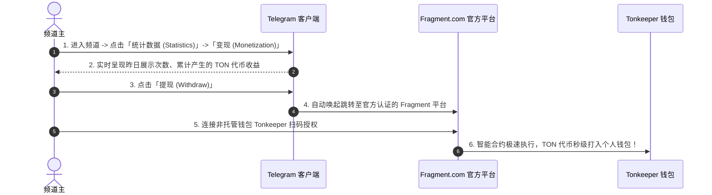
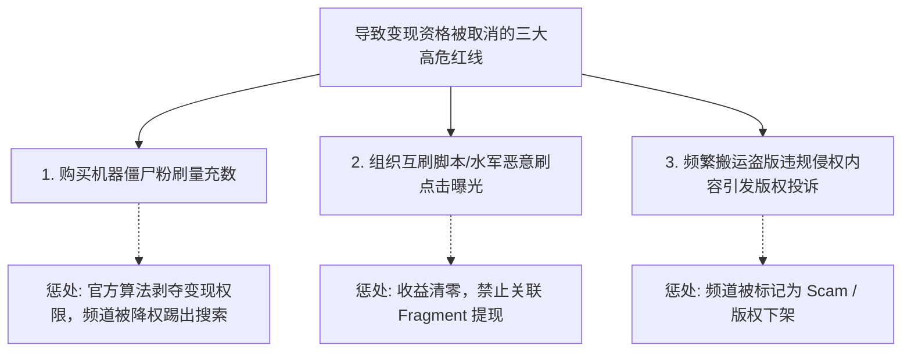

# Telegram 频道 50% 官方广告收益分成完全指南：千粉门槛、TON 提现与收益最大化实战

在过去的互联网自媒体生态中，创作者往往受困于传统平台极低的广告分成比例与严苛的提现门槛。然而，Telegram 掀起了一场全球自媒体平台的分配革命：**官方将频道内展示的所有赞助广告收入的整整 50%，全部返还给频道创建者，并以 TON 区块链代币秒级无门槛结算！**

这一创作者经济（Creator Economy）机制不仅让 Telegram 跃升为全球变现最慷慨的社交内容平台，也为全球自媒体人、出海出海团队和垂直领域博主开辟了一条持续睡后收入的黄金航道。

本文将为你详解开启 50% 广告分成的硬性条件、后台开启全流程、通过 Fragment 与 Tonkeeper 提现的实操步骤、不同垂直品类的高 CPM 增收秘诀，以及防作弊封号红线。

---

## 一、Telegram 官方广告收益分成模型全景

Telegram 的分成模式基于极度简洁透明的去中心化商业闭环：

```mermaid
graph LR
    Advertiser[广告主在 Telegram Ads 充值投放] --> Pool[广告总收入资金池 (TON)]
    Pool -->|50%| Durov[Telegram 官方: 覆盖服务器与网络成本]
    Pool -->|50%| Creator[频道创建者 (Owner): 直接分红]
    Creator -->|无锁定期| Fragment[Fragment 官方平台一键无损提现]
    Fragment --> Wallet[Tonkeeper 等去中心化加密钱包]
```

### 核心亮点与规则对比：

| 维度 | Telegram 官方广告分成 | YouTube / 传统自媒体平台 |
|:---|:---|:---|
| **创作者分成比例** | 🟢 **高达 50%**（全行业天花板） | 约 30% ~ 55%（需扣除大量杂费） |
| **结算结算货币** | 🟢 **TON 加密货币**（全球瞬时流通、抗通胀） | 美元法币（受外汇管制与跨国电汇限制） |
| **提现到账速度** | 🟢 **秒级到账**，在 Fragment 随时点击随时提 | 需累积满 100 美元，月结延时 30~60 天 |
| **隐私与身份验证** | 🟢 **无需复杂的跨国身份认证 (KYC)** | 必须提交护照、税单、住址证明等个人隐私 |
| **广告干扰度** | 🟢 **仅在频道最底部单条文字广告展示**，不插播视频 | 强制插播片头/片中不可跳过广告，极度伤害用户体验 |

---

## 二、准入门槛：如何解锁频道变现功能？

Telegram 为防止垃圾低质小号薅羊毛，设置了清晰明确的资格门槛：

```mermaid
graph TD
    Check1{频道订阅者 ≥ 1,000 人?}
    Check2{是否为公开频道 (拥有 @username)?}
    Check3{频道内容是否合规、非纯死粉刷量?}

    Check1 -- 否 --> Deny1[继续积累内容，冲刺 1000 真实粉丝]
    Check1 -- 是 --> Check2
    Check2 -- 否 --> Deny2[将私密频道转为公开频道并设置公网靓号]
    Check2 -- 是 --> Check3
    Check3 -- 否 --> Deny3[触发反刷量风控，变现功能被限制]
    Check3 -- 是 --> Pass[✅ 自动解锁「变现 (Monetization)」管理面板！]
```

### 必备前提条件：
1. **订阅人数门槛**：频道真实订阅人数达到 **1,000 人**。系统检测到达标后，通常在 24~48 小时内自动激活变现模块。
2. **公开属性**：必须是公开频道（Public Channel），私密群组或内部频道无法承接官方赞助广告。
3. **创建者主权**：只有频道的 **原始创建者 (Owner)** 拥有查看收益与提取代币的唯一最高权限，普通管理员无法触碰收益资金。

---

## 三、手把手实操：收益查看与提现到账全流程

当你的频道突破千粉后，按照以下步骤即可查看收益并提到个人钱包：



### 3.1 查看收益数据
1. 打开手机端 Telegram，进入你的目标频道。
2. 点击顶部频道名称进入频道资料页 -> 点击右上角「⋮ / 编辑」-> 选择 **「统计数据 (Statistics)」**。
3. 切换至 **「变现 (Monetization)」** 标签页：
   - 界面会直观展示你获得的 **总 TON 收益**、过去 7 天的收益曲线，以及每千次展示 (CPM) 的平均收入。

### 3.2 绑定钱包与秒级提现
1. 在变现界面中，点击底部的 **「提现 (Withdraw)」** 按钮。
2. 系统会自动通过专属签名链接安全拉起官方去中心化交易平台 **[Fragment (fragment.com)](https://fragment.com/)**。
3. 在网页端点击 **「Connect TON Wallet」**，使用手机端的 [Tonkeeper 钱包](../ton/wallet.html) 扫码一键连接。
4. 确认提现金额并签名。
5. **秒级到账**：由于运行在 TON 高性能区块链上，代币通常在 10~30 秒内直接入账你的 Tonkeeper 个人钱包，随后可在任何主流加密交易所（如 OKX、Bybit、Binance）直接折现兑换为本地法币！

::: tip 💡 收益反投频道推广
你赚取的 TON 收益不仅可以直接提现，还可以选择直接在 Telegram 内将其**免手续费反投为广告费**，用于在其他热门频道投放推广你自己的频道，实现“以赚养涨、滚雪球式裂变”。
:::

---

## 四、自媒体增收心法：如何将单粉收益拉升 3~5 倍？

Telegram 官方广告的分成收益并不是简单的“粉丝数越多赚得越多”，其本质取决于 **广告曝光千次收益 (CPM)**。

### 4.1 核心收益公式拆解：
$$\text{总收益 (TON)} = \frac{\text{频道真实阅读量 (Views)}}{1000} \times \text{该领域动态竞价 CPM} \times 50\%$$

### 4.2 高 CPM 黄金赛道排行榜：
- 🏆 **Web3 / 加密货币 / 金融投资**：广告主竞价极度激烈，CPM 往往高达 5 ~ 20 TON（千次阅读收益高）。
- 🥈 **出海跨境 / 外贸 / 软件开发 / AI 效率工具**：商业意向强，CPM 维持在 2 ~ 6 TON。
- 🥉 **搞笑段子 / 泛影视娱乐 / 壁纸**：受众泛化，广告主预算低，CPM 通常在 0.5 ~ 1.5 TON。

### 4.3 提高阅读率的 3 个实操动作：
1. **精简更新频率，保证单篇信息密度**：一天狂发 30 条水推文会导致读者直接静音，单篇阅读量暴跌；每天精选 2~3 条高价值硬核干货，能让每篇推文的阅读率维持在 40% 以上。
2. **配合 [频道投票与测验 (Polls)](../../poll.html)**：在推文末尾发起互动竞猜，大幅提升读者在频道底部的停留时长，增加底部赞助广告的有效曝光判定。
3. **保持公网链接与转发度**：优质内容被其他群组转发时，阅读量同样会计入曝光统计。

---

## 五、风控红线与安全避坑防封指南

许多新手急功近利，往往踩入红线导致收益被永久冻结：



1. **绝对不要刷死粉**：Telegram 的反作弊系统拥有极强的主动辨识能力。如果一个千粉频道发布推文后阅读数仅有可怜的几十，或者短时间内涌入成百上千个无头像的幽灵账号，变现功能会被系统立刻静默移除。
2. **防范钓鱼提现网站**：提现时认准且仅认准 Telegram 客户端内部唤起的跳转链接与官方唯一域名 `fragment.com`。**任何在私聊中声称“帮你开通绿色变现通道 / 代提现手续费”的客服，100% 为电信诈骗！**

---

## 六、总结

Telegram 50% 广告收益分成机制，真正让每一位认真耕耘垂直内容的自媒体人享受到了 Web3 去中心化分红红利。只要踏踏实实做好内容定位、突破千粉大关，你的频道就会变成一台 7x24 小时全自动运转的“数字现金流资产”。

---

**相关阅读：**

- [创建公开频道从零到一全攻略](../../createchannel.md) — 抢注公网靓号与千粉冷启动
- [TON 钱包与资产管理完全指南](../ton/wallet.md) — 创建并保管你的 Tonkeeper 助记词
- [Fragment 交易平台深度玩法](../../fragment.md) — 匿名号、靓号与 TON 代币生态
- [频道变现完全指南](../../monetization.md) — 广告分成、付费赞助与私域转化
