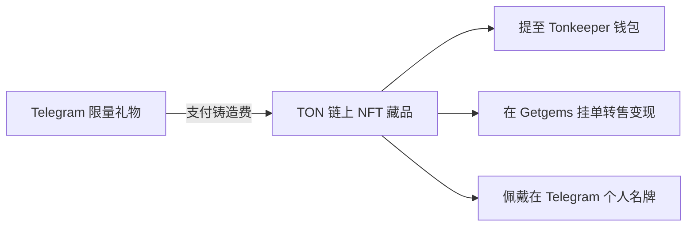
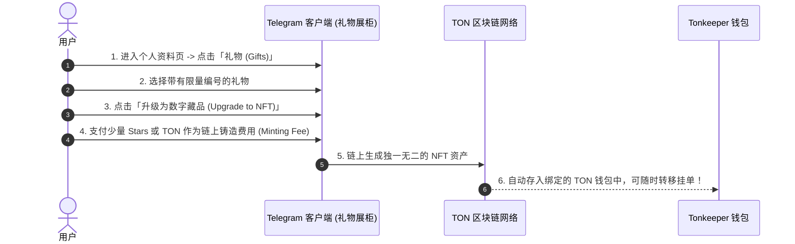

# Telegram 限量礼物升级 NFT 与链上交易完全指南：Getgems / Fragment 转售、Stars 折算与资产增值攻略

随着 Telegram 礼物系统（Gifts）与 TON 区块链的深度融合，Telegram 正式推出了**限量礼物升级为区块链数字藏品 (NFT Collectibles)** 的重磅功能。

用户收到的限量版 Telegram 礼物，不仅可以作为个人主页的尊贵勋章展示，更可以一键上链铸造为真实的 **TON 链上 NFT**，并在去中心化交易平台（如 Getgems 与 Fragment）上自由挂单交易、变现获利。

本文将为你详解限量礼物的升级条件、图解操作步骤、Getgems 市场转售实操、稀有编号估值体系以及普通礼物的 Stars 星币折算回收机制。

---

## 一、什么是限量礼物与 NFT 升级？



| 维度 | 普通礼物 (Regular Gifts) | 限量升级礼物 (NFT Gifts) |
|:---|:---|:---|
| **发行数量** | 无限发行，随时可买 | **限量发行**（如 5,000 ~ 50,000 份，售完即绝版）|
| **资产归属** | Telegram 内部虚拟数据 | **TON 区块链去中心化所有权**（存入非托管钱包）|
| **转让与变现** | 只能折算为 Telegram Stars | **可在 Getgems / Fragment 二级市场自由交易转售** |
| **独特性** | 完全一致的模型外观 | 带有**独立编号 (#Number)**、随机稀有背景与特效 |

---

## 二、图解 5 步：将限量礼物升级为 TON 链上 NFT



### 详细操作步骤：

1. **进入礼物墙**：打开 Telegram 手机端，进入个人主页 -> 点击 **「礼物 (Gifts)」** 标签。
2. **选择限量礼物**：在礼物列表中，点击带有限量编号（如 `#1234 of 10000`）的可升级礼物。
3. **触发升级入口**：点击底部的 **「升级为数字藏品 (Upgrade)」** 按钮。
4. **支付铸造费**：系统会提示升级所需的费用（通常为几十至上百个 [Telegram Stars](./../../stars.html) 或等额 TON）。确认支付后，系统将在后台自动向 TON 区块链提交智能合约调用。
5. **获取专属 NFT 属性**：铸造完成后，该礼物将生成独特的 3D 外观、专属属性卡片与区块链交易哈希 (TXID)。

---

## 三、在 Getgems 与 Fragment 交易市场挂单转售

升级为链上 NFT 后，你可以将其挂单到去中心化市场上出售给其他收藏家：

```mermaid
graph TD
    Step1[1. 打开 Getgems.io 官网] --> Step2[2. 连接你的 Tonkeeper 钱包]
    Step2 --> Step3[3. 在个人 Profile 中找到 Telegram Gifts 藏品]
    Step3 --> Step4[4. 点击 Put on Sale 设置固定价格 (TON) 或拍卖]
    Step4 --> Step5[5. 买家购买后，TON 自动打入你的钱包地址]
```

### 实战挂单指南：
1. 打开全球最大的 TON NFT 交易平台 [Getgems (getgems.io)](https://getgems.io/)。
2. 点击右上角 **`Connect Wallet`**，使用手机端 [Tonkeeper 钱包](./../ton/wallet.html) 扫码授权登录。
3. 进入个人中心，找到你刚才升级好的 Telegram Gift NFT。
4. 点击 **`Put on Sale (上架出售)`**：
   - **固定价格 (Fixed Price)**：输入期望收取的 TON 代币数量。
   - **定时拍卖 (Auction)**：设置起拍价与结束时间。
5. 签名确认交易。一旦有买家拍下，销售所得的 TON 会在扣除极低的市场手续费后，**秒级直接进入你的个人钱包**！

---

## 四、限量礼物估值体系：哪些礼物最值钱？

在二级市场上，Telegram NFT 礼物的溢价受以下三大核心维度影响：

### 4.1 编号价值 (Token ID)
- **顶级极品号**：`#1`（创世第一号）、`#666`、`#888`、`#777`、`#8888` 等吉祥豹子号，溢价通常是普通号的 **10 ~ 100 倍**。
- **单双位数号**：`#2 ~ #99` 的双位数编号由于存世极少，具备极高的收藏溢价。

### 4.2 发行总量 (Total Supply)
- **超级稀缺款 (≤ 5,000 份)**：往往在官方发售的几分钟内被秒光，二级市场地板价极高。
- **大众流通款 (50,000 ~ 100,000 份)**：价格更亲民，适合作为入门体验。

### 4.3 隐藏稀有背景与材质
升级后随机生成的背景特效（如金色流光、赛博朋克霓虹、全息反光等）在 Getgems 筛选器中具有更高的属性评分（Rarity Score）。

---

## 五、普通礼物变现：Stars 星币折算回收机制

如果你收到了大量无收藏价值、不能升级为 NFT 的普通礼物（如普通爱心、生日蛋糕）：

1. 打开个人资料页 -> 进入「礼物 (Gifts)」。
2. 点击该普通礼物 -> 点击右上角「⋮」菜单。
3. 选择 **「转换为 Stars (Convert to Stars)」**。
4. 系统会按照礼物的面值扣除小额手续费后，**即时将礼物折算回收为等值的 Telegram Stars（星星）**。
5. 回收获得的 Stars 可以用于支付 Telegram Premium 会员、在 [Fragment 平台](./../../fragment.html) 提现为 TON 或购买其他心仪的限量礼物！

---

## 六、安全防骗与避坑指南

1. **认准官方合约与权威市场**：交易 NFT 礼物请仅使用 [Getgems.io](https://getgems.io/) 或官方 [Fragment.com](https://fragment.com/)，切勿在陌生私聊中直接私下转币。
2. **警惕假冒高价收礼物钓鱼骗局**：骗子常假借“高价收礼物”为由发送恶意钓鱼链接，诱导你授权钱包签名。**永远不要对来路不明的 DApp 盲目签名授权！**
3. **保护你的助记词**：你的 NFT 礼物存放在你的 TON 钱包中，切勿将钱包的 24 位助记词告诉任何人。

---

**相关阅读：**

- [Telegram 礼物系统基础指南](./gifts.md) — 礼物类型、发送与主页展示
- [Telegram Stars 星币完全指南](./../../stars.md) — Stars 充值、提现与开发者结算
- [TON 钱包完全指南](./../ton/wallet.md) — Tonkeeper 钱包创建与链上资产管理
- [Fragment 交易平台深度指南](./../../fragment.md) — 靓号、匿名号与 Web3 资产交易
