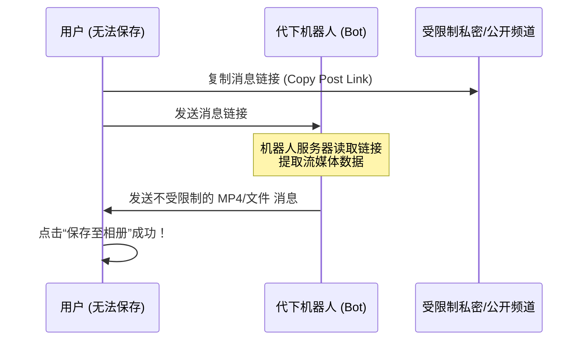

# Telegram 媒体下载与受限群组/频道资源导出完全指南

Telegram 是一个极为开放且高效的文件与媒体共享平台，最大支持单个 **2 GB**（Premium 会员最大为 **4 GB**）的文件传输。但在日常使用中，用户经常会遇到下载速度慢，或者因为频道/群组开启了**“禁止保存和转发内容 (Restrict saving content)”**保护，导致无法保存图片和视频的情况。

本文将手把手教你如何优化 Telegram 官方下载设置，并提供三种绕过限制、下载受保护频道/群组媒体资源的硬核实用技巧。

---

## 一、基础篇：官方下载优化与缓存管理

在尝试高阶下载技巧前，请先确保官方客户端的自动下载和路径设置已配置妥当。

### 1.1 开启自动下载 (Auto-Download)
- **路径**：`设置 (Settings)` -> `数据与存储 (Data and Storage)`。
- **配置**：可以针对“使用移动网络”、“使用 Wi-Fi”和“使用漫游”分别设置：
  - 是否自动下载照片、视频、音频和大型文件。
  - **建议**：在 Wi-Fi 下将视频和文件的自动下载大小限制调大，以便在后台自动缓存，避免手动点击等待。

### 1.2 手动保存至本地文件夹
默认情况下，Telegram 下载的文件保存在临时缓存目录中。若想永久存入本地：
- **手机端**：点击图片/视频 -> 右上角三点菜单 -> 点击 **「保存至相册 (Save to Gallery)」** 或 **「保存至下载 (Save to Downloads)」**。
- **电脑端**：右键点击媒体 -> 选择 **「另存为 (Save file as...)」** 自定义保存路径。

---

## 二、硬核篇：受限群组/频道资源提取的三大妙招

如果群主/频道主开启了「限制保存内容」，客户端会表现为：
- ❌ **无法转发 (Forward)** 消息。
- ❌ 鼠标右键或长按媒体，**不显示**「另存为」、「保存至相册」等选项。
- ❌ 移动端**禁止截屏 (Screenshot)** 和录屏。

以下是三种突破此限制的有效提取方法：

### 2.1 方法一：使用网页端 (Web K/A) 的媒体探测法 (适用于电脑端)
Telegram 官方网页端也是可以访问受保护频道的（只要你已加入该频道）。由于网页端运行在浏览器中，其媒体数据必然会加载到本地浏览器的缓存中。

1. 在电脑浏览器（推荐 Chrome 或 Edge）中登录官方网页版（推荐 K 版本）：
   👉 [https://web.telegram.org/k/](https://web.telegram.org/k/)
2. 打开对应的受保护频道，定位到你想下载的视频或图片。
3. 按下键盘上的 **`F12`**（或右键网页选择“检查”），打开**开发者工具 (Developer Tools)**。
4. 切换到 **网络 (Network)** 标签页。
5. 在过滤器中选择 **媒体 (Media)** 或 **全部 (All)**。
6. 回到网页上播放该视频，此时网络面板中会弹出一个大文件请求（通常以 `.mp4` 结尾或是一个流媒体 Blob 链接）。
7. 右键点击该网络请求 -> 选择 **「在新标签页中打开 (Open in new tab)」**，在拉起的浏览器原生播放器中，点击右下角三点即可选择**「下载 (Download)」**。

---

### 2.2 方法二：使用代下机器人 (Bot) 中转（适用于手机端/临时下载）
网络上有一些专门为突破转发限制而设计的机器人，其原理是你将受限制频道的消息链接发送给机器人，机器人在服务器端下载后，以不受限的普通文件格式发回给你。



1. **获取消息链接**：在受限频道的消息上右键或长按，点击 **「复制消息链接 (Copy Link)」**。
2. **发送给机器人**：将链接发送给支持代下的机器人（例如网络上可搜索到的限制内容提取机器人，注意部分可能需要付费或引导关注）。
3. **安全提醒**：**绝对不要向此类机器人授权登录你的账号（扫码或输入手机验证码）！** 真正安全的机器人只需要你提供公开或你已加入频道的消息链接，任何要求验证码登录的代下服务都是钓鱼陷阱！

---

### 2.3 方法三：使用 Python 脚本批量导出 (最彻底，适合大批量)
如果你有大量（如成百上千个）的限制视频需要下载，使用 Python 配合官方 API 框架 **Telethon** 是最安全、效率最高的专业做法。

#### 1. 准备 API 凭证
1. 登录官方开发后台：[https://my.telegram.org](https://my.telegram.org)。
2. 进入 `API development tools`。
3. 创建一个应用，获取你的 `api_id` 和 `api_hash`。

#### 2. 编写并运行 Python 脚本
在电脑上安装依赖：`pip install telethon`。使用以下脚本，它可以静默克隆并下载你已加入的任何频道（即使开启了限制）中的所有媒体。

```python
import os
from telethon import TelegramClient

# 填入在 my.telegram.org 申请的 API 信息
API_ID = 1234567          # 替换为你的真实 api_id (整型)
API_HASH = 'your_api_hash_here' # 替换为你的真实 api_hash (字符串)

# 目标频道的用户名（如 @mychannel）或私密频道的完整加入链接/频道ID
TARGET_CHANNEL = 'channel_username'
SAVE_DIR = './telegram_downloads'

# 创建保存目录
if not os.path.exists(SAVE_DIR):
    os.makedirs(SAVE_DIR)

client = TelegramClient('downloader_session', API_ID, API_HASH)

async def main():
    print("正在连接 Telegram...")
    # 获取目标频道实体
    channel = await client.get_entity(TARGET_CHANNEL)
    print(f"成功连接频道: {channel.title}，准备开始下载媒体文件...")
    
    count = 0
    # 遍历最新 100 条消息（可修改 limit 限制或删除 limit 下载全部）
    async for message in client.iter_messages(channel, limit=100):
        # 如果消息包含媒体（视频、照片、文档等）
        if message.media:
            print(f"正在下载消息 ID: {message.id} 的媒体内容...")
            # 下载媒体并保存
            file_path = await client.download_media(
                message.media, 
                file=os.path.join(SAVE_DIR, f"msg_{message.id}")
            )
            print(f"已保存至: {file_path}")
            count += 1
            
    print(f"下载结束！共成功导出 {count} 个文件。")

with client:
    client.loop.run_until_complete(main())
```

---

## 三、安全与版权注意事项

1. **尊重创作者版权**：开启“限制保存内容”通常是付费频道、知识付费团队或创作者为了防止原创内容流失而做出的设置。通过上述技术手段提取的资源**仅可用于个人备份、学习与存档**，切勿二次分发、倒卖或传播，以免面临法律纠纷。
2. **拒绝软件外挂**：市面上一些宣称“一键破解 Telegram 限制”的第三方 exe 可执行程序，多数带有木马病毒，会窃取你的 Telegram 登录 Session 凭证，从而控制你的账号发送诈骗信息。利用浏览器 F12 或自己编写 Python 脚本是最安全、透明的解决方式。
