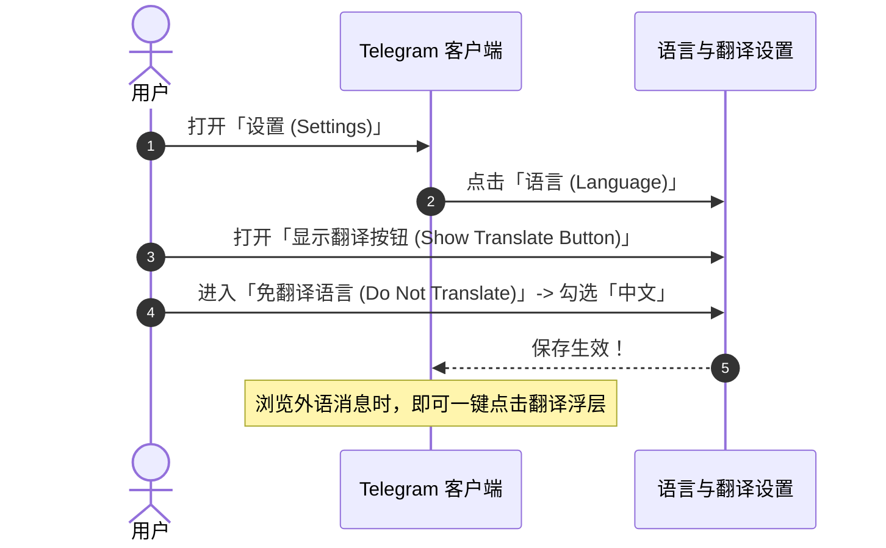
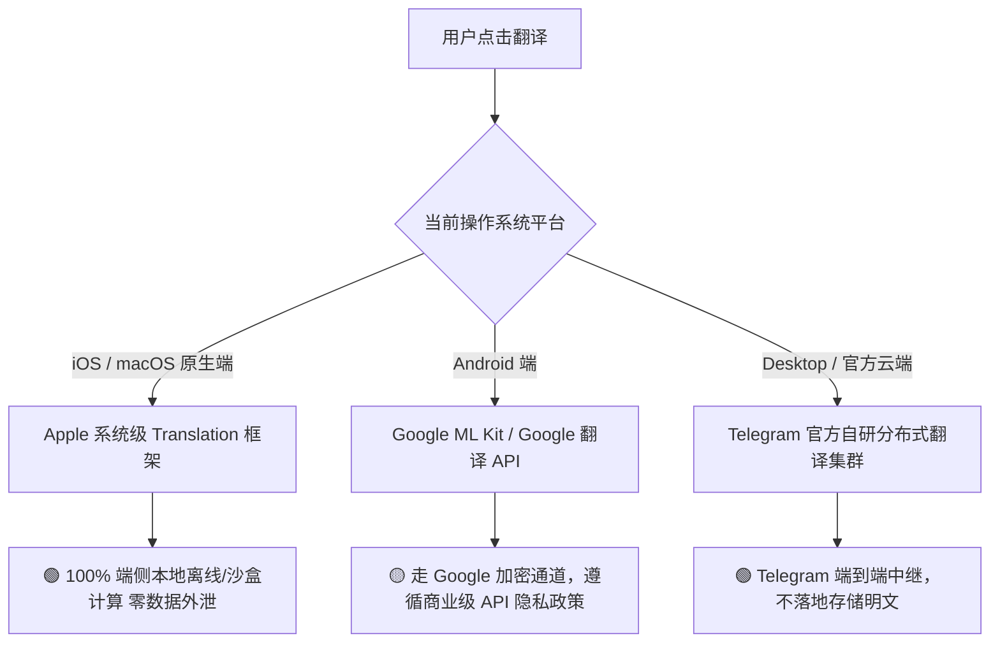

# Telegram 内置翻译功能完全指南：单条点译、整屏实时翻译、发送互译与隐私安全

在 Telegram 的全球化生态中，海量的优质资讯频道、技术开源项目以及跨境商业群组使用着英语、俄语、阿拉伯语、西班牙语等数十种不同语言。

为了打破跨语言交流壁垒，Telegram 官方在客户端底层深度集成了**多层次智能翻译引擎**：从最基础的**单条消息点按即译**，到高端实用的**整屏实时自动翻译栏（Real-Time Translation）**，再到出海商务场景下的**输入框打字即时翻译发送**。

本文将为你全面解析全平台客户端开启翻译的操作路径、整屏自动翻译的高阶配置、不同操作系统背后的翻译引擎原理，以及机密交流时的隐私安全防范指南。

---

## 一、Telegram 翻译系统全景：三大核心翻译模式

```mermaid
graph TD
    A[Telegram 翻译系统] --> B[模式一: 单条消息点按翻译 (全员免费)]
    A --> C[模式二: 顶部悬浮实时整屏翻译 (Real-time Bar)]
    A --> D[模式三: 输入框发送前即时互译 (出海利器)]

    B --> B1[长按/右键任意消息 -> 弹出翻译浮层]
    C --> C1[群聊/频道顶部常驻翻译条，进群消息秒级自动汉化]
    D --> D1[输入中文直接转换成目标外语发送给海外客户]
```

### 三种模式对比矩阵表：

| 翻译模式 | 准入门槛 | 交互方式 | 支持平台 | 最佳适用场景 |
|:---|:---|:---|:---|:---|
| **单条消息点按翻译** | 免费（全员可用） | 轻触/长按消息 -> 点击「翻译」 | iOS / Android / Desktop / Web | 偶尔浏览外语推文、查阅生僻词汇 |
| **整屏实时自动翻译** | 频道免费 / 私聊及群组需 Premium | 聊天窗口顶部自动弹出常驻翻译控制条 | iOS / Android / Desktop / Web | 深度订阅海外资讯频道、加入国际交流群 |
| **发送前打字即时互译** | 需 Premium 或部分增强端 | 输入中文后点击输入框翻译按钮直接替换 | iOS / Android / Desktop | 跨国客服、外贸撮合、国际友人社交 |

---

## 二、基础开启：如何在各端激活「翻译」功能？

默认情况下，Telegram 客户端的翻译按钮可能是关闭状态，需要先在设置中手动激活：



### 全平台详细设置路径：
1. **iOS (iPhone/iPad)**：
   - 进入 `设置 (Settings)` -> `语言 (Language)`。
   - 开启顶部 **「显示翻译按钮 (Show Translate Button)」** 开关。
   - 点击下方 **「不翻译 (Do Not Translate)」**：勾选你完全精通的母语（如 `简体中文`、`繁体中文`）。**这一步极其关键**，配置后，所有中文消息都不会出现多余的翻译提示，仅在外语消息上生效。
2. **Android (安卓手机)**：
   - 点击左上角三短线 -> `设置` -> `语言`。
   - 打开 **「显示翻译按钮」**，并设置 **「不翻译」** 语言清单。
3. **Desktop (Windows / macOS / 网页版)**：
   - 进入 `Settings` -> `Language` -> 开启 **`Show Translate Button`**。

---

## 三、进阶高阶玩法：整屏实时自动翻译与免跳转体验

如果你日常需要高频追踪 Bloomberg、CoinDesk、Reuters 或海外项目方频道，逐条点击翻译效率极低。此时**整屏实时翻译**是终极生产力神器：

### 3.1 开启整屏实时翻译条 (Real-Time Translate Bar)
1. 进入任何一个外语频道或群组。
2. 只要该群消息的语言不在你的「免翻译语言」名单内，**聊天界面正上方会自动出现一条半透明的翻译操作条**。
3. 点击右侧 **「翻译成中文 (Translate to Chinese)」**：
   - 整屏所有历史消息、后续源源不断涌入的新消息，都将在**毫秒级无感替换为地道中文**！
   - 原文的格式排版、粗体、剧透折叠与链接完全保留。
4. 如需比对原文，轻触单条消息即可切回原始外语。

### 3.2 出海业务必备：输入框即时翻译发送
面向海外客户或外国群友沟通时：
1. 在聊天输入框中用中文写下你的回复（例如：*“您好，这款产品目前现货充足，支持顺丰空运。”*）。
2. 长按或点击输入框右侧弹出的 **「翻译」图标**。
3. 选择目标输出语言（如 `English`、`Español`、`Русский`）。
4. 输入框中的中文会瞬间自动转换为符合地道语法的目标外语，确认无误后直接点击发送！

---

## 四、技术解密：各端翻译引擎与隐私安全考量

许多涉及商业机密、金融合规或敏感情报的用户最关心的问题是：**使用 Telegram 翻译，我的聊天内容会被第三方窃取吗？**



### 1. iOS / macOS：苹果原生系统框架（安全性最高）
在 iPhone、iPad 及 macOS 原生客户端上，Telegram 深度调用了 Apple 系统的 **`Translation API`**。
- 支持完全在本地硬件（Neural Engine 神经网络引擎）进行离线推理。
- **数据完全不出手机**，无需上传至第三方服务器，对商业机密和隐私聊天的保护最彻底。

### 2. Android：Google ML Kit / 云端智能
Android 端主要借助 Google 翻译引擎服务，语料库庞大，在长难句、行业黑话和多语种互译方面的流畅度表现极其优秀。

### 3. 警惕“第三方翻译机器人”窃密陷阱 🚨
在早期的 Telegram 群组中，常有人拉入所谓的“实时翻译 Bot”（例如各种自动群翻译机器人）：
::: danger 🚨 严重数据安全警告
把未知第三方的翻译机器人拉入私密群组，意味着**群内发送的每一句话都会以明文形式抄送给机器人的开发者服务器**！
黑产团伙常利用翻译 Bot 批量截获用户的私聊密码、助记词、银行账号与商务机密。**日常翻译请 100% 使用 Telegram 官方内置功能，坚决不使用任何第三方翻译机器人！**
:::

---

## 五、常见问题与疑难排查 (FAQ)

### Q1: 为什么我的客户端找不到“显示翻译按钮”？
- 确认你的客户端版本为官方最新版（Telegram 官方翻译功能在 8.4 版本后已全面普及）。
- 如果使用的是极其精简的非官方修改版，系统接口可能被阉割，建议换回官网正规客户端。

### Q2: 翻译俄语或小语种时提示“网络错误”？
- 部分地区因网络环境问题，访问翻译接口可能受到干扰。配置好 [Telegram 代理与 MTProto](./proxy.html) 后，翻译请求将随代理通道自动穿透加速。

---

**相关阅读：**

- [Telegram 中文语言包安装指南](./language.md) — 客户端全界面汉化教程
- [Telegram Premium 会员特权盘点](./premium.md) — 解锁整屏翻译与进阶功能
- [第三方客户端对比与评测](./thirdparty.md) — 内置 DeepL 增强翻译引擎客户端横评
- [高级隐私与反追踪完全指南](./topics/privacy-advanced.md) — 打造零数据泄露的安全环境
