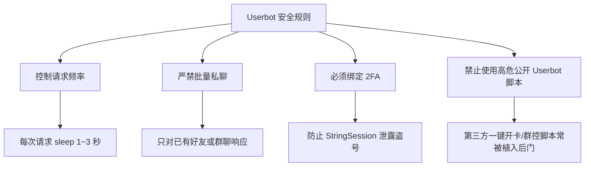

# Telegram Userbot 完全指南：Pyrogram / Telethon 框架、云端部署与 API 防封避坑

在 Telegram 生态中，除了我们常见的[官方客服/管理机器人（Bot API）](./createrobot.html)，还有一种威力更加强大、功能无限拓展的自动化形式——**Userbot（用户协议机器人）**。

Userbot 允许你通过代码控制一个**真实的个人账号**，实现自动消息过滤、多频道内容实时同步、智能私聊自动回复、定时备份数据以及自定义快捷指令功能。

本文将为你全面剖析 Userbot 的工作原理、主流开发框架选型（Pyrogram 与 Telethon）、Python 核心代码实战、Docker 24小时云端部署方案以及极重要的一点：**如何避免触发官方 MTProto API 风控被封号**。

---

## 一、什么是 Userbot？与官方 Bot 有何本质区别？

```mermaid
graph TD
    subgraph 官方 Bot API
        A1[Telegram 客户端] -->|HTTP POST JSON| A2[Telegram Bot Server]
        A2 -->|限定权限| A3[Bot 账号 (@xxx_bot)]
    end

    subgraph MTProto Userbot
        B1[Python / Node.js 脚本] -->|原生二进制 MTProto 协议| B2[Telegram 数据中心 DC]
        B2 -->|全量个人权限| B3[真实用户账号 (User Account)]
    end
```

| 维度 | 官方 Bot (Bot API) | Userbot (MTProto API) |
|:---|:---|:---|
| **登录凭证** | `bot_token` (通过 BotFather 申请) | `api_id` + `api_hash` + 手机号/Session |
| **消息主动权** | **无法主动给陌生人发私聊**，需用户先发 `/start` | 可以像普通用户一样**主动发起私聊** |
| **群组与频道权限** | 只能处理被 @ 或作为管理员受限的事件 | **具有账号拥有的完整权限**（读取私聊、管理群组等）|
| **视觉标识** | 账号名称旁有明显的 `BOT` 标签 | 外表就是**普通用户账号** |
| **风控敏感度** | 较低（官方规则保护） | **极高**（被 Anti-Spam 实时监控，滥用易被封号）|

---

## 二、主流开发框架选型对比

在 Python 生态中，有两个最受欢迎的 MTProto 客户端框架：

| 框架名称 | 特性与优势 | 缺点/短板 | 适用场景 |
|:---|:---|:---|:---|
| **[Pyrogram](https://docs.pyrogram.org/)** | 🏆 **现代异步设计**、类 Telegram 官方风格 API、内置 Smart Plugins 系统，上手最快 | 偶尔需关注更新与 API 版本对接 | 商业自动客服、聊天助手、跨群消息同步 |
| **[Telethon](https://docs.telethon.dev/)** | 🌲 **历史悠久**、稳定性极高、底层 TL-Schema 映射完整，支持最底层的 Raw API 调用 | 异步事件代码写法相对偏老式 | 大规模数据爬取、频道媒体备份、深度协议开发 |

> 💡 **建议**：新手和绝大多数自动化需求推荐优先使用 **Pyrogram**；需要调用复杂官方未公开底层的深入开发推荐 **Telethon**。

---

## 三、获取 API 凭证 (api_id & api_hash)

运行任何 Userbot 之前，你都需要申请专属的 API 凭证：

1. 浏览器访问官方开发者门户：[my.telegram.org](https://my.telegram.org)。
2. 输入你的 Telegram 绑定手机号，并在客户端内接收验证码完成登录。
3. 点击 **「API development tools」**。
4. 填写 App title 与 Short name（例如 `MyAssistant`），Platform 选择 `Desktop` 或 `Web`。
5. 点击提交，即可获得你的 `api_id` (数字) 和 `api_hash` (32位哈希字符串)。

::: danger ⚠️ 凭证安全警示
`api_id` 和 `api_hash` 相当于你账号的开发者密钥，**绝对不要泄露给任何人或开源到 GitHub 上**！别人获取后可以直接接管你的账号。
:::

---

## 四、Pyrogram 实战项目演练

### 4.1 环境准备
在本地或服务器上安装最新版 Python 3.8+ 及依赖库：

```bash
pip install pyrogram tgcrypto
```

### 4.2 案例 1：智能关键词自动回复与关键词过滤
以下代码演示如何监听私聊消息，自动识别关键词并回复：

```python
import asyncio
from pyrogram import Client, filters

# 填入你的凭证
API_ID = 1234567
API_HASH = "your_api_hash_here"

app = Client("my_account", api_id=API_ID, api_hash=API_HASH)

# 监听所有来自私聊的文本消息
@app.on_message(filters.private & filters.text & ~filters.me)
async def auto_reply(client, message):
    text = message.text.lower()
    
    # 关键词匹配示例
    if "客服" in text or "合作" in text:
        await message.reply_text(
            "👋 您好！我现在正在忙，已收到您的合作/客服请求，稍后会第一时间回复您！"
        )
    elif "价格" in text:
        await message.reply_text("💰 关于服务价格说明请查阅该文档：https://example.com/price")

if __name__ == "__main__":
    print("🚀 Userbot 正在运行中...")
    app.run()
```

### 4.3 案例 2：频道消息跨群自动实时同步（消息转发）
将某个关注的公开/私密频道消息自动清洗并重发到你指定的群组中：

```python
from pyrogram import Client, filters

app = Client("sync_bot", api_id=API_ID, api_hash=API_HASH)

SOURCE_CHANNEL = "target_channel_username"  # 目标源频道
TARGET_GROUP_ID = -1001234567890             # 你的目标群组 ID

@app.on_message(filters.chat(SOURCE_CHANNEL))
async def sync_messages(client, message):
    # 如果消息包含文字，过滤掉特定广告词
    clean_text = message.text or message.caption or ""
    if "广告垃圾词" in clean_text:
        return
        
    # 转发/重发消息至目标群组
    if message.text:
        await client.send_message(TARGET_GROUP_ID, f"📢 **同步更新：**\n\n{message.text}")
    elif message.photo:
        await client.send_photo(TARGET_GROUP_ID, message.photo.file_id, caption=message.caption)

app.run()
```

---

## 五、Userbot 24 小时云端部署（Docker 方案）

为了让你的 Userbot 不间断运行，建议将其部署在 VPS Linux 服务器上。

### 5.1 Dockerfile 配置
在项目根目录下创建 `Dockerfile`：

```dockerfile
FROM python:3.11-slim

WORKDIR /app

COPY requirements.txt .
RUN pip install --no-cache-dir -r requirements.txt

COPY . .

CMD ["python", "main.py"]
```

### 5.2 运行与后台守护
```bash
# 构建镜像
docker build -t my-tg-userbot .

# 启动容器
docker run -d --name tg_userbot --restart=always my-tg-userbot
```

---

## 六、严禁触碰的 API 防封与风控红线 (Anti-Ban Rules)

Telegram 的 Anti-Spam 风控引擎对 MTProto 协议调用有着**极高的敏感度**。如果操作不当，你的个人账号可能会在几秒内被**永久封禁**！



### 6.1 绝对不能做的危险行为 ❌
1. **短时间内主动私聊大量陌生人**：瞬间触发 Telegram `PEER_FLOOD` 限制并直接封号。
2. **零间隔高频 API 循环**：在代码中使用无 `asyncio.sleep()` 的死循环发送请求，会触发 HTTP 420 `FLOOD_WAIT_X` 甚至永久禁封。
3. **自动批量加入大量敏感群组**：系统会将你的 Userbot 判定为 Spam 刷屏账号。
4. **随意运行网络上未经审计的“一键安装 Userbot”脚本**：许多网上的开源项目含有偷取 Session 的后门木马。

### 6.2 安全运行最佳实践 ✅
- **频率限制 (Rate Limiting)**：所有的批量操作在逻辑中**必须引入 `await asyncio.sleep(2)` 或更长时间间隔**。
- **使用小号测试**：在编写和调试新的 Userbot 功能时，**绝对不要直接用你的主号**！先在备用小号上测试稳定后再部署。
- **配置异常捕获**：在代码中妥善捕获 `FloodWait` 错误：
  ```python
  from pyrogram.errors import FloodWait
  
  try:
      await app.send_message(chat_id, "Hello")
  except FloodWait as e:
      print(f"⚠️ 触发频率限制，需等待 {e.value} 秒")
      await asyncio.sleep(e.value)
  ```

---

## 七、常见问题排查 (FAQ)

### Q1: 运行提示 `AUTH_KEY_DUPLICATED`？
你使用的 session 在另一台机器或客户端上重新生成了验证 key，导致当前 Session 失效。删除本地 `.session` 文件后重新运行代码登录即可。

### Q2: 提示 `PHONE_NUMBER_BANNED`？
非常遗憾，你的号码因触发防风控规则已被封禁。请参阅 [账号申诉与解封完全指南](./banned.html) 尝试向 Telegram 官方邮箱发送申诉邮件。

---

**相关阅读：**

- [Bot API 入门指南](./api-intro.md) — 官方机器人开发与对比
- [自动化与集成指南](./topics/automation/automation-guide.md) — n8n 与 Webhook 自动化工作流
- [虚拟号与海外手机号指南](./virtual-number.md) — 养号防封与安全避坑
- [账号申诉与解封完全指南](./banned.md) — 封号原因排查与申诉解封
