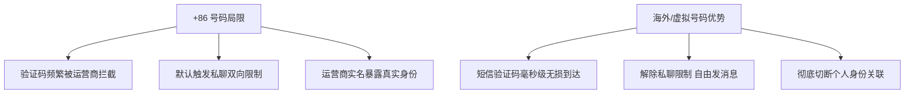
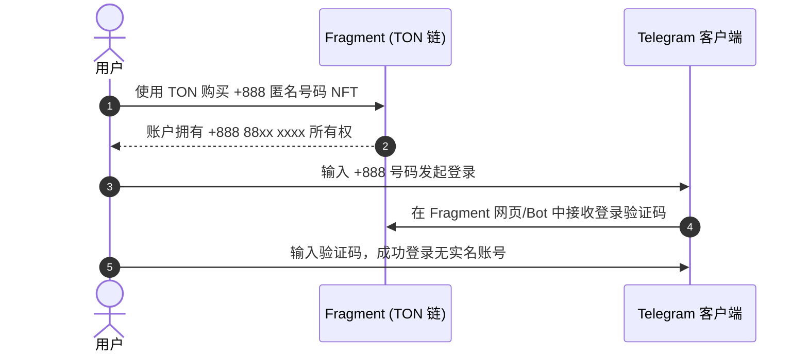
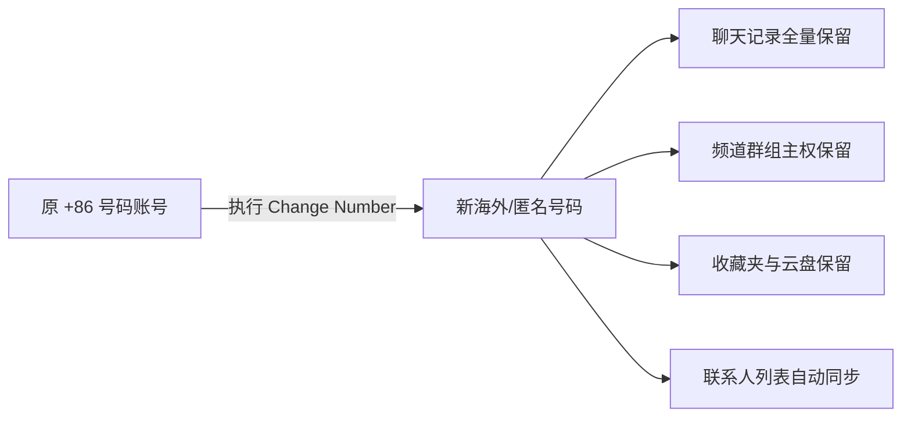

# Telegram 虚拟号码与海外手机号完全指南：eSIM、+888 匿名号、接码平台与养号防回收

在使用 Telegram 时，**手机号**不仅是注册与登录的凭证，更是关乎账号隐私、私聊权限与账号生命周期的核心要素。许多用户因为使用国内 +86 号码遇到验证码拦截、双向私聊限制或实名信息暴露问题，因而选择更换为海外手机号或虚拟号码。

本文将为你全面对比 Telegram 适用的四大类手机号方案（Fragment 官方匿名号、海外物理 SIM/eSIM、VoIP 虚拟号、接码平台），并提供无缝换号迁移与防风控封号的实操避坑指南。

---

## 一、为什么越来越多的用户选择更换海外/虚拟号码？

1. **解决验证码接收难题**：国内部分运营商拦截境外 SMS 验证码，导致登录时收不到短信。使用海外物理卡或 eSIM 能做到验证码毫秒级到达。
2. **解除双向私聊限制**：+86 号码注册的新账号默认会被限制主动私聊陌生人（显示 *“Sorry, you can only send messages to mutual contacts”*）。使用海外号码注册则无此限制。
3. **隐私隔离与安全防护**：防止通过手机号反查社工库泄漏真实身份，避免 SIM 交换攻击 (SIM Swap Attack)。

---

## 二、四大手机号类型全景对比

| 方案类型 | 代表产品 | 价格成本 | 隐私安全度 | 风控率 | 保号/月租 | 推荐指数 |
|:---|:---|:---|:---:|:---:|:---|:---:|
| **区块链匿名号** | [Fragment (+888)](./fragment.html) | 一次性买断 (~$5-20) | 🏆 极高 | 零风控（官方认可） | **零月租 永久有效** | ⭐⭐⭐⭐⭐ |
| **海外物理卡 / eSIM** | giffgaff / Club Sim / Ultra PayGo | 低保号门槛 | 极高 | 极低（真实运营商） | 约 $1-10/年 | ⭐⭐⭐⭐⭐ |
| **VoIP 虚拟号** | Google Voice / Skype / TextNow | 免费 ~ 廉价 | 中等 | 中高（部分被风控） | 定期活跃/发短信保号 | ⭐⭐⭐ |
| **临时接码平台** | SMS-Activate / Receive-SMS | 极低 ($0.5-2) | 低（公用临时号） | 极高（易回收/被盗） | 一次性（无法长期保号） | ⭐⭐ |

---

## 三、海外物理 SIM 卡与 eSIM 方案推荐

物理卡与 eSIM 是稳定性最高、最适合作为主号或长期账号使用的方案。

### 3.1 英国 giffgaff 物理卡
- **特点**：英国老牌运营商，在国内免费接收短信（漫游免收费）。
- **保号成本**：无固定月租。每 180 天（半年）在漫游状态下使用余额发送一条短信（约 £0.30），即可永久延长 180 天保号期。
- **适合人群**：想要实体卡、追求极低保号成本的用户。

### 3.2 香港 Club Sim (eSIM)
- **特点**：香港 HKT 旗下，支持 eSIM 电子卡，在线购买后几分钟内即可写入手机。
- **保号成本**：每年购买一次 6 港币（约 $0.8 美元）的短信包或验证服务包即可保号一年。
- **适合人群**：支持 eSIM 功能的手机（如 iPhone 美版/港版/国行安卓支持 eSIM 扩展卡的用户）。

### 3.3 美国 Ultra Mobile PayGo
- **特点**：美国原生移动号码，每月含 100 分钟通话 + 100 条短信。
- **保号成本**：$3 美元/月。
- **适合人群**：除了 Telegram 之外，还需要注册美股、PayPal、OpenAI 等对 IP/号码要求极高的重度用户。

---

## 四、Fragment +888 区块链匿名号码

Telegram 官方在 [Fragment 平台](./fragment.html) 上推出的基于 TON 区块链的 **+888 虚拟号码** 是终极隐私解决方案。

- **零实名**：完全不需要身份证或护照。号码归属于你的去中心化 TON 钱包。
- **无限使用**：号码永久保存在区块链上，不存在忘充值被运营商收回销号的风险。
- **专门优化**：Telegram 官方原生识别，不会触发任何 Anti-Spam 机制。

---

## 五、Google Voice 与 VoIP 虚拟号使用技巧

Google Voice (GV) 是使用广范的美国 VoIP 号码。

### 5.1 使用 Google Voice 的注意规则
1. **防止风控**：注册或换号时，若 Telegram 提示 `Invalid phone number`，说明当前该段 GV 号码段被暂设保护，建议过几天重试或切换 IP。
2. **防止 GV 被 Google 回收**：Google 规定连续 3 个月无主动呼出或发短信的 GV 号码将被回收。建议设置自动化脚本或每月主动向其他免费美国号码发送一条短信。
3. **设置两步验证 (2FA)**：VoIP 号码如果被回收，新拿号的人可能会尝试重置你的账号。**必须在 Telegram 中设置 2FA 密码！**

---

## 六、临时接码平台（SMS-Activate）避坑警示

::: danger ⚠️ 严禁使用接码平台做主号
SMS-Activate 等平台上的号码均为**一次性/短时复用号**。接码结束后，你将永远失去该号码的控制权。
- 一旦你在新设备登录需要 SMS 验证码，由于无法再次接码，你的账号将**永久丢失**！
- 接码平台的号码会被频繁回收，下一个人买到同一号码后可以直接封禁或重置你的会话。
:::

**接码平台仅有的合法用途**：测试临时机器人、临时挂载无重要数据的测试群等。即使使用接码平台，也**必须在登录后 1 分钟内开启 2FA 密码**。

---

## 七、Telegram 无缝更换号码 (Change Number) 实操

如果你现有的账号是 +86 号码，希望换成海外卡或 +888 匿名号，无需重新注册！可以使用 Telegram 官方的**无缝换号功能**。

### 7.1 换号操作步骤
1. 打开 Telegram 客户端 -> 进入 **设置 (Settings)**。
2. 点击你的个人信息区域（含有当前手机号的地方）。
3. 点击 **「更换号码 (Change Number)」**。
4. 阅读提示（**所有聊天记录、频道、群组、联系人和云端数据将完整保留**）。
5. 输入新的海外手机号/匿名号，接收短信/链上验证码并输入。
6. 换号即刻完成！

::: tip 💡 换号隐私设置检查
换号成功后，建议立即检查 `设置` -> `隐私与安全` -> `手机号码`：
- 将「谁可以看到我的手机号」设置为 **「所有人不可见 (Nobody)」**。
- 将「谁可以通过手机号找到我」设置为 **「我的联系人 (My Contacts)」**。
:::

---

## 八、新号/换号后的防风控 (Anti-Risk Control) 黄金法则

新注册或刚更换号码的账号在前 7 天属于**风控观察期**，请严格遵守以下法则：

1. **开启两步验证 (2FA)**：进入 `设置` -> `隐私与安全` -> `两步验证`，设置强密码并绑定安全邮箱。
2. **严禁刚换号就批量发私聊**：不要在新号前 3 天主动私聊大量陌生人或发送带网址的广告。
3. **保持网络 IP 稳定**：避免在几分钟内频繁切换多个不同国家/地区的代理节点。
4. **绑定个人设备**：保持至少一台手机或电脑客户端处于在线登录状态，以便后续登录时直接在应用内接收验证码（无需走 SMS）。

---

**相关阅读：**

- [Fragment 交易平台完全指南](./fragment.md) — 竞拍靓号与 +888 匿名号码
- [Telegram 收不到验证码排查](./notcomesms.md) — 10 种验证码接收问题解决方案
- [账号安全与 2FA 完全指南](./2fa.md) — 两步验证密码设置
- [高级隐私保护指南](./topics/privacy-advanced.md) — 匿名身份与反追踪技巧
