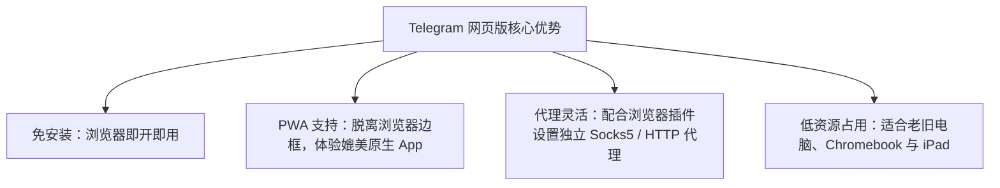
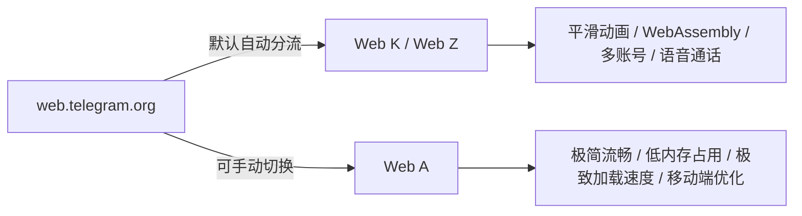
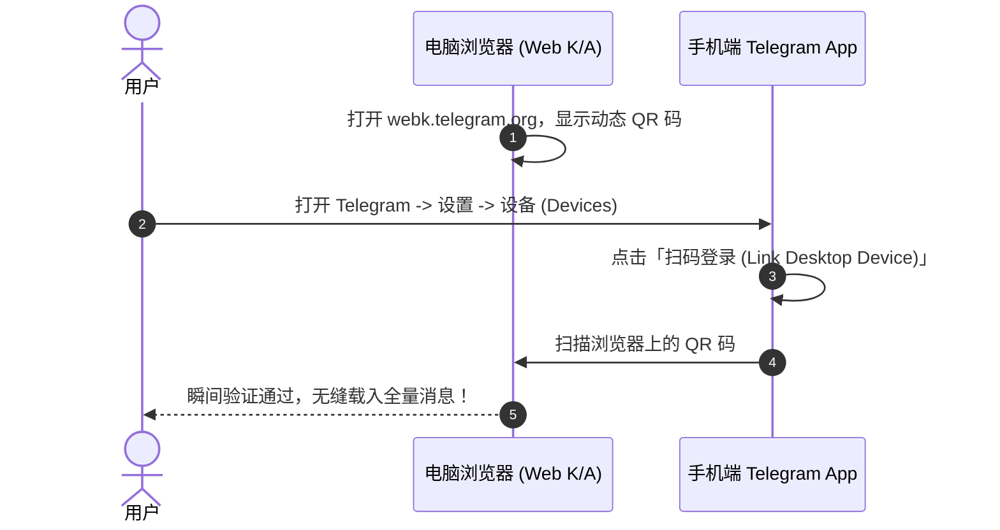

# Telegram 网页版全景指南：Web K 与 Web A 区别、PWA 离线安装与免客户端使用技巧

当你使用的是公司受限电脑（没有管理员权限安装软件）、公用电脑、Chromebook、iPad，或者不想在电脑上安装独立客户端时，**Telegram 网页版 (Telegram Web)** 是最完美的选择。

Telegram 官方同时维护着两个功能完备的现代网页版本：**Web K** 与 **Web A**。

本文将为你深度对比 Web K 与 Web A 的性能与功能差异、演示如何将网页版安装为独立 **PWA (Progressive Web App)** 应用，并提供网页版的代理配置与故障排查技巧。

---

## 一、为什么选择 Telegram 网页版？

1. **零安装门槛**：无需下载 `.exe` 或 `.dmg` 安装包，在任何支持现代 HTML5 的浏览器（Chrome / Edge / Safari / Firefox）中打开网址即可使用。
2. **跨平台离线 PWA**：支持一键添加到桌面或手机主屏幕，作为独立窗口运行，支持桌面消息通知。
3. **隔离安全与隐私**：在公共电脑使用后，只需清理浏览器缓存或关闭无痕模式窗口即可彻底清除会话，不留痕迹。

---

## 二、官方两大网页版深度对比：Web K vs Web A

很多用户在访问 `web.telegram.org` 时会发现页面自动跳转到了 `webk.telegram.org` 或 `weba.telegram.org`。这是 Telegram 官方竞赛中脱颖而出的两个不同架构的网页客户端。

### Web K 与 Web A 功能特性全景对比表：

| 对比维度 | **Web K** (`webk.telegram.org`) | **Web A** (`weba.telegram.org`) |
|:---|:---|:---|
| **开发者背景** | 由 Igor Zhukov 主导开发（原 Web Z） | 由 Evgeny Nadymov 主导开发 |
| **设计风格与 UI** | 类似 iOS 原生应用，平滑高帧率动画 | 极简现代化 Web 风格，结构紧凑 |
| **底层核心引擎** | 基于 WebAssembly & Web Audio | 基于 Vanilla Web API & Canvas 优化 |
| **音视频通话** | **完美支持** 1 对 1 音视频通话与语音房 | 依赖系统 WebRTC，部分浏览器受限 |
| **多账号切换** | **支持** 在同一个浏览器中登录多个账号 | 仅支持单账号登录 |
| **资源开销** | 内存占用略高，适合性能较好的电脑 | **内存占用极低**，适合旧电脑/低配设备 |
| **推荐适用场景** | 桌面大屏电脑、追求美观动画与音视频通话 | 低配设备、Chromebook、iPad / 手机 Safari |

---

## 三、扫码快捷登录与设备授权

网页版无需手动输入手机号接收 SMS（避免收不到短信），推荐直接使用 **QR 码扫码登录**：

::: tip 💡 登录提示
如果是新账号或首次注册 Telegram，**不能直接在网页版上注册**！必须先在 iOS / Android 手机官方 App 上完成首次手机号注册。
:::

---

## 四、将 Web 版安装为 PWA (Progressive Web App) 独立应用

借助 PWA 技术，你可以将 Telegram 网页版变成一个**没有浏览器地址栏和标签页的独立桌面软件**：

### 4.1 Windows / Mac (Edge 或 Chrome 浏览器)
1. 在浏览器中打开 [webk.telegram.org](https://webk.telegram.org)。
2. 查看浏览器地址栏右侧，点击出现的 **「安装 Telegram Web (Install)」** 图标（或点击右上角 `...` -> `应用` -> `将此站点作为应用安装`）。
3. 安装后，桌面上会自动生成 Telegram 快捷图标，且可以将其固定到任务栏或 Dock 栏！

### 4.2 iOS / iPadOS (Safari 浏览器)
1. 在 Safari 中打开 [weba.telegram.org](https://weba.telegram.org)。
2. 点击屏幕底部的 **「分享 (Share)」** 按钮。
3. 向下滚动并选择 **「添加到主屏幕 (Add to Home Screen)」**。
4. 主屏幕即会出现 Telegram 图标，点击即可全屏无边框运行。

---

## 五、网页版高级技巧与网络代理设置

### 5.1 配合浏览器插件设置独立代理
如果你在公司或特定网络环境中，无需全局 VPN，只需在 Chrome / Edge 中安装 **ZeroOmni** 或 **Proxy SwitchyOmega** 插件：
- 将代理规则设置为 `*.telegram.org` 和 `*.comments.app` 走本地 Socks5 (`127.0.0.1:10808`) 或 HTTP 代理。
- 即可仅让 Telegram 网页版走代理，不影响其他网页访问。

### 5.2 彻底清除网页版数据与强制登出
如果在公用电脑使用完毕，请按以下步骤彻底清理：
1. 客户端内登出：点击网页版侧边栏菜单 -> `设置 (Settings)` -> `退出登录 (Log Out)`。
2. 开发者工具清理：按 `F12` 打开开发者工具 -> 切换到 `Application (应用)` 标签 -> 点击 `Storage` -> 点击 **`Clear site data (清除站点数据)`**。

---

## 六、常见问题排查 (FAQ)

### Q1: 网页版一直显示 `Connecting...`（连接中）？
- **原因**：Telegram 网页版使用 WebSocket (WSS) 协议与 Telegram DC 服务器通讯。部分网络防火墙会单独拦截 WSS 端口。
- **解决方法**：检查代理插件是否开启了 WebSocket 代理支持，或尝试在 Web K 与 Web A 之间切换。

### Q2: 网页版收不到消息桌面通知？
- 首次使用时，浏览器顶部会弹窗询问「是否允许显示通知」。必须点击 **「允许 (Allow)」**。
- 如果不小心点了禁止，可在浏览器地址栏左侧锁头图标处点击「网站设置」，重新将「通知」改为允许。

---

**相关阅读：**

- [第三方客户端推荐](./thirdparty.md) — Unigram、Nekogram 等增强端对比
- [扫码登录与设备安全管理](./scan.md) — 会话管理与防扫码钓鱼
- [Telegram 隐藏功能与技巧](./power-tips.md) — 30+ 提高效率的高手秘技
- [代理配置与 MTProto 指南](./proxy.md) — 自建与内置代理配置
